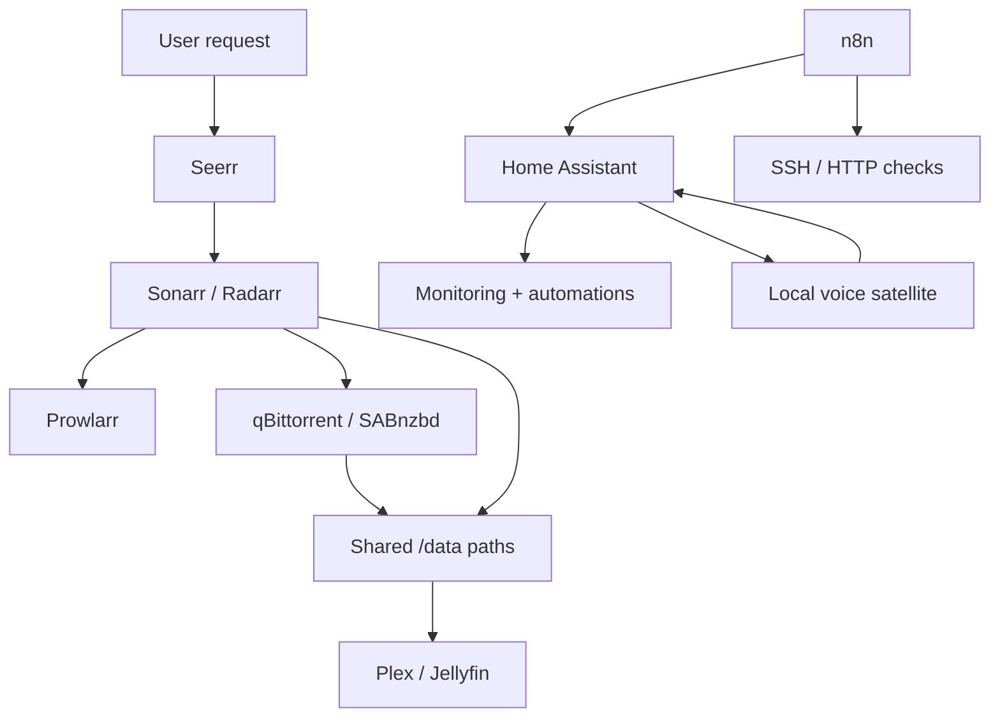

# Course Map

| Class | Subject | Build output | Pass evidence |
|---|---|---|---|
| 1 | Proxmox, VMs, and LXC | Linux VM plus test LXC | VM networking, DNS, SSH, and LXC comparison |
| 2 | Docker Compose | Persistent two-service Compose project | Recreate without data loss |
| 3 | Docker networking | Isolated `media_net` with DNS-based service calls | Name resolution and isolation tests |
| 4 | Container operations | Maintainable service lifecycle and observability | Health, logs, update, rollback evidence |
| 5 | Prowlarr and service contracts | Prowlarr connected to Sonarr/Radarr | Application sync and test results |
| 6 | TRaSH quality design | Quality profiles and Custom Formats | Scored sample releases and cutoff behavior |
| 7 | Configuration automation | Reproducible profile sync and drift report | Backup, dry run, apply, rollback |
| 8 | Home Assistant foundations | HA instance with entity, dashboard, and backup | Restart and restore evidence |
| 9 | Home Assistant automations | Trigger-condition-action automation | Positive and negative test cases |
| 10 | Secure remote access | Authenticated remote path or VPN | Unauthorized denial and rollback |
| 11 | Local voice architecture | Instrumented Assist pipeline | Stage-by-stage trace |
| 12 | Whisper, Piper, and Wyoming | Local STT and TTS services | Known-sentence and known-response tests |
| 13 | Private smart speaker | Wake-to-action-to-speech system | Internet-disconnected end-to-end pass |
| 14 | n8n homelab automation | n8n + RSS digest + guarded Keep Agent | Item-flow explained; approval before mutation |

## Final architecture

## Stage gates

### Gate 1 — Infrastructure

Classes 1–4 must pass before building the media applications. The student can explain persistence, ports, networks, name resolution, logs, health, updates, and rollback.

### Gate 2 — Media automation

Classes 5–7 must pass before automation is considered reliable. The student can trace a request through indexer search, download-client submission, completed-download import, naming, and library discovery.

### Gate 3 — Home automation

Classes 8–10 must pass before remote access is enabled. The student has a current backup, a tested restore path, and denies unauthenticated external access.

### Gate 4 — Voice

Classes 11–13 must pass one component at a time. The full voice pipeline is attempted only after microphone, wake word, STT, intent/action, TTS, and playback pass independently.

### Gate 5 — Workflow automation

Class 14 must pass with n8n on the lab network only. The student can explain JSON item cardinality, keep credentials out of git, and require human approval before any mutating agent action.

## Evidence rule

“It seems to work” is not evidence. Acceptable evidence is an observed result tied to a requirement: command output, API test, application test button, log excerpt, screenshot with secrets removed, file metadata, or a repeatable test record.

