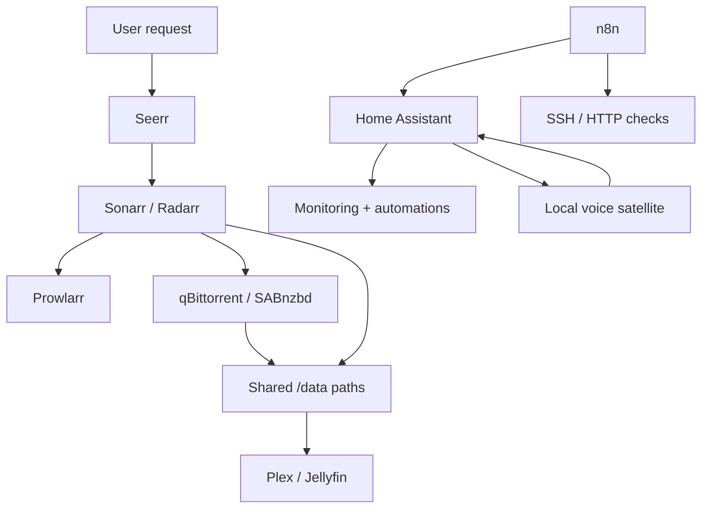

# Course Map

Methodology: **Backward Design → Bloom → Learn/Practice/Test/Reflect → Mastery → Spiral**.  
Feynman teach-back is required in every class. See `METHODOLOGY.md`.

## Modules (units)

| Module | Classes | Stage gate |
|---|---|---|
| 1 — Infrastructure & addressing | 1–4, 15 | Gate 1 |
| 2 — ARR media automation | 5–7 | Gate 2 |
| 3 — Home Assistant & remote access | 8–10 | Gate 3 |
| 4 — Local voice | 11–13 | Gate 4 |
| 5 — Workflow automation | 14 | Gate 5 |
| Capstone | Final exam | Course complete |

## Class map

| Class | Subject | Learning focus (Bloom) | Build output | Pass evidence |
|---|---|---|---|---|
| 1 | Proxmox, VMs, and LXC | Apply | Linux VM plus test LXC / VirtualBox path | VM networking, DNS, SSH, LXC comparison + Feynman |
| 2 | Docker Compose | Apply / Create | Persistent two-service Compose project | Recreate without data loss + Feynman |
| 3 | Docker networking | Analyze | Isolated `media_net` with DNS-based calls | Name resolution and isolation tests + Feynman |
| 4 | Container operations | Apply / Evaluate | Maintainable service lifecycle | Health, logs, update, rollback + Feynman |
| 5 | Prowlarr and service contracts | Apply / Analyze | Prowlarr connected to Sonarr/Radarr | Application sync and test results + Feynman |
| 6 | TRaSH quality design | Evaluate / Create | Quality profiles and Custom Formats | Scored sample releases and cutoff behavior + Feynman |
| 7 | Configuration automation | Apply / Evaluate | Reproducible profile sync and drift report | Backup, dry run, apply, rollback + Feynman |
| 8 | Home Assistant foundations | Apply | HA instance with entity, dashboard, backup | Restart and restore evidence + Feynman |
| 9 | Home Assistant automations | Analyze / Create | Trigger-condition-action automation | Positive and negative test cases + Feynman |
| 10 | Secure remote access | Evaluate / Apply | Authenticated remote path or VPN | Unauthorized denial and rollback + Feynman |
| 11 | Local voice architecture | Analyze | Instrumented Assist pipeline | Stage-by-stage trace + Feynman |
| 12 | Whisper, Piper, and Wyoming | Apply / Evaluate | Local STT and TTS services | Known-sentence and known-response tests + Feynman |
| 13 | Private smart speaker | Create / Evaluate | Wake-to-action-to-speech system | Internet-disconnected end-to-end pass + Feynman |
| 14 | n8n homelab automation | Apply / Evaluate | n8n + RSS digest + guarded Keep Agent | Item-flow explained; approval before mutation + Feynman |
| 15 | IPv4 addresses and gateways | Understand / Apply | Read IP/mask/gateway; classful vs classless | Same-LAN vs gateway; reserved + loopback + Feynman |

## Every class section order

1. Learning objective  
2. Why this matters  
3. Prior-knowledge check  
4. Vocabulary  
5. Instruction  
6. Worked example (I do)  
7. Guided practice (We do)  
8. Independent practice (You do)  
9. **Feynman teach-back** (mandatory)  
10. Retrieval check  
11. Guided lab  
12. Break / fix  
13. Feedback / common mistakes  
14. Practical mastery gate  
15. Reflection  
16. Spiral hook  
17. Current correction (when needed)

## Final architecture

## Stage gates

### Gate 1 — Infrastructure

Classes 1–4 must pass before building the media applications. Class 15 may be taken early alongside 1–3. The student explains persistence, ports, networks, name resolution, logs, health, updates, rollback, and basic IPv4 delivery.

### Gate 2 — Media automation

Classes 5–7 must pass. The student traces request → search → download → import and shows a tested quality policy under automation.

### Gate 3 — Home automation

Classes 8–10 must pass. Backup/restore proven; unauthenticated external admin access denied.

### Gate 4 — Voice

Classes 11–13 pass stage-by-stage, then disconnected end-to-end.

### Gate 5 — Workflow automation

Class 14 passes with lab-only networking, cardinality explained, and approval before mutation.

## Spiral examples

- Compose (2) returns in every later deploy.
- Docker DNS (3) returns in ARR, HA, voice, n8n.
- Quality policy (6) returns when automation (7) drifts.
- Entity naming (8) returns in automations (9) and voice actions (11–13).
- Addressing (15) returns on every “hosts can’t talk” incident.

## Evidence rule

“It seems to work” is not evidence. Acceptable evidence is an observed result tied to a requirement: command output, API test, application test button, log excerpt, screenshot with secrets removed, file metadata, or a repeatable test record — plus a completed Feynman teach-back.
