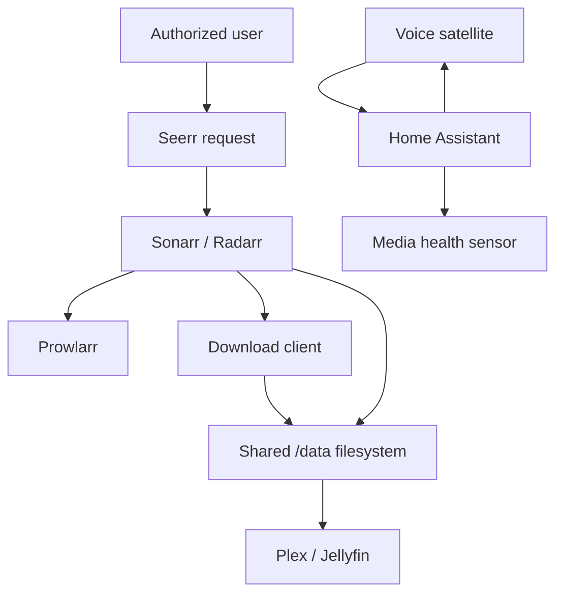

# Final Capstone — Verified Private Homelab

## Mission scenario

Build and demonstrate a homelab where an authorized user can request permitted media, trace the request through the ARR pipeline, discover the imported item in a media server, ask Home Assistant whether the media service is online, and receive a local spoken response. Core local tests must pass with WAN disconnected.

## Required architecture

## Constraints

- Use only authorized indexers, sources, and test media.
- No administrative application is directly exposed to the public internet.
- Every stateful service has a current backup and documented restore target.
- Persistent paths, identities, networks, and ports are documented.
- One source of truth owns automated quality/profile configuration.
- Voice STT and TTS run locally for the offline requirement.

## Verification matrix

| ID | Requirement | Verification | Pass condition |
|---|---|---|---|
| CAP-01 | Docker data persists | Recreate one stateful test container | Configuration/data remain intact |
| CAP-02 | Service discovery works | Resolve/call services by container DNS | Expected responses received |
| CAP-03 | ARR API links work | Run application tests | All intended links pass |
| CAP-04 | Prowlarr sync works | Trigger sync and inspect targets | Expected definitions/categories appear |
| CAP-05 | Quality policy works | Score five controlled candidates | Rankings/rejections match written policy |
| CAP-06 | Download handoff works | Submit authorized controlled test | Correct client/category receives job |
| CAP-07 | Import works | Complete controlled test | Correct root/naming and no path error |
| CAP-08 | Hardlink policy works | Compare device/inode where applicable | Same data inode or documented exception |
| CAP-09 | Media discovery works | Scan library | One correct item appears |
| CAP-10 | HA health entity works | Stop/start test service | State changes within requirement |
| CAP-11 | HA automation works | Run positive/negative cases | Correct action only under allowed case |
| CAP-12 | Remote access is controlled | Allowed and denied tests | Allowed passes; denied fails |
| CAP-13 | STT works | Known sentence trials | Action/target words correct per threshold |
| CAP-14 | TTS works | Fixed phrase trials | Complete intelligible audio |
| CAP-15 | Voice E2E works | Ten wake-command trials | Meets reliability/latency requirement |
| CAP-16 | Local mode works | Disconnect WAN and repeat local tests | Defined core path remains functional |
| CAP-17 | Recovery works | Restart one voice and one media service | Automatic/manual recovery meets runbook |
| CAP-18 | Restore path works | Restore disposable config/VM | Service returns with verified state |

## Demonstration sequence

1. Present the architecture and inventory.
2. Show Compose validation and running health state.
3. Demonstrate persistent data after recreation.
4. Show Prowlarr application sync and one controlled candidate evaluation.
5. Trace an authorized test transaction from request to media discovery.
6. Prove path/hardlink behavior or explain the documented filesystem exception.
7. Trigger the Home Assistant media-health automation in positive and negative cases.
8. Demonstrate allowed and denied remote-access cases.
9. Run the voice component checks.
10. Issue: “Is the media server online?” and capture local spoken response.
11. Disconnect WAN while maintaining LAN.
12. Repeat the defined Home Assistant and voice command.
13. Restore WAN and verify normal operation.
14. Introduce one hidden fault and diagnose it by boundary.
15. Show backups and execute one safe restoration in a disposable target.

## Critical failures

Any of the following prevents a pass until corrected:

- Public unauthenticated admin interface.
- Secrets in submitted screenshots/configuration.
- No recovery copy for stateful configuration.
- Inability to distinguish path mapping from permission failure.
- Quality automation applied broadly without backup or behavioral test.
- Voice “local” claim without a WAN-disconnect demonstration.
- Destructive testing against irreplaceable data.

## Final score

| Category | Points |
|---|---:|
| Architecture and requirements | 15 |
| Container/ARR implementation | 25 |
| Home Assistant implementation | 15 |
| Local voice implementation | 15 |
| Verification evidence | 15 |
| Fault isolation | 10 |
| Security and recovery | 5 |
| **Total** | **100** |

Pass requires at least 80 points and zero unresolved critical failures.

## Final Feynman explanation (required)

Explain the **entire course system** as if teaching a smart beginner:

1. **Explain:** How does a request become playable media, how does Home Assistant know service health, and how does local voice answer — in your own words?
2. **Simplify:** Explain the same story to a 12-year-old. Define every jargon word.
3. **Example:** Give one real incident from your lab and which module’s idea fixed it.
4. **Weak spot:** Which module still feels fuzzy?
5. **Retry:** Restudy that module’s spiral hook, then rewrite a clearer system explanation.

## Course reflection (required)

1. What can you do now that you could not do at the start? (Use course outcomes language.)
2. Which mastery gate was hardest, and why?
3. Which earlier skill returned later via spiral review?
4. What will you remediate next week?
5. What evidence artifact are you most proud of?

