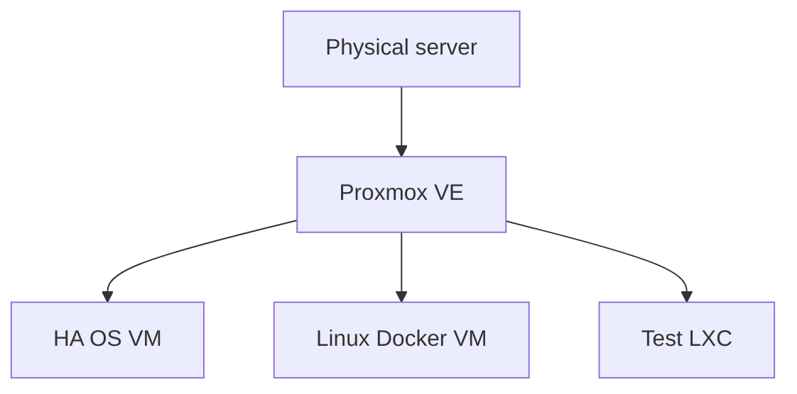
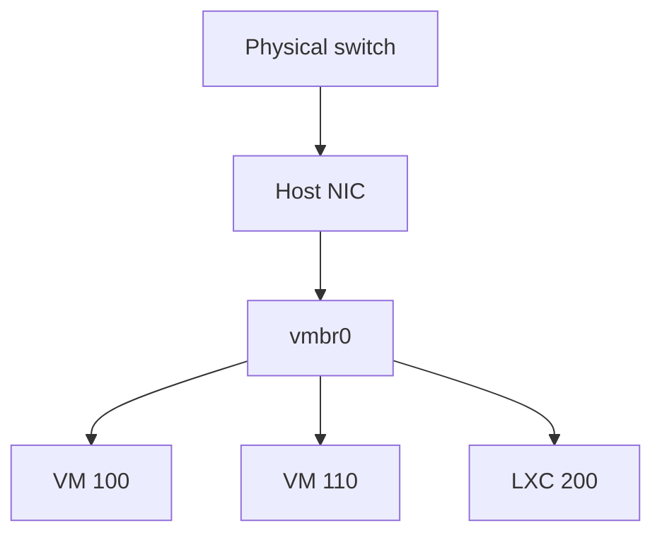

# Class 1 — Virtualization, Proxmox, VMs, and LXC

**Lecture:** [NetworkChuck — Proxmox / Virtual Machines](https://www.youtube.com/watch?v=_u8qTN3cCnQ)  
**Time:** 90–120 minutes  
**Build output:** one Linux VM and one disposable LXC

## What you will learn

You will learn how one physical computer can host multiple isolated systems, what Proxmox manages, how VMs differ from LXC system containers, how virtual storage and networking work, and why the course places Docker inside a Linux VM.

## Vocabulary

| Term | Meaning |
|---|---|
| Host | Physical server running the hypervisor |
| Guest | VM or container managed by the host |
| Hypervisor | Platform that creates and schedules virtual computers |
| KVM/QEMU | Linux virtualization stack used for Proxmox VMs |
| LXC | Linux system container sharing the host kernel |
| ISO | Install-disc image used to install an OS |
| vCPU | CPU execution capacity presented to a guest |
| Bridge | Virtual switch connecting guests and physical networking |
| `vmbr0` | Common name of Proxmox's primary Linux bridge |
| Snapshot | Point-in-time guest state; not a substitute for a backup |

## Lesson

Without virtualization, a server normally runs one operating system directly on its hardware. Virtualization inserts a management layer that presents virtual CPU, memory, disk, firmware, and network devices to separate guests.



A VM has its own kernel. An LXC shares the Proxmox host's Linux kernel. That single distinction explains most tradeoffs: VMs cost more resources but provide broader OS compatibility and stronger separation; LXCs start quickly and use fewer resources but remain tied to the host kernel.

| Decision | VM | LXC |
|---|---:|---:|
| Own kernel | Yes | No |
| Windows guest | Yes | No |
| Stronger boundary | Yes | No |
| Lower overhead | No | Yes |
| Full OS flexibility | Yes | Limited to compatible Linux userspace |

Docker is an application-container platform, not a synonym for either VM or LXC. The beginner architecture used here is:

```text
Proxmox -> Debian/Ubuntu VM -> Docker Engine -> applications
```

This avoids combining LXC nesting, device mappings, Docker storage drivers, and application troubleshooting before the student understands the separate layers.

### Resource allocation

Allocating four vCPUs does not normally dedicate four physical cores forever. The hypervisor schedules work. Memory is less forgiving: the host and every running guest need enough real RAM. Keep headroom for Proxmox, filesystem cache, backup jobs, and workload spikes.

### Storage

Capacity and content type are separate ideas. A Proxmox storage target may allow ISO images, VM disks, container root filesystems, backups, templates, or only a subset. “The disk has free space” does not prove it accepts the content you are creating.

### Networking

`vmbr0` behaves like a virtual Ethernet switch. A guest NIC attaches to the bridge, the bridge attaches to a physical NIC, and frames can reach the LAN.



The management workstation can be Windows, Linux, or macOS. Proxmox normally runs on a separate dedicated system and is managed at `https://SERVER-IP:8006`.

## Guided lab

1. Confirm the target disk contains no irreplaceable data. Installing Proxmox can erase it.
2. Enable AMD-V/SVM or Intel VT-x in firmware if disabled.
3. Write the current Proxmox ISO to a USB drive and boot the server from it.
4. Record hostname, management IP, gateway, DNS, and selected target disk before confirming the install.
5. From a second computer, reach `https://SERVER-IP:8006` and authenticate.
6. Upload a Debian or Ubuntu Server ISO.
7. Create `lab-linux-01` with 2 vCPU, 2–4 GB RAM, 20–32 GB disk, and a NIC on `vmbr0`.
8. Install the guest OS and enable SSH.
9. In the guest, run:

```bash
ip addr
ip route
ping -c 3 1.1.1.1
getent hosts example.com
```

10. SSH from the workstation: `ssh USER@VM-IP`.
11. Download a Debian LXC template and create CT 200 with 1 CPU, 1 GB RAM, and 8 GB disk.
12. Compare `free -h`, `uname -a`, boot time, and visible device model between VM and LXC.

## Break it, then fix it

Detach the VM's virtual NIC or attach it to the wrong bridge. Observe whether the guest still has a link, address, route, gateway reachability, and DNS. Restore the original configuration one change at a time.

Troubleshoot in order:

```text
Virtual NIC -> bridge -> IP address -> route -> gateway -> internet IP -> DNS -> application
```

If `ping 1.1.1.1` works but a hostname lookup fails, routing works and DNS is the likely fault. Do not reinstall the guest.

## Common mistakes

- Installing onto the only copy of important data.
- Giving one guest nearly all RAM and starving the host.
- Treating snapshots as independent backups.
- Assuming LXC and Docker are the same.
- Using Wi-Fi as the default server uplink without understanding bridge limitations.
- Changing IP, bridge, firewall, and DNS simultaneously during diagnosis.

## Knowledge check

1. What is the difference between a host and a guest?
2. Which guest type normally has its own kernel?
3. What does `vmbr0` behave like?
4. Why is a successful ping to `1.1.1.1` but failed hostname lookup useful?
5. Why does this course put Docker in a Linux VM?

## Practical gate

- [ ] Proxmox UI is reachable at the recorded management address.
- [ ] The VM receives the expected IP configuration.
- [ ] Gateway, internet IP, and DNS tests pass independently.
- [ ] SSH works from the management workstation.
- [ ] The LXC boots and its kernel relationship can be explained.
- [ ] The student can draw physical NIC -> bridge -> guest NIC from memory.

## 2026 correction

Use the current Proxmox documentation for exact installer screens and supported versions. The 2021 lecture remains useful for the virtualization model, but current Proxmox guidance and hardware support take precedence.

