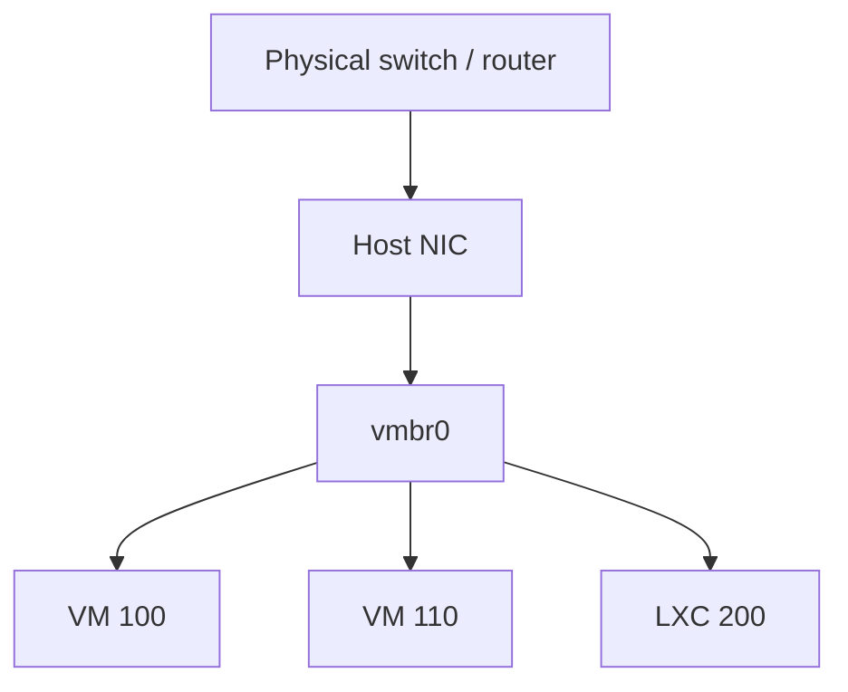

# Class 1 — Virtual machines, hypervisors, and Proxmox

**Build output:** understand Type 1 vs Type 2; run either a laptop VM (VirtualBox) or a dedicated Proxmox host with one Linux VM and one disposable LXC

## What you will learn

You will understand what a virtual machine really is (a full computer living inside another computer), why hypervisors exist, the difference between Type 2 (app-on-your-OS) and Type 1 (OS replaced by the hypervisor), and how to stand up a safe practice box without risking your daily desktop. You will also learn how VMs differ from LXC, how storage and networking attach to guests, and why this Academy puts Docker inside a Linux VM later.

## Vocabulary

| Term | Meaning |
|---|---|
| Host | The real machine (or OS) that owns the hardware |
| Guest | A VM or container that thinks it is “the” computer |
| Hypervisor | Software that creates fake hardware and schedules guests |
| Type 2 hypervisor | App installed on Windows/macOS/Linux (example: VirtualBox) |
| Type 1 hypervisor | Installed on bare metal; the hypervisor *is* the host OS (example: Proxmox VE) |
| KVM/QEMU | Linux virtualization stack used under Proxmox VMs |
| LXC | Linux system container that shares the host kernel |
| ISO | Install-disc image used to install an operating system |
| vCPU | CPU time presented to a guest (scheduled, not always exclusive) |
| Bridge | Virtual switch connecting guests to each other and/or the LAN |
| NAT (guest network) | Guest shares the host’s internet path; often not a full peer on your LAN |
| Bridged (guest network) | Guest gets an address on the real LAN like another PC |
| Snapshot | Freeze-frame of a guest you can restore later |
| Clone | Full copy of a guest for experiments or backup-like recovery |
| `vmbr0` | Common name of Proxmox’s primary Linux bridge |

## Lesson

### What a virtual machine is

Open your laptop. Inside the case sit real parts: CPU, RAM, storage, network chip. An operating system (Windows, macOS, or Linux) sits on top and turns those parts into something you can use.

A **virtual machine** is another complete computer that lives *inside* that setup. It gets virtual CPU, virtual RAM, a virtual disk, and a virtual network card. The guest OS boots, paints a desktop, and runs programs. From the guest’s point of view, it is the only computer in the room. From your point of view, it is software sharing your real hardware.

You do not need a second physical PC just to try Linux, practice networking, or break configuration on purpose. You carve out a slice of what you already own.

### Why you want one

Three reasons show up again and again in real labs:

1. **Safe practice.** Mess up the guest. Delete it. Rebuild it. Your daily host OS stays untouched.
2. **Learn other operating systems.** Run Ubuntu, Debian, a server trial, or a second Windows install without repartitioning your only disk.
3. **Isolation when you experiment.** Labs, scrapers, new stacks, and “what if I change this?” work are safer inside a guest—especially if you keep sharing features (clipboard, folders, bridged LAN) turned down until you need them.

Virtualization is not a toy idea. It is how cloud providers and most serious IT shops pack many systems onto fewer machines. Learning it once pays off for the rest of this Academy.

### Hypervisors: Type 2 vs Type 1

The **hypervisor** is the piece that performs the “computer inside a computer” trick.

| | Type 2 | Type 1 |
|---|---|---|
| Where it lives | App on your existing OS | Installed on the hardware itself |
| Everyday example | VirtualBox on a Windows laptop | Proxmox VE on a spare PC |
| Who owns the hardware | Your host OS shares RAM/CPU with the hypervisor | Hypervisor owns the hardware and feeds guests |
| Best for | Learning on the machine you already use | Always-on labs, more guests, more RAM for VMs |
| Tradeoff | Easy and free; host OS still eats resources | Requires dedicating (or wiping) a machine; more power |

Both types create guests. Type 2 asks the host OS for resources. Type 1 sits closer to the metal and usually gives you more room for bigger labs.

This class supports **both paths**. The Academy’s default for later classes is a **dedicated Proxmox host** (Type 1). If you only have one laptop today, start with **VirtualBox** (Type 2), finish the gate with a working guest, then move Proxmox onto spare hardware when you can.

```text
Type 2 (laptop path)
  Hardware → Windows/macOS/Linux → VirtualBox → Guest OS

Type 1 (Academy default)
  Hardware → Proxmox VE → VM / LXC guests
```

### Firmware: turn on hardware virtualization

Modern guests expect 64-bit virtualization support in the CPU. In firmware (BIOS/UEFI) look for **Intel VT-x / VMX** or **AMD-V / SVM** and set it to **Enabled**. Keys vary by vendor (`Del`, `F2`, `F10`, `F12`). Change only that setting, save, and reboot. Without it, many 64-bit guests will refuse to start or run poorly.

### Path A — Type 2 on your daily computer (VirtualBox)

Use this when you do not yet have a spare PC.

1. Download the guest **ISO** you want (Ubuntu Desktop/Server is a solid first choice). Start the download early; ISOs are large.
2. Install **VirtualBox** for your host OS from the official site. Accept defaults.
3. Install the matching **Extension Pack** if you need USB passthrough and related extras.
4. Create a new VM: name it, choose Linux + a 64-bit Debian/Ubuntu-class type, give it modest RAM (often 2 GB to start on a 8–16 GB host), create a dynamically allocated virtual disk (20 GB+), and assign more than one vCPU only if your host has cores to spare—stay under about half your physical cores.
5. Attach the ISO as the virtual optical drive and start the VM.
6. Install the guest OS. Guided partitioning of the *virtual* disk is safe for your host disk; you are formatting the fake drive, not your Windows/macOS partition.
7. Learn the **host key** (often Right Ctrl on Windows/Linux) so you can release the mouse/keyboard back to the host.

**Power features worth using on day one**

- **Pause** — freeze the guest like pausing a game; resumes where you left off.
- **Save state** — close the guest and reopen later with apps still open.
- **Snapshot** — take a restore point before a risky change; roll back if it breaks.
- **Clone** — duplicate a known-good machine before you thrash a copy.

**Network modes (keep this mental model)**

- **NAT** — guest reaches the internet through the host; it is usually *not* a full peer on your home LAN. Good default for isolation.
- **Bridged** — guest appears on the LAN with its own address. Convenient for SSH from other devices; less isolation.

Clipboard sharing, drag-and-drop, and shared folders are convenient and weaken isolation. Leave them off until you understand the tradeoff.

### Path B — Type 1 on spare hardware (Proxmox VE)

Use this when you have an old laptop/desktop (or a small server) you can dedicate. This is the path later Academy classes assume.

Proxmox replaces the previous OS on that machine. Back up anything you care about first. Prefer a **wired Ethernet** uplink for the host; bridging Wi-Fi is a common pain point.

High-level install flow:

1. Download the current Proxmox VE ISO and write it to USB (on Windows, imaging tools often need **DD mode**, not a naive ISO copy).
2. Boot the target machine from USB (set boot order in firmware if needed).
3. Install Proxmox: accept the license, choose the target disk, set locale, set a strong `root` password, set hostname and management IP/gateway/DNS.
4. Remove the USB, reboot, and open `https://SERVER-IP:8006` from another computer. Trust the self-signed certificate warning for a local lab, or replace the cert later.
5. Ignore the “no subscription” nag if you are on the free/no-subscription path; the hypervisor still works.
6. Upload guest ISOs to storage that allows **ISO image** content.
7. Create a VM, attach the ISO, install Linux, enable SSH.
8. Optionally create an LXC from a template to feel the speed difference.

**Single-disk storage note:** fresh installs sometimes leave usable space split oddly between `local` and `local-lvm`. Before you fill the host with disks, confirm which storage accepts **disk images** and that you have the capacity you expect. Official Proxmox docs cover resizing; do that housecleaning *before* you depend on the box.

```mermaid
flowchart TD
    H["Physical server"] --> P["Proxmox VE"]
    P --> V1["Linux Docker VM"]
    P --> V2["Optional second VM"]
    P --> C1["Test LXC"]
```

### VM vs LXC vs Docker

A **VM** has its own kernel. An **LXC** shares the Proxmox host kernel. That one fact drives most tradeoffs:

| Decision | VM | LXC |
|---|---:|---:|
| Own kernel | Yes | No |
| Windows guest | Yes | No |
| Stronger boundary | Yes | No |
| Lower overhead | No | Yes |
| Full OS flexibility | Yes | Limited to compatible Linux userspace |

**Docker** is an application-container platform. It is not a synonym for VM or LXC. The beginner architecture for this Academy is:

```text
Proxmox → Debian/Ubuntu VM → Docker Engine → applications
```

That avoids nesting Docker inside LXC (and the storage/device headaches that follow) before you understand each layer.

### Resource allocation

vCPUs are scheduled. Four vCPUs does not mean four cores locked forever. **RAM is less forgiving:** the host plus every running guest need real memory. Leave headroom for the hypervisor, disk cache, backups, and spikes. On a laptop Type 2 setup, watch Task Manager / Activity Monitor / `htop` with your normal apps open before you gift the guest huge RAM.

### Storage

Capacity and **content type** are separate. A storage target may allow ISOs, VM disks, container filesystems, backups, or only some of those. Free space on the wrong content type still blocks “Create disk.” Dynamically allocated virtual disks grow as used; fixed disks reserve space up front (sometimes faster, always hungrier).

### Networking on Proxmox

`vmbr0` behaves like a virtual Ethernet switch. Guest NICs attach to the bridge; the bridge attaches to a physical NIC; frames can reach the LAN.



Manage Proxmox from a second device at `https://SERVER-IP:8006`. The management workstation can be Windows, Linux, or macOS.

### Isolation vs convenience (both paths)

The guest is valuable because it is a sandboxed world. Every convenience feature—bridged LAN, shared clipboard, shared folders, USB passthrough—makes the sandbox thinner. For learning and break/fix work, start strict. Open doors on purpose, one at a time, and write down what you changed.

## Guided lab

Pick **one** primary path and finish every step. Path B (Proxmox) is what later Academy classes expect. Path A (VirtualBox) is a valid first finish if you only have one computer today—then schedule Path B before Class 2.

Official download pages change layout; if a button moved, use the current docs linked under References. The **order and checks** below stay the same.

### Path B — Proxmox on spare hardware (preferred)

**You need:** a PC/laptop you can wipe, an 8 GB+ USB stick, a network cable to your router/switch, and a second computer with a browser.

1. **Protect your data first.**  
   Proxmox install can erase the disk you select. Unplug extra drives if you are unsure. Copy anything you care about off this machine. Write the disk model/size you plan to install on in your workbook.

2. **Turn on CPU virtualization in firmware.**  
   Restart the target PC. Enter setup (common keys: `Del`, `F2`, `F10`, `F12`—watch the splash screen). Find **Intel VT-x / VMX** or **AMD-V / SVM** under CPU / Advanced and set **Enabled**. Save and exit (`F10` is common). Boot back to whatever OS you use for downloading files.

3. **Download the Proxmox ISO and write the USB.**  
   On your second computer (or this one before you wipe it): open the official Proxmox download page → **Proxmox Virtual Environment** → **ISO Images** → download the current ISO.  
   On Windows, use Rufus (or similar): select the USB device carefully → select the ISO → when asked for mode, choose **DD** (ISO mode often fails for Proxmox) → start and accept that the USB will be erased.  
   On macOS/Linux, balenaEtcher or `dd` to the USB device also works—double-check the device name so you do not wipe the wrong disk.

4. **Boot the spare PC from the USB with Ethernet plugged in.**  
   Plug the Ethernet cable into the PC and into your router/switch (Wi-Fi is not the default path). Insert the USB, power on, and open the boot menu / BIOS boot order so **USB** is first. Choose **Install Proxmox VE** at the installer menu.

5. **Walk the installer and write down the network plan before you click Install.**  
   Agree to the license. Choose the **target hard disk** (the one you meant to wipe). Set country/timezone/keyboard. Set a strong `root` password and remember it.  
   On the network screen, set:
   - **Hostname** (example: `pve.lab.local` or `pve`)
   - **IP address** you will use on your LAN (example: `192.168.1.50`)
   - **Netmask / CIDR**, **Gateway**, and **DNS**  
   If DHCP filled values automatically, still copy them into your workbook. Review the summary, then install. When it finishes, remove the USB and let it reboot.

6. **Open the web UI from your other computer.**  
   On the second PC’s browser go to `https://YOUR-IP:8006` (use the IP you set). Accept the self-signed certificate warning for a home lab (Advanced → proceed). Log in as user `root` with the password from the installer.  
   If you see a “no subscription” notice, close it—the free/no-subscription hypervisor still runs. Record the URL in your workbook.

7. **Make storage accept VM disks (disk images).**  
   In the left tree open **Datacenter → Storage**. Select `local` → **Edit**. Under content types, enable **Disk image** (and keep **ISO image** / **Container template** as needed) → OK.  
   Click `local` → **Summary** and note free space. If almost all capacity sits on `local-lvm` and you are on a single-disk laptop install, finish storage cleanup using current Proxmox docs *before* creating guests—do not invent random delete commands. Goal: you know where ISOs and VM disks will live.

8. **Upload a Linux install ISO.**  
   Select storage `local` → **ISO Images** → **Upload**. Choose a current **Debian** or **Ubuntu Server** ISO from your downloads. Wait until the upload shows in the list. (Start the ISO download on the second PC early if you have not already.)

9. **Create the VM shell (hardware only—no OS yet).**  
   Top right: **Create VM**.
   - **Node:** your Proxmox node  
   - **VM ID:** `100` (or next free)  
   - **Name:** `lab-linux-01`  
   - **OS:** Use CD/DVD → storage `local` → select the ISO you uploaded → Type **Linux**  
   - **System:** defaults are fine for a first lab  
   - **Disks:** SCSI, storage that allows disk images, **20–32 GB**  
   - **CPU:** **2** cores  
   - **Memory:** **2048–4096** MB (leave RAM for Proxmox itself)  
   - **Network:** Bridge **`vmbr0`**, model VirtIO  
   Check **Start after created** if you want, then **Finish**.

10. **Install Linux inside the VM console.**  
    Select `lab-linux-01` → **Console**. If it did not auto-start, click **Start**. Use the graphical or text installer. When asked about disks, you are wiping the **virtual** disk only—not your Proxmox host disk. Create a user, set a password, and **enable OpenSSH server** if the installer offers it (Ubuntu Server). Finish and reboot the guest until you get a login prompt.

11. **Prove the guest network from inside the VM.**  
    Log in on the console. Run:

```bash
ip addr
ip route
ping -c 3 1.1.1.1
getent hosts example.com
```

    Write down the guest IP. If ping to `1.1.1.1` works but the hostname lookup fails, routing is OK and DNS needs fixing—do not reinstall.

12. **SSH in from your workstation.**  
    On your second computer:

```bash
ssh YOURUSER@GUEST-IP
```

    Accept the host key fingerprint. You should get a shell. If it fails: confirm guest IP, confirm `sshd` is installed/enabled, confirm you are on the same LAN as `vmbr0`.

13. **Create a small LXC and compare it to the VM.**  
    Storage `local` → **CT Templates** → **Templates** → download a Debian template.  
    Top: **Create CT** → ID `200`, hostname `lab-ct-01`, set a password → pick the template → **8 GB** disk, **1** CPU, **1024** MB RAM → network on `vmbr0` (DHCP is fine) → start after create.  
    Open both consoles. On each run `free -h` and `uname -a`. Note: the LXC kernel string matches the **Proxmox host**; the VM has its **own** kernel. Feel how fast the CT starts versus the VM.

14. **Take a snapshot, change something, restore it.**  
    Select the VM (powered off or per UI rules for snapshots) → **Snapshots** → **Take Snapshot** named `before-break`. Start the VM, make a harmless change (create a file in `/tmp` or on the desktop). Shut down if required → select `before-break` → **Rollback**. Boot again and confirm the change is gone. Record the snapshot name in your workbook.

### Path A — VirtualBox on your daily computer (acceptable first finish)

**You need:** your everyday PC (Windows, macOS, or Linux), ~20 GB free disk, and a network connection. This path does **not** wipe your host OS.

1. **Turn on CPU virtualization in firmware.**  
   Restart → enter BIOS/UEFI → enable **Intel VT-x / VMX** or **AMD-V / SVM** → save → boot into your normal desktop. Without this, 64-bit guests often fail.

2. **Download the guest ISO and VirtualBox.**  
   Start downloading **Ubuntu Desktop** or **Ubuntu Server** (or Debian) ISO from the official site—large file, start early.  
   Open the official VirtualBox downloads page → install the package for **your host OS**. Run the installer; accept defaults.  
   On the same downloads page, get the **VirtualBox Extension Pack** that matches your VirtualBox version → open the downloaded file → install/agree when VirtualBox prompts. (Needed for USB 2/3 and some extras.)

3. **Create the VM hardware.**  
   Open VirtualBox → **New**.
   - **Name:** `lab-linux-01`  
   - **Type:** Linux → version **Ubuntu (64-bit)** or **Debian (64-bit)**  
   - **Memory:** start at **2048 MB** (more only if Task Manager / Activity Monitor shows plenty free with your normal apps open)  
   - **Hard disk:** Create a virtual hard disk → **VDI** → **Dynamically allocated** → **20 GB** or larger  
   Finish the wizard. Then select the VM → **Settings → System → Processor** → set **2** CPUs if your host has 4+ cores (stay under about half your cores) → OK.

4. **Attach the ISO and install the guest OS.**  
   **Settings → Storage** → under Controller: IDE/SATA empty optical drive → choose disk → **Add** → pick your Ubuntu/Debian ISO → OK.  
   Click **Start**. Choose Install / Graphical install. Prefer defaults for a first run. When it offers to erase the disk, that is the **virtual** disk only. Create your user/password. After install, remove the ISO from the virtual optical drive (Settings → Storage → remove disk) if the guest keeps booting the installer, then start again and log in.  
   **Host key tip:** if the mouse is trapped in the window, press **Right Ctrl** (default host key) to release it back to your real desktop.

5. **Prove the guest can reach the internet.**  
   Inside the guest, open a browser to a simple site, or open a terminal:

```bash
ping -c 3 1.1.1.1
```

   On Windows guests use `ping 1.1.1.1`. If this fails, check VirtualBox **Settings → Network → Adapter 1** is enabled (NAT is the easy default).

6. **Practice pause and save-state.**  
   With the guest running, use Machine → **Pause**, wait a few seconds, then unpause—apps should resume.  
   Then Machine → **Close → Save the machine state**. Quit VirtualBox if you want. Open VirtualBox again → **Start**. Confirm you return to the same session. Write “pause OK” and “save-state OK” in your workbook.

7. **Snapshot, break, restore.**  
   With the guest running or stopped (either works; pick one and stay consistent), open the **Snapshots** tool for this VM → **Take** → name it `before-break`.  
   Inside the guest, create a file or folder you will notice (example: a folder on the desktop named `DELETE-ME`).  
   Shut down the guest if the UI asks → select snapshot `before-break` → **Restore**. Start the guest. Confirm `DELETE-ME` is gone. That is the skill you will use before risky changes.

8. **Inspect NAT vs bridged.**  
   **Settings → Network → Adapter 1**. Note whether it says **NAT** or **Bridged Adapter**.  
   In the guest, check the IP (`ip addr` or `ipconfig`).  
   - NAT often looks like `10.0.2.x` and is **not** a normal address on your home LAN.  
   - Bridged usually looks like your LAN (`192.168.x.x` / `10.x.x.x`).  
   Leave NAT for now unless you need LAN SSH. Write the mode and guest IP in your workbook.

9. **Record evidence in the workbook.**  
   Write: host OS + version, VirtualBox version, VM name, RAM, vCPU count, disk size, snapshot name `before-break`, network mode, and a one-line note that pause/save-state/snapshot worked.

10. **Plan Path B before Class 2.**  
    List the spare PC you will use (or “buy/find spare”), confirm you have a USB stick and Ethernet cable, and set a calendar date to run Path B. Later classes assume you can open `https://PROXMOX-IP:8006`.

## Break it, then fix it

### Network break

**VirtualBox:** Settings → Network → uncheck “Enable Network Adapter” (or switch to a wrong mode) → observe browser/`ping` failure → re-enable NAT → retest in order below.

**Proxmox:** Hardware → Network Device → detach or set a wrong bridge → observe → put `vmbr0` back → retest one layer at a time.

Troubleshoot in order—only change one thing per test:

```text
Virtual NIC on? → correct bridge/NAT mode → IP address → route → gateway → ping 1.1.1.1 → DNS (getent/ping a name) → app
```

If `ping 1.1.1.1` works but a hostname fails, fix DNS. Do not reinstall the guest.

### Snapshot break

Start from snapshot `before-break` (or take a fresh one). Change something obvious. Restore the snapshot. Prove the change disappeared. If rollback errors, stop and fix snapshot/storage settings before more experiments.

## Common mistakes

- Installing a Type 1 hypervisor onto the only copy of important data.
- Giving one guest nearly all RAM and starving the host (or your browser).
- Treating snapshots as independent off-box backups.
- Assuming LXC and Docker are the same thing.
- Using Wi-Fi as the default Proxmox uplink without understanding bridge limits.
- Turning on bridged networking, shared folders, and clipboard sharing all at once “for convenience.”
- Changing IP, bridge, firewall, and DNS simultaneously during diagnosis.
- Skipping firmware virtualization and blaming the ISO when 64-bit guests fail.

## Knowledge check

1. In plain words, what is a virtual machine?
2. What is the difference between a host and a guest?
3. How does a Type 2 hypervisor differ from a Type 1 hypervisor?
4. Which guest type normally has its own kernel: VM or LXC?
5. What does `vmbr0` behave like on Proxmox?
6. Why is a successful ping to `1.1.1.1` but failed hostname lookup useful?
7. Why does this course put Docker in a Linux VM instead of nesting it in LXC on day one?
8. Name one benefit and one risk of bridged networking versus NAT.
9. What problem do snapshots solve that “just reinstall” is too slow for?

## Practical gate

- [ ] You can explain Type 1 vs Type 2 without reading notes.
- [ ] Firmware virtualization (VT-x or AMD-V) is enabled on the machine you use for guests.
- [ ] A guest OS boots and you can log in (VirtualBox **or** Proxmox VM).
- [ ] You demonstrated pause/save-state **or** a Proxmox start/stop cycle and recorded it.
- [ ] You took a snapshot (or Proxmox snapshot), changed something, restored, and proved it.
- [ ] Gateway, internet IP, and DNS tests pass independently on the guest (or you documented the exact failing layer).
- [ ] If on Proxmox: UI reachable at the recorded address, SSH to the VM works, and you can explain physical NIC → bridge → guest NIC.
- [ ] If on VirtualBox only: workbook includes a dated plan for moving to Proxmox before Class 2 labs that need it.

## 2026 correction

Use current official VirtualBox and Proxmox documentation for installer screens, Extension Pack pairing, and supported versions. Video walkthroughs age; the model (host/guest, Type 1 vs Type 2, snapshot discipline, NAT vs bridge) stays. Prefer current ISOs and release notes over any year-stamped screenshot.
