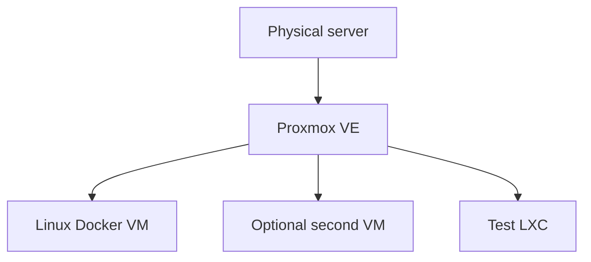
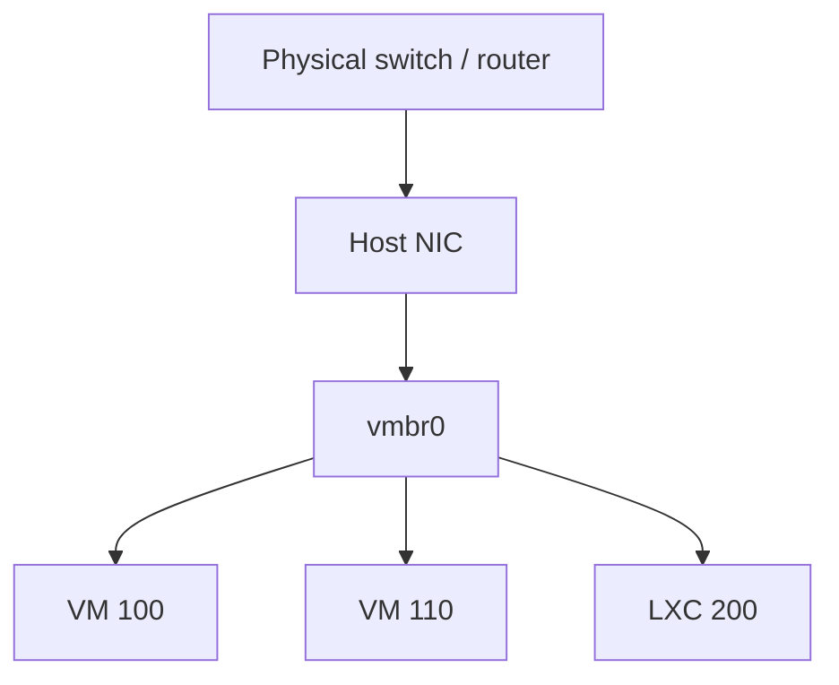

# Class 1 — Virtual machines, hypervisors, and Proxmox

**Build output:** understand Type 1 vs Type 2; run either a laptop VM (VirtualBox) or a dedicated Proxmox host with one Linux VM and one disposable LXC

## What you will learn

You will understand what a virtual machine really is (a full computer living inside another computer), why hypervisors exist, the difference between Type 2 (app-on-your-OS) and Type 1 (OS replaced by the hypervisor), and how to stand up a safe practice box without risking your daily desktop. You will also learn how VMs differ from LXC, how storage and networking attach to guests, and why this Academy puts Docker inside a Linux VM later.

## Vocabulary

| Term | Meaning |
|---|---|
| Host | The real machine (or OS) that owns the hardware |
| Guest | A VM or container that thinks it is “the” computer |
| Hypervisor | Software that creates fake hardware and schedules guests |
| Type 2 hypervisor | App installed on Windows/macOS/Linux (example: VirtualBox) |
| Type 1 hypervisor | Installed on bare metal; the hypervisor *is* the host OS (example: Proxmox VE) |
| KVM/QEMU | Linux virtualization stack used under Proxmox VMs |
| LXC | Linux system container that shares the host kernel |
| ISO | Install-disc image used to install an operating system |
| vCPU | CPU time presented to a guest (scheduled, not always exclusive) |
| Bridge | Virtual switch connecting guests to each other and/or the LAN |
| NAT (guest network) | Guest shares the host’s internet path; often not a full peer on your LAN |
| Bridged (guest network) | Guest gets an address on the real LAN like another PC |
| Snapshot | Freeze-frame of a guest you can restore later |
| Clone | Full copy of a guest for experiments or backup-like recovery |
| `vmbr0` | Common name of Proxmox’s primary Linux bridge |

## Lesson

### What a virtual machine is

Open your laptop. Inside the case sit real parts: CPU, RAM, storage, network chip. An operating system (Windows, macOS, or Linux) sits on top and turns those parts into something you can use.

A **virtual machine** is another complete computer that lives *inside* that setup. It gets virtual CPU, virtual RAM, a virtual disk, and a virtual network card. The guest OS boots, paints a desktop, and runs programs. From the guest’s point of view, it is the only computer in the room. From your point of view, it is software sharing your real hardware.

You do not need a second physical PC just to try Linux, practice networking, or break configuration on purpose. You carve out a slice of what you already own.

### Why you want one

Three reasons show up again and again in real labs:

1. **Safe practice.** Mess up the guest. Delete it. Rebuild it. Your daily host OS stays untouched.
2. **Learn other operating systems.** Run Ubuntu, Debian, a server trial, or a second Windows install without repartitioning your only disk.
3. **Isolation when you experiment.** Labs, scrapers, new stacks, and “what if I change this?” work are safer inside a guest—especially if you keep sharing features (clipboard, folders, bridged LAN) turned down until you need them.

Virtualization is not a toy idea. It is how cloud providers and most serious IT shops pack many systems onto fewer machines. Learning it once pays off for the rest of this Academy.

### Hypervisors: Type 2 vs Type 1

The **hypervisor** is the piece that performs the “computer inside a computer” trick.

| | Type 2 | Type 1 |
|---|---|---|
| Where it lives | App on your existing OS | Installed on the hardware itself |
| Everyday example | VirtualBox on a Windows laptop | Proxmox VE on a spare PC |
| Who owns the hardware | Your host OS shares RAM/CPU with the hypervisor | Hypervisor owns the hardware and feeds guests |
| Best for | Learning on the machine you already use | Always-on labs, more guests, more RAM for VMs |
| Tradeoff | Easy and free; host OS still eats resources | Requires dedicating (or wiping) a machine; more power |

Both types create guests. Type 2 asks the host OS for resources. Type 1 sits closer to the metal and usually gives you more room for bigger labs.

This class supports **both paths**. The Academy’s default for later classes is a **dedicated Proxmox host** (Type 1). If you only have one laptop today, start with **VirtualBox** (Type 2), finish the gate with a working guest, then move Proxmox onto spare hardware when you can.

```text
Type 2 (laptop path)
  Hardware → Windows/macOS/Linux → VirtualBox → Guest OS

Type 1 (Academy default)
  Hardware → Proxmox VE → VM / LXC guests
```

### Firmware: turn on hardware virtualization

Modern guests expect 64-bit virtualization support in the CPU. In firmware (BIOS/UEFI) look for **Intel VT-x / VMX** or **AMD-V / SVM** and set it to **Enabled**. Keys vary by vendor (`Del`, `F2`, `F10`, `F12`). Change only that setting, save, and reboot. Without it, many 64-bit guests will refuse to start or run poorly.

### Path A — Type 2 on your daily computer (VirtualBox)

Use this when you do not yet have a spare PC.

1. Download the guest **ISO** you want (Ubuntu Desktop/Server is a solid first choice). Start the download early; ISOs are large.
2. Install **VirtualBox** for your host OS from the official site. Accept defaults.
3. Install the matching **Extension Pack** if you need USB passthrough and related extras.
4. Create a new VM: name it, choose Linux + a 64-bit Debian/Ubuntu-class type, give it modest RAM (often 2 GB to start on a 8–16 GB host), create a dynamically allocated virtual disk (20 GB+), and assign more than one vCPU only if your host has cores to spare—stay under about half your physical cores.
5. Attach the ISO as the virtual optical drive and start the VM.
6. Install the guest OS. Guided partitioning of the *virtual* disk is safe for your host disk; you are formatting the fake drive, not your Windows/macOS partition.
7. Learn the **host key** (often Right Ctrl on Windows/Linux) so you can release the mouse/keyboard back to the host.

**Power features worth using on day one**

- **Pause** — freeze the guest like pausing a game; resumes where you left off.
- **Save state** — close the guest and reopen later with apps still open.
- **Snapshot** — take a restore point before a risky change; roll back if it breaks.
- **Clone** — duplicate a known-good machine before you thrash a copy.

**Network modes (keep this mental model)**

- **NAT** — guest reaches the internet through the host; it is usually *not* a full peer on your home LAN. Good default for isolation.
- **Bridged** — guest appears on the LAN with its own address. Convenient for SSH from other devices; less isolation.

Clipboard sharing, drag-and-drop, and shared folders are convenient and weaken isolation. Leave them off until you understand the tradeoff.

### Path B — Type 1 on spare hardware (Proxmox VE)

Use this when you have an old laptop/desktop (or a small server) you can dedicate. This is the path later Academy classes assume.

Proxmox replaces the previous OS on that machine. Back up anything you care about first. Prefer a **wired Ethernet** uplink for the host; bridging Wi-Fi is a common pain point.

High-level install flow:

1. Download the current Proxmox VE ISO and write it to USB (on Windows, imaging tools often need **DD mode**, not a naive ISO copy).
2. Boot the target machine from USB (set boot order in firmware if needed).
3. Install Proxmox: accept the license, choose the target disk, set locale, set a strong `root` password, set hostname and management IP/gateway/DNS.
4. Remove the USB, reboot, and open `https://SERVER-IP:8006` from another computer. Trust the self-signed certificate warning for a local lab, or replace the cert later.
5. Ignore the “no subscription” nag if you are on the free/no-subscription path; the hypervisor still works.
6. Upload guest ISOs to storage that allows **ISO image** content.
7. Create a VM, attach the ISO, install Linux, enable SSH.
8. Optionally create an LXC from a template to feel the speed difference.

**Single-disk storage note:** fresh installs sometimes leave usable space split oddly between `local` and `local-lvm`. Before you fill the host with disks, confirm which storage accepts **disk images** and that you have the capacity you expect. Official Proxmox docs cover resizing; do that housecleaning *before* you depend on the box.



### VM vs LXC vs Docker

A **VM** has its own kernel. An **LXC** shares the Proxmox host kernel. That one fact drives most tradeoffs:

| Decision | VM | LXC |
|---|---:|---:|
| Own kernel | Yes | No |
| Windows guest | Yes | No |
| Stronger boundary | Yes | No |
| Lower overhead | No | Yes |
| Full OS flexibility | Yes | Limited to compatible Linux userspace |

**Docker** is an application-container platform. It is not a synonym for VM or LXC. The beginner architecture for this Academy is:

```text
Proxmox → Debian/Ubuntu VM → Docker Engine → applications
```

That avoids nesting Docker inside LXC (and the storage/device headaches that follow) before you understand each layer.

### Resource allocation

vCPUs are scheduled. Four vCPUs does not mean four cores locked forever. **RAM is less forgiving:** the host plus every running guest need real memory. Leave headroom for the hypervisor, disk cache, backups, and spikes. On a laptop Type 2 setup, watch Task Manager / Activity Monitor / `htop` with your normal apps open before you gift the guest huge RAM.

### Storage

Capacity and **content type** are separate. A storage target may allow ISOs, VM disks, container filesystems, backups, or only some of those. Free space on the wrong content type still blocks “Create disk.” Dynamically allocated virtual disks grow as used; fixed disks reserve space up front (sometimes faster, always hungrier).

### Networking on Proxmox

`vmbr0` behaves like a virtual Ethernet switch. Guest NICs attach to the bridge; the bridge attaches to a physical NIC; frames can reach the LAN.



Manage Proxmox from a second device at `https://SERVER-IP:8006`. The management workstation can be Windows, Linux, or macOS.

### Isolation vs convenience (both paths)

The guest is valuable because it is a sandboxed world. Every convenience feature—bridged LAN, shared clipboard, shared folders, USB passthrough—makes the sandbox thinner. For learning and break/fix work, start strict. Open doors on purpose, one at a time, and write down what you changed.

## Guided lab

Pick **one** primary path and finish every step. Path B (Proxmox) is what later Academy classes expect. Path A (VirtualBox) is a valid first finish if you only have one computer today—then schedule Path B before Class 2.

Use the **Windows / Linux** toggle at the top of this class for host commands. Guest Linux commands are the same on both paths once you are inside the VM.

Replace placeholders: `YOUR-IP`, `GUEST-IP`, `YOURUSER`, `proxmox.iso`, `ubuntu.iso`.

### Path B — Proxmox on spare hardware (preferred)

**You need:** a PC/laptop you can wipe, an 8 GB+ USB stick, a network cable to your router/switch, and a second computer with a browser + terminal.

1. **Protect your data first.**
   Proxmox install can erase the disk you select. Unplug extra drives if unsure. Copy anything important off this machine. List disks and write model/size in your workbook:

:::windows
```powershell
Get-Disk | Format-Table Number, FriendlyName, Size, PartitionStyle
Get-Volume | Format-Table DriveLetter, FileSystemLabel, SizeRemaining, Size
```
:::

:::linux
```bash
lsblk -o NAME,SIZE,MODEL,FSTYPE,MOUNTPOINT
df -h
```
:::

2. **Turn on CPU virtualization in firmware.**
   Restart the target PC → enter setup (`Del` / `F2` / `F10` / `F12`) → enable **Intel VT-x / VMX** or **AMD-V / SVM** → save → reboot. Then confirm from the OS you use for downloads:

:::windows
```powershell
systeminfo | findstr /i "Hyper-V Virtualization"
Get-CimInstance Win32_Processor | Select-Object Name, VirtualizationFirmwareEnabled
```
You want firmware virtualization **Yes** / `VirtualizationFirmwareEnabled : True`.
:::

:::linux
```bash
egrep -c '(vmx|svm)' /proc/cpuinfo
# Result should be > 0. Also useful:
lscpu | egrep 'Virtualization|Hypervisor|Flags'
```
:::

3. **Download the Proxmox ISO and write the USB.**
   Download the current Proxmox VE ISO from the official site into a folder you can find (example: Downloads). Identify the USB device letter/name carefully—wrong disk = data loss.

:::windows
Rufus GUI is safest for beginners (select USB → select ISO → mode **DD** → Start).

Optional PowerShell check of removable disks before you write:
```powershell
Get-Disk | Where-Object BusType -eq 'USB' | Format-Table Number, FriendlyName, Size
Get-Volume | Format-Table DriveLetter, FileSystemLabel, DriveType, Size
```
:::

:::linux
```bash
lsblk -o NAME,SIZE,MODEL,TRAN,MOUNTPOINT
# Example only — YOUR USB might be /dev/sdb or /dev/sdc, NOT /dev/sda (usually the main disk)
# Unmount partitions first if mounted, then:
sudo dd if=$HOME/Downloads/proxmox.iso of=/dev/sdX bs=4M status=progress oflag=sync
sync
```
Replace `proxmox.iso` and `/dev/sdX` with your real paths. Triple-check `sdX`.
:::

4. **Boot the spare PC from USB with Ethernet plugged in.**
   Cable into router/switch. Boot menu → USB → **Install Proxmox VE**. No CLI on this step—watch the installer.

5. **Walk the installer and write the network plan before Install.**
   Agree → choose target disk → locale → strong `root` password. Set hostname, static IP (example `192.168.1.50`), gateway, DNS. Copy every value into the workbook, then install. Remove USB and reboot.

6. **Open the web UI, then prove it from the CLI too.**
   Browser: `https://YOUR-IP:8006` → accept the cert warning → login `root`. Close the no-subscription nag if it appears.

:::windows
```powershell
curl.exe -kI https://YOUR-IP:8006
ping -n 3 YOUR-IP
```
:::

:::linux
```bash
curl -kI https://YOUR-IP:8006
ping -c 3 YOUR-IP
```
:::

On the Proxmox host itself (local console or later via SSH as root), also run:
```bash
pveversion
ip -br addr
ip route
cat /etc/network/interfaces
```

7. **Make storage accept VM disks — UI plus verify in shell.**
   UI: **Datacenter → Storage → local → Edit** → enable **Disk image** (+ ISO / Container template) → OK.

   Proxmox host shell (node → **Shell**, or SSH as root):
```bash
pvesm status
pvesm list local
cat /etc/pve/storage.cfg
df -h /var/lib/vz
```
   Confirm `local` is listed and you understand free space. If a single-disk install left capacity stuck on `local-lvm`, follow current Proxmox storage docs before creating guests.

8. **Upload a Linux ISO (UI) and confirm the file on disk.**
   UI: `local` → **ISO Images** → **Upload** (Debian or Ubuntu Server).

   Proxmox shell:
```bash
ls -lh /var/lib/vz/template/iso/
```
   You should see your `.iso` listed.

9. **Create the VM (UI) and verify with `qm`.**
   UI **Create VM**: ID `100`, name `lab-linux-01`, ISO from local, Linux, disk 20–32 GB, 2 vCPU, 2048–4096 MB RAM, NIC bridge `vmbr0` VirtIO → Finish.

   Proxmox shell:
```bash
qm config 100
qm list
qm start 100
qm status 100
```

10. **Install Linux in the console, then enable SSH from the guest.**
    UI: select VM → **Console** → install OS (virtual disk only). Prefer enabling OpenSSH during Ubuntu Server install. If you skipped it, after first login inside the guest:
```bash
sudo apt update
sudo apt install -y openssh-server
sudo systemctl enable --now ssh
sudo systemctl status ssh --no-pager
```

11. **Prove the guest network from inside the VM.**
    Guest terminal:
```bash
ip -br addr
ip route
ping -c 3 1.1.1.1
ping -c 3 $(ip route | awk '/default/ {print $3; exit}')
getent hosts example.com
hostname -I
```
    Write down `GUEST-IP`. If `1.1.1.1` works but `example.com` fails, fix DNS—do not reinstall.

12. **SSH in from your workstation.**

:::windows
Windows 10/11 usually includes OpenSSH. In PowerShell or CMD:
```powershell
ssh YOURUSER@GUEST-IP
```
First connect: type `yes` to trust the host key. If `ssh` is missing:
```powershell
Add-WindowsCapability -Online -Name OpenSSH.Client~~~~0.0.1.0
```
:::

:::linux
```bash
ssh YOURUSER@GUEST-IP
# Optional connectivity checks first:
ping -c 2 GUEST-IP
nc -vz GUEST-IP 22
```
:::

    Inside the SSH session, re-run `hostname` and `ip -br addr` to prove you are on the guest.

13. **Create an LXC and compare with CLI.**
    UI: download a Debian CT template → **Create CT** ID `200`, hostname `lab-ct-01`, 8 GB disk, 1 CPU, 1024 MB, `vmbr0`.

    Proxmox shell:
```bash
pveam update
pveam available | head
pct list
pct start 200
pct status 200
pct enter 200
```
    Inside the CT (and separately in the VM), run:
```bash
free -h
uname -a
uptime
```
    Type `exit` to leave `pct enter`. Note: CT `uname` matches the **host** kernel; VM `uname` is its own.

14. **Snapshot, change a file with CLI, roll back, prove it.**
    Proxmox shell (VM should be stopped for a clean snapshot on many setups):
```bash
qm shutdown 100
qm status 100
qm snapshot 100 before-break --description "class1 gate"
qm listsnapshot 100
qm start 100
```
    In the guest (console or SSH):
```bash
echo "break-me" > /tmp/DELETE-ME
cat /tmp/DELETE-ME
ls -l /tmp/DELETE-ME
```
    Then roll back:
```bash
qm shutdown 100
qm rollback 100 before-break
qm start 100
```
    Guest again:
```bash
ls /tmp/DELETE-ME || echo "GOOD: file gone after rollback"
```
    Record snapshot name `before-break` in the workbook.

### Path A — VirtualBox on your daily computer (acceptable first finish)

**You need:** your everyday PC, ~20 GB free disk, VirtualBox, and a terminal. This path does **not** wipe your host OS.

1. **Turn on CPU virtualization, then verify in the terminal.**
   Firmware: enable VT-x / AMD-V, save, boot to desktop.

:::windows
```powershell
systeminfo | findstr /i "Virtualization"
Get-CimInstance Win32_Processor | Select-Object VirtualizationFirmwareEnabled
```
:::

:::linux
```bash
egrep -c '(vmx|svm)' /proc/cpuinfo
```
:::

2. **Install VirtualBox and confirm the CLI works.**
   Install VirtualBox (+ Extension Pack) from the official site. Then:

:::windows
```powershell
& "C:\Program Files\Oracle\VirtualBox\VBoxManage.exe" --version
& "C:\Program Files\Oracle\VirtualBox\VBoxManage.exe" list extpacks
```
If that path fails, open a prompt from the VirtualBox install folder, or add it to PATH.
:::

:::linux
```bash
VBoxManage --version
VBoxManage list extpacks
```
:::

   Also start downloading your Ubuntu/Debian ISO while this installs.

3. **Create the VM with the GUI or with `VBoxManage`.**
   GUI: **New** → name `lab-linux-01`, Linux 64-bit, 2048 MB RAM, VDI dynamic ≥20 GB → then Settings → System → Processor → 2 CPUs if host has ≥4 cores.

   Or create from CLI (adjust ISO path and memory):

:::windows
```powershell
$VB = "C:\Program Files\Oracle\VirtualBox\VBoxManage.exe"
& $VB createvm --name "lab-linux-01" --ostype "Ubuntu_64" --register
& $VB modifyvm "lab-linux-01" --memory 2048 --cpus 2 --nic1 nat --vram 16
& $VB createhd --filename "$env:USERPROFILE\VirtualBox VMs\lab-linux-01\lab-linux-01.vdi" --size 20480 --format VDI
& $VB storagectl "lab-linux-01" --name "SATA" --add sata --controller IntelAhci
& $VB storageattach "lab-linux-01" --storagectl "SATA" --port 0 --device 0 --type hdd --medium "$env:USERPROFILE\VirtualBox VMs\lab-linux-01\lab-linux-01.vdi"
& $VB storageattach "lab-linux-01" --storagectl "SATA" --port 1 --device 0 --type dvddrive --medium "$env:USERPROFILE\Downloads\ubuntu.iso"
& $VB list vms
```
:::

:::linux
```bash
VBoxManage createvm --name "lab-linux-01" --ostype "Ubuntu_64" --register
VBoxManage modifyvm "lab-linux-01" --memory 2048 --cpus 2 --nic1 nat --vram 16
mkdir -p "$HOME/VirtualBox VMs/lab-linux-01"
VBoxManage createhd --filename "$HOME/VirtualBox VMs/lab-linux-01/lab-linux-01.vdi" --size 20480 --format VDI
VBoxManage storagectl "lab-linux-01" --name "SATA" --add sata --controller IntelAhci
VBoxManage storageattach "lab-linux-01" --storagectl "SATA" --port 0 --device 0 --type hdd --medium "$HOME/VirtualBox VMs/lab-linux-01/lab-linux-01.vdi"
VBoxManage storageattach "lab-linux-01" --storagectl "SATA" --port 1 --device 0 --type dvddrive --medium "$HOME/Downloads/ubuntu.iso"
VBoxManage list vms
```
:::

4. **Start the VM and install the guest OS.**

:::windows
```powershell
& "C:\Program Files\Oracle\VirtualBox\VBoxManage.exe" startvm "lab-linux-01" --type gui
```
:::

:::linux
```bash
VBoxManage startvm "lab-linux-01" --type gui
```
:::

   Complete the installer in the window. Virtual disk wipe ≠ host wipe. Host key to release mouse: **Right Ctrl**. After install, detach the ISO if it keeps booting the installer:

:::windows
```powershell
& "C:\Program Files\Oracle\VirtualBox\VBoxManage.exe" storageattach "lab-linux-01" --storagectl "SATA" --port 1 --device 0 --type dvddrive --medium none
```
:::

:::linux
```bash
VBoxManage storageattach "lab-linux-01" --storagectl "SATA" --port 1 --device 0 --type dvddrive --medium none
```
:::

5. **Prove internet from the guest with ping.**
   Inside the Linux guest terminal:
```bash
ping -c 3 1.1.1.1
ip -br addr
ip route
```
   From the **host**, you can also check the VM is running:

:::windows
```powershell
& "C:\Program Files\Oracle\VirtualBox\VBoxManage.exe" showvminfo "lab-linux-01" --machinereadable | findstr /i "VMState= nic1"
ping -n 3 1.1.1.1
```
:::

:::linux
```bash
VBoxManage showvminfo "lab-linux-01" --machinereadable | egrep 'VMState=|nic1='
ping -c 3 1.1.1.1
```
:::

6. **Pause and save-state from the GUI or CLI.**

:::windows
```powershell
$VB = "C:\Program Files\Oracle\VirtualBox\VBoxManage.exe"
& $VB controlvm "lab-linux-01" pause
& $VB controlvm "lab-linux-01" resume
& $VB controlvm "lab-linux-01" savestate
& $VB startvm "lab-linux-01" --type gui
```
:::

:::linux
```bash
VBoxManage controlvm "lab-linux-01" pause
VBoxManage controlvm "lab-linux-01" resume
VBoxManage controlvm "lab-linux-01" savestate
VBoxManage startvm "lab-linux-01" --type gui
```
:::

7. **Snapshot, break a file, restore.**

:::windows
```powershell
$VB = "C:\Program Files\Oracle\VirtualBox\VBoxManage.exe"
& $VB snapshot "lab-linux-01" take "before-break" --description "class1"
```
:::

:::linux
```bash
VBoxManage snapshot "lab-linux-01" take "before-break" --description "class1"
```
:::

   Inside the guest:
```bash
mkdir -p ~/DELETE-ME
echo test > ~/DELETE-ME/note.txt
ls ~/DELETE-ME
```
   Shut down the guest, then restore:

:::windows
```powershell
$VB = "C:\Program Files\Oracle\VirtualBox\VBoxManage.exe"
& $VB controlvm "lab-linux-01" acpipowerbutton
# wait until powered off, then:
& $VB snapshot "lab-linux-01" restore "before-break"
& $VB startvm "lab-linux-01" --type gui
```
:::

:::linux
```bash
VBoxManage controlvm "lab-linux-01" acpipowerbutton
# wait until powered off, then:
VBoxManage snapshot "lab-linux-01" restore "before-break"
VBoxManage startvm "lab-linux-01" --type gui
```
:::

   Guest check: `ls ~/DELETE-ME` should fail (folder gone).

8. **Inspect NAT vs bridged with CLI.**

:::windows
```powershell
& "C:\Program Files\Oracle\VirtualBox\VBoxManage.exe" showvminfo "lab-linux-01" | findstr /i "NIC 1"
```
:::

:::linux
```bash
VBoxManage showvminfo "lab-linux-01" | egrep -i 'NIC 1'
```
:::

   Guest: `ip -br addr`. NAT often shows `10.0.2.x`. Bridged usually matches your LAN. Leave NAT unless you need LAN SSH.

9. **Record evidence (workbook + command output).**

:::windows
```powershell
& "C:\Program Files\Oracle\VirtualBox\VBoxManage.exe" --version
& "C:\Program Files\Oracle\VirtualBox\VBoxManage.exe" showvminfo "lab-linux-01" --machinereadable | findstr /i "name= memory= cpus= VMState= nic1"
& "C:\Program Files\Oracle\VirtualBox\VBoxManage.exe" snapshot "lab-linux-01" list
```
:::

:::linux
```bash
VBoxManage --version
VBoxManage showvminfo "lab-linux-01" --machinereadable | egrep 'name=|memory=|cpus=|VMState=|nic1='
VBoxManage snapshot "lab-linux-01" list
```
:::

   Paste version, RAM, CPUs, NIC mode, and snapshot name into the workbook.

10. **Plan Path B before Class 2.**
    Write spare-PC plan + USB + Ethernet. Quick reachability test you will use later:

:::windows
```powershell
# After Proxmox exists:
curl.exe -kI https://PROXMOX-IP:8006
```
:::

:::linux
```bash
# After Proxmox exists:
curl -kI https://PROXMOX-IP:8006
```
:::

## Break it, then fix it

### Network break

Break one thing, then repair with commands.

**VirtualBox — disable NIC, watch ping fail, re-enable NAT:**

:::windows
```powershell
$VB = "C:\Program Files\Oracle\VirtualBox\VBoxManage.exe"
& $VB controlvm "lab-linux-01" nic1 null
# in guest: ping -c 2 1.1.1.1  (should fail)
& $VB controlvm "lab-linux-01" nic1 nat
# in guest: ping -c 2 1.1.1.1  (should work)
```
:::

:::linux
```bash
VBoxManage controlvm "lab-linux-01" nic1 null
# guest: ping -c 2 1.1.1.1
VBoxManage controlvm "lab-linux-01" nic1 nat
# guest: ping -c 2 1.1.1.1
```
:::

**Proxmox — wrong bridge then fix (host shell):**
```bash
qm config 100 | grep -i net
qm set 100 --delete net0
# guest loses link — then restore:
qm set 100 --net0 virtio,bridge=vmbr0
qm config 100 | grep -i net
```

Guest proof order (run after each change):
```bash
ip -br link
ip -br addr
ip route
ping -c 2 1.1.1.1
getent hosts example.com
```

### Snapshot break

Create a visible file, roll back, prove it vanished (Path B `qm rollback` or Path A `VBoxManage snapshot … restore` from the lab above). Do not continue until `ls` shows the file is gone.

## Common mistakes

- Installing a Type 1 hypervisor onto the only copy of important data.
- Giving one guest nearly all RAM and starving the host (or your browser).
- Treating snapshots as independent off-box backups.
- Assuming LXC and Docker are the same thing.
- Using Wi-Fi as the default Proxmox uplink without understanding bridge limits.
- Turning on bridged networking, shared folders, and clipboard sharing all at once “for convenience.”
- Changing IP, bridge, firewall, and DNS simultaneously during diagnosis.
- Skipping firmware virtualization and blaming the ISO when 64-bit guests fail.

## Knowledge check

1. In plain words, what is a virtual machine?
2. What is the difference between a host and a guest?
3. How does a Type 2 hypervisor differ from a Type 1 hypervisor?
4. Which guest type normally has its own kernel: VM or LXC?
5. What does `vmbr0` behave like on Proxmox?
6. Why is a successful ping to `1.1.1.1` but failed hostname lookup useful?
7. Why does this course put Docker in a Linux VM instead of nesting it in LXC on day one?
8. Name one benefit and one risk of bridged networking versus NAT.
9. What problem do snapshots solve that “just reinstall” is too slow for?

## Practical gate

- [ ] You can explain Type 1 vs Type 2 without reading notes.
- [ ] Firmware virtualization (VT-x or AMD-V) is enabled on the machine you use for guests.
- [ ] A guest OS boots and you can log in (VirtualBox **or** Proxmox VM).
- [ ] You demonstrated pause/save-state **or** a Proxmox start/stop cycle and recorded it.
- [ ] You took a snapshot (or Proxmox snapshot), changed something, restored, and proved it.
- [ ] Gateway, internet IP, and DNS tests pass independently on the guest (or you documented the exact failing layer).
- [ ] If on Proxmox: UI reachable at the recorded address, SSH to the VM works, and you can explain physical NIC → bridge → guest NIC.
- [ ] If on VirtualBox only: workbook includes a dated plan for moving to Proxmox before Class 2 labs that need it.

## 2026 correction

Use current official VirtualBox and Proxmox documentation for installer screens, Extension Pack pairing, and supported versions. Video walkthroughs age; the model (host/guest, Type 1 vs Type 2, snapshot discipline, NAT vs bridge) stays. Prefer current ISOs and release notes over any year-stamped screenshot.
