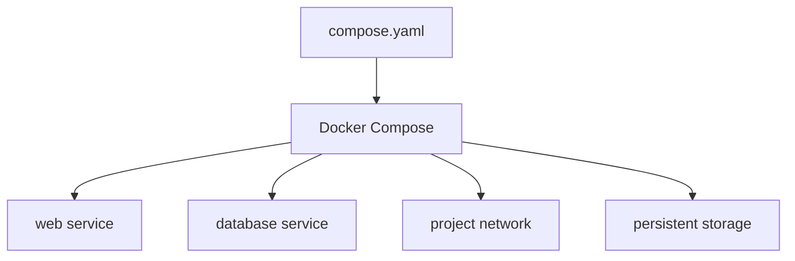

# Class 2 — Docker Compose and Persistent Applications

**Lecture:** [NetworkChuck — Docker Compose](https://www.youtube.com/watch?v=DM65_JyGxCo)  
**Time:** 120 minutes  
**Build output:** a repeatable Compose project that survives recreation

## Outcomes and vocabulary

You will distinguish image, container, registry, service, volume, and bind mount; read YAML; convert `docker run` intent into Compose; manage environment values; publish ports; add healthchecks; and prove data persistence.

| Term | Meaning |
|---|---|
| Image | Immutable application filesystem and metadata |
| Container | Running or stopped instance created from an image |
| Registry | Image distribution service |
| Compose project | Related services described in one YAML model |
| Bind mount | Host path mapped into a container |
| Named volume | Docker-managed persistent storage |
| Environment variable | Runtime configuration passed as key/value data |
| Port publish | Mapping from host port to container port |
| Healthcheck | Command that reports application readiness/health |

## Lesson

A long `docker run` command records configuration only in shell history and human memory. Compose stores the desired state in a file that can be reviewed, versioned without secrets, validated, and redeployed.



YAML uses indentation to express structure. Spaces matter; tabs and misalignment can change or invalidate the model. A minimal service declares an image, name or project identity, restart behavior, storage, networks, ports, and environment.

```yaml
services:
  demo:
    image: nginx:stable
    ports:
      - "8080:80"
    restart: unless-stopped
```

The left side of `8080:80` is the host port; the right side is the port inside the container.

### Persistence

Containers are replaceable. Persistent state must live outside the writable container layer.

```yaml
services:
  app:
    image: example/app:1.2.3
    volumes:
      - ./config:/config
```

Destroying and recreating the container should not destroy `./config`. This is a requirement to test, not an assumption.

### Paths and identity

Linux container processes use numeric user and group IDs. A container can see a bind-mounted path yet fail to write if the host permissions do not match the container identity. Record PUID/PGID or equivalent ownership decisions in the service contract.

Windows students should run the production-like lab inside the Linux VM from Class 1. Windows path syntax, Desktop file sharing, WSL filesystems, and case sensitivity add variables that distract from the container model.

### Secrets

An `.env` file can reduce repetition, but it is not encryption. Do not commit API keys, passwords, or tunnel tokens. Prefer purpose-built secrets mechanisms where supported, restrict file permissions, and keep a safe recovery record.

### Lifecycle

```bash
docker compose config
docker compose pull
docker compose up -d
docker compose ps
docker compose logs --tail=100
docker compose down
```

`config` validates and renders the model. `pull` downloads declared images. `up -d` reconciles running resources to the file. `down` removes project containers and networks; adding `-v` can remove volumes and is therefore not used casually.

## Guided lab

**Where to run:** Prefer the Linux VM from Class 1 (or a Linux Docker host). Docker Desktop on Windows works for this class’s CLI, but later ARR path labs assume Linux paths.

Create a project folder and the files below. Use the OS toggle for host commands.

### Setup — create the project files

1. **Make the lab directory and Compose file.**

:::windows
```powershell
mkdir $HOME\compose-lab\site -Force
cd $HOME\compose-lab
@'
name: compose-lab
services:
  web:
    image: nginx:stable
    ports:
      - "8080:80"
    volumes:
      - ./site:/usr/share/nginx/html:ro
    restart: unless-stopped
    healthcheck:
      test: ["CMD", "curl", "-f", "http://localhost/"]
      interval: 30s
      timeout: 5s
      retries: 3
'@ | Set-Content -Encoding utf8 compose.yaml
@'
<!doctype html><title>compose-lab</title>
<h1>Otaconskeep compose-lab UNIQUE-PHRASE-001</h1>
'@ | Set-Content -Encoding utf8 site\index.html
Get-ChildItem -Recurse
```
If the image healthcheck fails because `curl` is missing in nginx, edit `compose.yaml` and replace the healthcheck with:
```yaml
    healthcheck:
      test: ["CMD", "wget", "-qO-", "http://localhost/"]
```
or remove the healthcheck for this learning lab and note that in the workbook.
:::

:::linux
```bash
mkdir -p ~/compose-lab/site
cd ~/compose-lab
cat > compose.yaml <<'YAML'
name: compose-lab
services:
  web:
    image: nginx:stable
    ports:
      - "8080:80"
    volumes:
      - ./site:/usr/share/nginx/html:ro
    restart: unless-stopped
    healthcheck:
      test: ["CMD", "curl", "-f", "http://localhost/"]
      interval: 30s
      timeout: 5s
      retries: 3
YAML
printf '%s\n' '<!doctype html><title>compose-lab</title>' \
  '<h1>Otaconskeep compose-lab UNIQUE-PHRASE-001</h1>' > site/index.html
ls -la site
```
If healthcheck fails for missing `curl`, switch the test to `wget -qO- http://localhost/` or remove healthcheck and document it.
:::

2. **Validate the Compose model before starting anything.**

:::windows
```powershell
cd $HOME\compose-lab
docker compose config
docker compose config --quiet
```
:::

:::linux
```bash
cd ~/compose-lab
docker compose config
docker compose config --quiet && echo CONFIG_OK
```
:::

   Fix any YAML/indent errors until `config` exits 0.

3. **Start the stack and confirm the container is up.**

:::windows
```powershell
docker compose up -d
docker compose ps
docker compose logs --tail=50 web
```
:::

:::linux
```bash
docker compose up -d
docker compose ps
docker compose logs --tail=50 web
```
:::

4. **Hit the published port from the host.**

:::windows
```powershell
curl.exe -I http://127.0.0.1:8080/
curl.exe -s http://127.0.0.1:8080/ | findstr UNIQUE-PHRASE
```
:::

:::linux
```bash
curl -I http://127.0.0.1:8080/
curl -s http://127.0.0.1:8080/ | grep UNIQUE-PHRASE
```
:::

   Also open `http://DOCKER-HOST:8080` in a browser if the host is remote. Record the URL in the workbook.

5. **Prove the bind mount: edit the host file, refresh, see the change.**

:::windows
```powershell
(Get-Content site\index.html) -replace 'UNIQUE-PHRASE-001','UNIQUE-PHRASE-002' | Set-Content site\index.html
curl.exe -s http://127.0.0.1:8080/ | findstr UNIQUE-PHRASE
```
:::

:::linux
```bash
sed -i 's/UNIQUE-PHRASE-001/UNIQUE-PHRASE-002/' site/index.html
curl -s http://127.0.0.1:8080/ | grep UNIQUE-PHRASE
```
:::

6. **Recreate the container and prove content survives.**

:::windows
```powershell
docker compose down
docker compose up -d
curl.exe -s http://127.0.0.1:8080/ | findstr UNIQUE-PHRASE-002
docker compose ps
```
:::

:::linux
```bash
docker compose down
docker compose up -d
curl -s http://127.0.0.1:8080/ | grep UNIQUE-PHRASE-002
docker compose ps
```
:::

7. **Capture evidence for the gate.**

:::windows
```powershell
docker compose ps
docker inspect --format "{{.State.Health.Status}}" $(docker compose ps -q web)
docker compose logs --tail=20 web
```
:::

:::linux
```bash
docker compose ps
docker inspect --format '{{.State.Health.Status}}' "$(docker compose ps -q web)"
docker compose logs --tail=20 web
```
:::

### ARR path design preview

Later classes use one shared data tree so downloaders and importers see the same files:

```text
/data
  /torrents
  /usenet
  /media
    /movies
    /tv
```

Avoid unrelated mounts such as `/downloads` in one container and `/incoming` in another unless you fully understand remote paths and hardlinks.

## Break/fix

Perform these faults **one at a time**. Restore before the next fault.

1. **Port already in use.** Change `"8080:80"` to a port your host already uses (or start a second compose on 8080). Read the bind error, restore 8080.

:::windows
```powershell
docker compose up -d
# read error, then fix compose.yaml and:
docker compose up -d
```
:::

:::linux
```bash
# After editing the port wrongly:
docker compose up -d
# restore port, then:
docker compose up -d
```
:::

2. **YAML indentation error.** Break indent under `services:`, run `docker compose config`, fix from the error line.

3. **Permission denied on a writable mount.** Create `./writable`, mount it read-write, `chmod 000 writable` (Linux) or remove write ACL (Windows), recreate, read logs, restore permissions only.

:::linux
```bash
mkdir -p writable && chmod 000 writable
# after observing failure:
chmod 755 writable
```
:::

4. **Image tag change + rollback.** Record current tag `nginx:stable`, change to another explicit tag, `pull` + `up -d`, verify, then restore `nginx:stable` and prove the page still loads.

## Knowledge check

1. Why should persistent data not remain only in the container layer?
2. In `8080:80`, which is the host port?
3. What does `docker compose config` prove?
4. Is `.env` encryption?
5. What is the difference between an image and a container?
6. Why can a mounted directory be visible but not writable?

## Practical gate

- [ ] Compose validates.
- [ ] The service is reachable on the documented host port.
- [ ] Configuration/content survives `down` and `up`.
- [ ] Logs and health status can be retrieved.
- [ ] The student can identify every mount's host and container side.
- [ ] No real secret is stored in a tracked course file.

## 2026 correction

Use `docker compose` (Compose v2 plugin) in current environments. Old tutorials may use the standalone `docker-compose` command or obsolete schema keys. Validate against current Docker Compose documentation.

