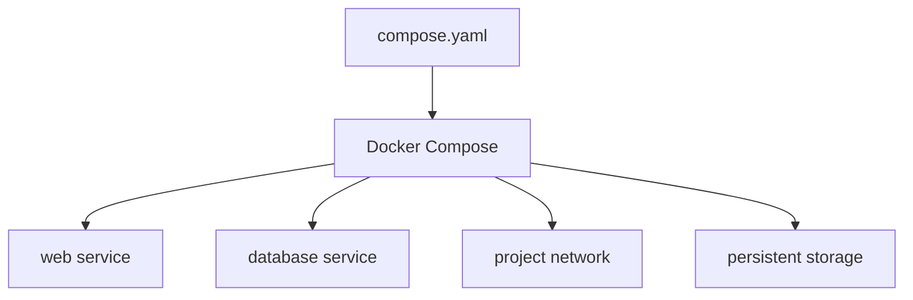

# Class 2 — Docker Compose and Persistent Applications

**Lecture:** [NetworkChuck — Docker Compose](https://www.youtube.com/watch?v=DM65_JyGxCo)  
**Time:** 120 minutes  
**Build output:** a repeatable Compose project that survives recreation

## Outcomes and vocabulary

You will distinguish image, container, registry, service, volume, and bind mount; read YAML; convert `docker run` intent into Compose; manage environment values; publish ports; add healthchecks; and prove data persistence.

| Term | Meaning |
|---|---|
| Image | Immutable application filesystem and metadata |
| Container | Running or stopped instance created from an image |
| Registry | Image distribution service |
| Compose project | Related services described in one YAML model |
| Bind mount | Host path mapped into a container |
| Named volume | Docker-managed persistent storage |
| Environment variable | Runtime configuration passed as key/value data |
| Port publish | Mapping from host port to container port |
| Healthcheck | Command that reports application readiness/health |

## Lesson

A long `docker run` command records configuration only in shell history and human memory. Compose stores the desired state in a file that can be reviewed, versioned without secrets, validated, and redeployed.



YAML uses indentation to express structure. Spaces matter; tabs and misalignment can change or invalidate the model. A minimal service declares an image, name or project identity, restart behavior, storage, networks, ports, and environment.

```yaml
services:
  demo:
    image: nginx:stable
    ports:
      - "8080:80"
    restart: unless-stopped
```

The left side of `8080:80` is the host port; the right side is the port inside the container.

### Persistence

Containers are replaceable. Persistent state must live outside the writable container layer.

```yaml
services:
  app:
    image: example/app:1.2.3
    volumes:
      - ./config:/config
```

Destroying and recreating the container should not destroy `./config`. This is a requirement to test, not an assumption.

### Paths and identity

Linux container processes use numeric user and group IDs. A container can see a bind-mounted path yet fail to write if the host permissions do not match the container identity. Record PUID/PGID or equivalent ownership decisions in the service contract.

Windows students should run the production-like lab inside the Linux VM from Class 1. Windows path syntax, Desktop file sharing, WSL filesystems, and case sensitivity add variables that distract from the container model.

### Secrets

An `.env` file can reduce repetition, but it is not encryption. Do not commit API keys, passwords, or tunnel tokens. Prefer purpose-built secrets mechanisms where supported, restrict file permissions, and keep a safe recovery record.

### Lifecycle

```bash
docker compose config
docker compose pull
docker compose up -d
docker compose ps
docker compose logs --tail=100
docker compose down
```

`config` validates and renders the model. `pull` downloads declared images. `up -d` reconciles running resources to the file. `down` removes project containers and networks; adding `-v` can remove volumes and is therefore not used casually.

## Guided lab

Create a directory containing this safe learning project:

```yaml
name: compose-lab
services:
  web:
    image: nginx:stable
    ports:
      - "8080:80"
    volumes:
      - ./site:/usr/share/nginx/html:ro
    restart: unless-stopped
    healthcheck:
      test: ["CMD", "curl", "-f", "http://localhost/"]
      interval: 30s
      timeout: 5s
      retries: 3
```

Create `site/index.html` containing a unique lab phrase. If the image lacks the healthcheck command, replace the healthcheck with one supported by the selected image rather than declaring the application broken.

1. Run `docker compose config` and resolve all warnings/errors.
2. Run `docker compose up -d`.
3. Visit `http://DOCKER-HOST:8080`.
4. Record `docker compose ps` and the health state.
5. Edit the host file and refresh the browser to prove the bind mount.
6. Run `docker compose down`, then `docker compose up -d`.
7. Prove the unique content remains.

### ARR path design preview

The later stack uses consistent paths so the downloader and importers describe the same files the same way:

```text
/data
  /torrents
  /usenet
  /media
    /movies
    /tv
```

Avoid separate, unrelated mounts such as `/downloads` in one container and `/incoming` in another. They can be mapped correctly, but beginners often create remote-path and hardlink problems.

## Break/fix

Perform these faults one at a time:

1. Change the published host port to one already in use. Read the bind error and restore it.
2. Introduce one indentation error. Use `docker compose config` to locate it.
3. Remove write permission from a test writable directory. Observe the application log, inspect numeric ownership, then restore only the required access.
4. Change an image tag, pull, recreate, verify, then roll back to the recorded prior tag.

## Knowledge check

1. Why should persistent data not remain only in the container layer?
2. In `8080:80`, which is the host port?
3. What does `docker compose config` prove?
4. Is `.env` encryption?
5. What is the difference between an image and a container?
6. Why can a mounted directory be visible but not writable?

## Practical gate

- [ ] Compose validates.
- [ ] The service is reachable on the documented host port.
- [ ] Configuration/content survives `down` and `up`.
- [ ] Logs and health status can be retrieved.
- [ ] The student can identify every mount's host and container side.
- [ ] No real secret is stored in a tracked course file.

## 2026 correction

Use `docker compose` (Compose v2 plugin) in current environments. Old tutorials may use the standalone `docker-compose` command or obsolete schema keys. Validate against current Docker Compose documentation.

