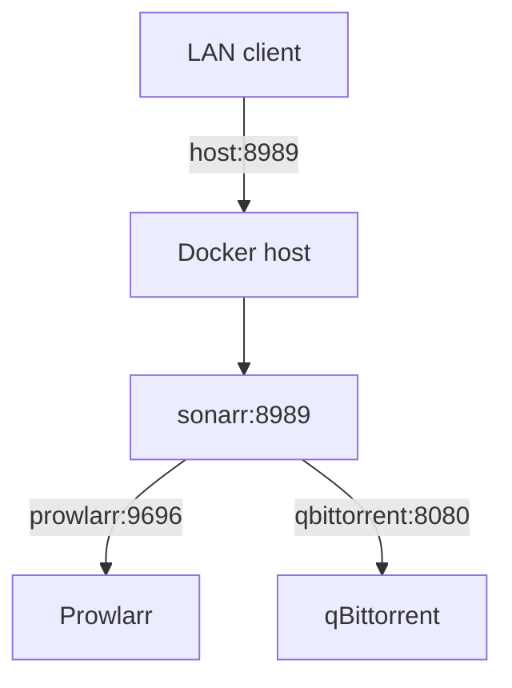

# Class 3 — Docker Networking for the ARR Stack

**Lecture (optional):** [NetworkChuck — Docker Networking](https://www.youtube.com/watch?v=bKFMS5C4CG0)
**Time:** 120–150 minutes
**Learning objective:** Given two Compose services, the learner can place them on an isolated user-defined network, call one service by DNS name from the other, and explain host-port publish versus container-to-container traffic.
**Bloom level:** Analyze
**Build output:** isolated application network with DNS-based calls
**Mastery unlock:** ≥80% retrieval target when scored + completed Feynman teach-back + independent practice + all practical gate boxes + workbook evidence.

## Learning objective

Given two Compose services, the learner can place them on an isolated user-defined network, call one service by DNS name from the other, and explain host-port publish versus container-to-container traffic.

## Why this matters

Wrong networking is the #1 silent failure in ARR and Home Assistant stacks: ‘it works in the browser on the host’ but containers cannot see each other — or everything is published to the LAN by accident.

## Prior-knowledge check

Answer briefly before reading Instruction. Wrong answers are useful — they show what to review.

1. What does a port number identify?
2. What is DNS used for?
3. If two containers share a Docker network, do they need published host ports to talk to each other?

## Vocabulary

_Add terms as you encounter them in Instruction._

## Instruction

### Originally: Outcomes

You will understand default and user-defined bridges, embedded DNS, port publishing, host networking, `none`, MACVLAN, IPVLAN, overlay networks, and why the ARR stack normally starts with a user-defined bridge.

### Core model

Docker networking has two separate jobs:

1. Let containers communicate with each other.
2. Decide which services are reachable from the host or other networks.



Inside a container, `localhost` means that container. Sonarr calling `localhost:9696` attempts to reach Sonarr, not Prowlarr. On a user-defined bridge, call `http://prowlarr:9696` using the Compose service name.

### Drivers

| Driver/mode | Purpose | Beginner position |
|---|---|---|
| Default bridge | Legacy automatic network | Understand, but do not build the stack around it |
| User-defined bridge | Single-host application networking with DNS | Default for the course |
| Host | Shares host network namespace | Use only with a documented reason |
| None | No external networking | Useful for isolation tests |
| MACVLAN | Gives containers LAN-facing MAC/IP identities | Advanced; switch/AP behavior matters |
| IPVLAN | Alternative L2/L3 attachment model | Advanced routing design |
| Overlay | Multi-host/swarm networking | Not required for one Docker host |

User-defined bridges provide predictable grouping and automatic name resolution. Port publishing is still needed for LAN users to access a service, but container-to-container calls do not need a published host port when both services share the network.

### Exposure and isolation

Do not publish every internal service simply because you can. A database used only by one application can remain reachable only on its Docker network. ARR web interfaces normally remain LAN-only or VPN-protected.

## Worked example

**I do** — study the reasoning, not just the final answer.

**Bad:** Publish every container port to `0.0.0.0` on the host and point services at `localhost`.

**Better:** Put related services on `media_net` (or similar), use service DNS names for container-to-container calls, and publish host ports only for the UIs you intentionally open.

## Guided practice

**We do** — hints allowed. Check your reasoning against Instruction.

With the lesson open, trace one packet path: browser → host port → container A → DNS name → container B. Label each hop.

## Independent practice

**You do** — close the hints. Solve before opening the lab.

Design a tiny two-service Compose network. Write the exact URL/hostname each side should use. Predict what breaks if you remove the shared network.

## Feynman teach-back

Required. Do not skip.

### Explain
Describe **Docker networks, DNS service discovery, and why localhost inside a container is not your PC** in your own words. No copying the lesson verbatim.

### Simplify
Explain the same idea to a 12-year-old. If you use a technical word, define it.

### Example
Analogy: apartment intercoms (container DNS) vs listing your home phone number on a billboard (publishing ports).

### Weak spot
What part was hard to explain? That is where your understanding is thin.

### Retry
Return to that part of **Instruction**, restudy it, then rewrite a clearer explanation below.

> Mastery note: a completed Feynman teach-back is required before the next class unlocks — “I get it” without explanation does not count.


## Retrieval check

Active recall — write answers without rereading first. Target ≥80% before the gate.

1. What does `localhost` mean inside Sonarr's container?
2. Why is a user-defined bridge better than the legacy default for a Compose stack?
3. Does container-to-container traffic require a published host port?
4. When is overlay networking relevant?
5. Why is host networking not a harmless troubleshooting switch?

## Guided lab

**Where to run:** Docker host from Class 2 (Linux VM preferred).

### Setup — two containers on one user-defined bridge

1. **Create the network lab project.**

:::windows
```powershell
mkdir $HOME\network-lab -Force
cd $HOME\network-lab
@'
name: network-lab
services:
  responder:
    image: nginx:stable
    networks: [media_net]
  tester:
    image: curlimages/curl:latest
    command: ["sleep", "infinity"]
    networks: [media_net]
networks:
  media_net:
    name: media_net
'@ | Set-Content -Encoding utf8 compose.yaml
docker compose config
docker compose up -d
docker compose ps
```
:::

:::linux
```bash
mkdir -p ~/network-lab && cd ~/network-lab
cat > compose.yaml <<'YAML'
name: network-lab
services:
  responder:
    image: nginx:stable
    networks: [media_net]
  tester:
    image: curlimages/curl:latest
    command: ["sleep", "infinity"]
    networks: [media_net]
networks:
  media_net:
    name: media_net
YAML
docker compose config
docker compose up -d
docker compose ps
```
:::

2. **Prove DNS + HTTP by service name (no published host port required).**

:::windows
```powershell
docker compose exec tester getent hosts responder
docker compose exec tester curl -sI http://responder:80
docker network inspect media_net --format "{{json .Containers}}"
```
:::

:::linux
```bash
docker compose exec tester getent hosts responder
docker compose exec tester curl -sI http://responder:80
docker network inspect media_net
docker network inspect media_net -f '{{range .Containers}}{{.Name}} {{.IPv4Address}}{{"\n"}}{{end}}'
```
:::

   Expected: `responder` resolves and `HTTP/1.1 200` (or similar) returns even though nothing is published to the LAN yet.

3. **Show why `localhost` inside tester is wrong for reaching responder.**

:::windows
```powershell
docker compose exec tester curl -sI http://localhost:80
# Expect failure — localhost is the tester container itself, not responder.
```
:::

:::linux
```bash
docker compose exec tester curl -sI --max-time 3 http://127.0.0.1:80 || echo "EXPECTED_FAIL localhost"
```
:::

4. **Publish a host port and compare internal vs external access.**  
   Edit responder to add:
```yaml
    ports:
      - "8081:80"
```
   Then recreate and test:

:::windows
```powershell
docker compose up -d
curl.exe -sI http://127.0.0.1:8081/
docker compose exec tester curl -sI http://responder:80
```
:::

:::linux
```bash
docker compose up -d
curl -sI http://127.0.0.1:8081/
# From another LAN machine (replace DOCKER-HOST):
# curl -sI http://DOCKER-HOST:8081/
docker compose exec tester curl -sI http://responder:80
```
:::

   Record in the workbook: **internal** `http://responder:80` vs **external** `http://DOCKER-HOST:8081`.

### Apply the model to media services

Later ARR wiring uses names like:

```text
Sonarr -> http://prowlarr:9696
Sonarr -> http://qbittorrent:8080
Radarr -> http://sabnzbd:8080
```

Exact ports go in `templates/service_contract.csv`—do not guess.

## Break / fix

### Break/fix

1. **Disconnect tester from the network, watch DNS fail, reconnect.**

:::windows
```powershell
docker compose ps
docker network disconnect media_net $(docker compose ps -q tester)
docker compose exec tester getent hosts responder
docker network connect media_net $(docker compose ps -q tester)
docker compose exec tester getent hosts responder
docker compose exec tester curl -sI http://responder:80
```
:::

:::linux
```bash
T=$(docker compose ps -q tester)
docker network disconnect media_net "$T"
docker compose exec tester getent hosts responder || echo EXPECTED_FAIL
docker network connect media_net "$T"
docker compose exec tester getent hosts responder
docker compose exec tester curl -sI http://responder:80
```
:::

2. **Replace `responder` with `localhost` in curl** (already done above)—explain the failure in the workbook.

3. **Bind only to loopback and compare LAN access.** Change ports to `"127.0.0.1:8081:80"`, recreate, prove host-local works and another LAN device fails.

Troubleshooting order:

```text
running container -> shared network -> DNS name -> destination port -> listener -> application auth -> firewall/routing
```

## Feedback / common mistakes

- Using host LAN IPs for all internal calls and creating unnecessary hairpin paths.
- Assuming `localhost` refers to the Docker host.
- Adding `network_mode: host` as a universal fix.
- Using MACVLAN before checking parent interface, switch port, Wi-Fi limitations, and host-to-container reachability.
- Publishing database or admin ports to every interface.
- Debugging authentication before proving TCP reachability.

## Practical mastery gate

All boxes must be true before the next class unlocks. If you fail: feedback → targeted review → new practice → reassess.

- [ ] Two containers communicate by service name.
- [ ] The student proves an unexposed service is unreachable from the LAN.
- [ ] Internal and external addresses are recorded separately.
- [ ] A deliberate network disconnect is diagnosed and repaired.
- [ ] No ARR/downloader admin interface is publicly exposed.
- [ ] Prior-knowledge check answered
- [ ] Feynman teach-back completed (Explain, Simplify, Example, Weak spot, Retry)
- [ ] Independent practice completed
- [ ] Retrieval check attempted (target ≥80% when scored)
- [ ] Evidence recorded in workbook / verification matrix

## Reflection

Where did you confuse host localhost with container localhost, and how will you check DNS next time?

Also answer:

1. What did I learn?
2. What did I struggle with?
3. How does this connect to earlier classes?

## Spiral hook

Prowlarr→Sonarr (Class 5), HA add-ons (8–10), Wyoming voice (11–12), and n8n (14) all depend on this model. Class 15 (IPv4) explains same-LAN vs gateway when Docker networking meets your home router.

## 2026 correction

The lecture's driver survey is valuable, but a single-host ARR stack rarely needs MACVLAN, IPVLAN, or overlay networking. Start with a user-defined bridge and adopt advanced drivers only from an explicit requirement.
