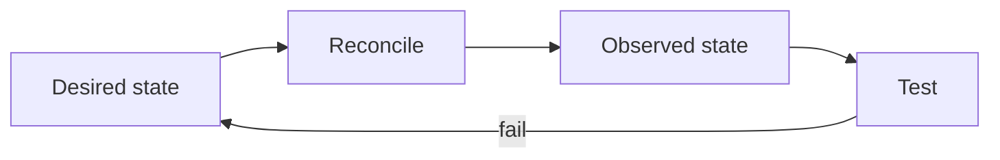

# Class 4 — Operating Containers as a System

**Lecture:** [NetworkChuck — 18 Ways I Use Docker](https://www.youtube.com/watch?v=RUqGlWr5LBA)  
**Time:** 90–120 minutes  
**Build output:** operational runbook for one containerized service

## Purpose

The lecture demonstrates Docker's breadth. This class turns that inspiration into engineering discipline: selecting appropriate workloads, understanding state, observing health, updating safely, backing up configuration, and recovering from a failed change.

## Workload classification

Before deploying an image, classify it:

| Question | Why it matters |
|---|---|
| Is it stateless or stateful? | Determines backup and persistence needs |
| What data is authoritative? | Tells you what loss is unacceptable |
| What ports are required? | Controls exposure and conflicts |
| What identities access host files? | Controls permissions |
| What devices are required? | GPU, USB, tun, serial, and audio expand risk |
| What are its dependencies? | Defines startup and recovery order |
| How is health measured? | Prevents “container running” from being mistaken for service working |

Containers package processes. They do not remove systems-engineering responsibilities.

## Desired state and observed state

Compose says what should run. Commands and tests show what is actually running.



A container can be “Up” while the application is deadlocked, unable to reach its database, or serving an error page. Use layered signals:

- Docker state and restart count.
- Healthcheck status.
- Application logs.
- Local HTTP/API probe.
- Dependency tests.
- User-level transaction.

## Image trust and versioning

Record image source, tag, digest when appropriate, upstream project, release notes, and last-known-good version. `latest` is a moving pointer, not a release policy. Before updates, capture configuration backup and current version, then change one service or dependency group at a time.

## Logs and resource observation

Useful commands:

```bash
docker compose ps
docker compose logs --since=10m SERVICE
docker inspect CONTAINER
docker stats --no-stream
docker system df
```

Do not treat all warnings as faults. Tie logs to the test time and symptom. Redact tokens, API keys, cookies, internal hostnames, and personal media names before sharing.

## Guided lab — safe update and rollback

Use the Class 2 `compose-lab` web service (or recreate it). Goal: prove you can update an explicit image tag and roll back with commands—not vibes.

1. **Record the current image identity (last-known-good).**

:::windows
```powershell
cd $HOME\compose-lab
docker compose ps
docker compose images
docker image inspect nginx:stable --format "Id={{.Id}} RepoTags={{.RepoTags}}"
Copy-Item compose.yaml compose.yaml.bak
curl.exe -s http://127.0.0.1:8080/ | findstr UNIQUE
```
:::

:::linux
```bash
cd ~/compose-lab
docker compose ps
docker compose images
docker image inspect nginx:stable --format 'Id={{.Id}} RepoTags={{.RepoTags}}'
cp compose.yaml compose.yaml.bak
curl -s http://127.0.0.1:8080/ | grep UNIQUE
```
:::

   Write the image ID and tag in the workbook. That is your rollback target.

2. **Run the acceptance test (before change).**  
   Browser or curl must show your unique phrase. Record “PASS” + timestamp.

3. **Change to another explicit tag, validate, pull, recreate.**  
   Edit `image:` from `nginx:stable` to a newer explicit tag you choose from Docker Hub (example pattern `nginx:1.27`—pick one that exists today). Then:

:::windows
```powershell
docker compose config
docker compose pull
docker compose up -d
docker compose ps
docker compose logs --tail=80 web
docker compose images
```
:::

:::linux
```bash
docker compose config
docker compose pull
docker compose up -d
docker compose ps
docker compose logs --tail=80 web
docker image inspect $(docker compose images -q web) --format '{{.RepoTags}} {{.Id}}'
```
:::

4. **Re-run the acceptance test.**  
   `curl` the unique phrase again. If it fails, do not continue—roll back now.

5. **Simulate a bad update (nonexistent tag), then restore.**

:::windows
```powershell
# Temporarily set image: nginx:this-tag-does-not-exist-otacon
docker compose pull
docker compose up -d
docker compose ps
docker compose logs --tail=40 web
Copy-Item compose.yaml.bak compose.yaml -Force
docker compose pull
docker compose up -d
curl.exe -s http://127.0.0.1:8080/ | findstr UNIQUE
```
:::

:::linux
```bash
# edit image to nginx:this-tag-does-not-exist-otacon, then:
docker compose pull || true
docker compose up -d || true
docker compose ps
docker compose logs --tail=40 web
cp compose.yaml.bak compose.yaml
docker compose pull
docker compose up -d
curl -s http://127.0.0.1:8080/ | grep UNIQUE
```
:::

6. **Fill a mini service contract** (also use `templates/service_contract.csv`):

```text
purpose: compose-lab nginx demo
image/version: (tag + image id)
configuration path: ./compose.yaml , ./site
media/download paths: n/a
internal address/port: web:80
published address/port: DOCKER-HOST:8080
dependencies: none
health test: curl unique phrase
backup method: copy compose.yaml + site/
update procedure: change tag -> config -> pull -> up -d -> test
rollback procedure: restore compose.yaml.bak -> pull -> up -d -> test
```

## ARR operational contract

For every later service, record the same fields. This turns containers into an operable system.

## Break/fix scenarios

Run with commands; change only one variable at a time.

- **Restart loop:** `docker compose ps` + `docker inspect --format '{{.State.ExitCode}} {{.State.Error}}' CID` + first error in `logs`.
- **Port conflict:**

:::windows
```powershell
netstat -ano | findstr :8080
```
:::

:::linux
```bash
ss -lntp | grep 8080 || sudo lsof -i :8080
```
:::

- **Disk pressure:** `docker system df` and host `df -h` / PowerShell `Get-PSDrive`. Do **not** run `docker system prune --volumes` casually.
- **Permission denied:** inspect mount UID/GID and mode.
- **Update regression:** restore last-known-good tag from step 1.

## Knowledge check

1. Why is “container is Up” insufficient evidence?
2. What is authoritative data?
3. Why is `latest` a weak rollback record?
4. What should be captured before an update?
5. Why can `docker system prune --volumes` be destructive?

## Practical gate

- [ ] A service contract is complete.
- [ ] Health is verified above the container-process layer.
- [ ] Configuration is backed up.
- [ ] An update and rollback are demonstrated.
- [ ] The runbook identifies last-known-good version and acceptance test.
- [ ] Logs shared as evidence contain no secrets.

## 2026 correction

Novel container examples age quickly. Use the lecture to understand deployment possibilities, then verify maintenance status, image provenance, architecture support, licenses, and security guidance before adopting any showcased project.

