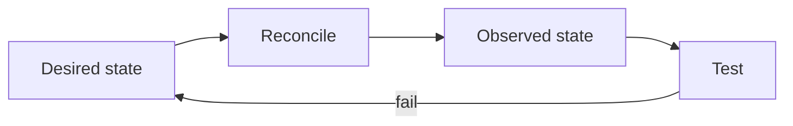

# Class 4 — Operating Containers as a System

**Lecture:** [NetworkChuck — 18 Ways I Use Docker](https://www.youtube.com/watch?v=RUqGlWr5LBA)  
**Time:** 90–120 minutes  
**Build output:** operational runbook for one containerized service

## Purpose

The lecture demonstrates Docker's breadth. This class turns that inspiration into engineering discipline: selecting appropriate workloads, understanding state, observing health, updating safely, backing up configuration, and recovering from a failed change.

## Workload classification

Before deploying an image, classify it:

| Question | Why it matters |
|---|---|
| Is it stateless or stateful? | Determines backup and persistence needs |
| What data is authoritative? | Tells you what loss is unacceptable |
| What ports are required? | Controls exposure and conflicts |
| What identities access host files? | Controls permissions |
| What devices are required? | GPU, USB, tun, serial, and audio expand risk |
| What are its dependencies? | Defines startup and recovery order |
| How is health measured? | Prevents “container running” from being mistaken for service working |

Containers package processes. They do not remove systems-engineering responsibilities.

## Desired state and observed state

Compose says what should run. Commands and tests show what is actually running.



A container can be “Up” while the application is deadlocked, unable to reach its database, or serving an error page. Use layered signals:

- Docker state and restart count.
- Healthcheck status.
- Application logs.
- Local HTTP/API probe.
- Dependency tests.
- User-level transaction.

## Image trust and versioning

Record image source, tag, digest when appropriate, upstream project, release notes, and last-known-good version. `latest` is a moving pointer, not a release policy. Before updates, capture configuration backup and current version, then change one service or dependency group at a time.

## Logs and resource observation

Useful commands:

```bash
docker compose ps
docker compose logs --since=10m SERVICE
docker inspect CONTAINER
docker stats --no-stream
docker system df
```

Do not treat all warnings as faults. Tie logs to the test time and symptom. Redact tokens, API keys, cookies, internal hostnames, and personal media names before sharing.

## Guided lab — safe update and rollback

Use the Class 2 web service or another disposable service.

1. Record current image reference and `docker image inspect` result.
2. Save a copy of the Compose file and persistent configuration.
3. Run the user-level acceptance test.
4. Change to a newer explicit image tag supported by the project.
5. Run `docker compose config`, `pull`, and `up -d`.
6. Observe startup logs and health.
7. Repeat the acceptance test.
8. Simulate failure by selecting a nonexistent tag or incompatible disposable configuration.
9. Restore the recorded version/configuration.
10. Prove the original test passes.

## ARR operational contract

For every later service, record:

```text
purpose
image/version
configuration path
media/download paths
internal address and port
published address and port
dependencies
health test
backup method
update procedure
rollback procedure
```

This turns a pile of containers into an operable system.

## Break/fix scenarios

- **Restart loop:** inspect exit code and first failure, not only the last repeated line.
- **Port conflict:** identify the listener with `ss -lntp` or platform equivalent; change only the intended binding.
- **Disk full:** use `docker system df`, filesystem usage, logs, downloads, and database growth to identify the consumer. Do not blindly prune volumes.
- **Permission denied:** inspect numeric UID/GID and mount options.
- **Dependency unavailable:** test DNS, TCP, protocol, and authentication in that order.
- **Update regression:** restore the last-known-good tag and matching data/config backup when required.

## Knowledge check

1. Why is “container is Up” insufficient evidence?
2. What is authoritative data?
3. Why is `latest` a weak rollback record?
4. What should be captured before an update?
5. Why can `docker system prune --volumes` be destructive?

## Practical gate

- [ ] A service contract is complete.
- [ ] Health is verified above the container-process layer.
- [ ] Configuration is backed up.
- [ ] An update and rollback are demonstrated.
- [ ] The runbook identifies last-known-good version and acceptance test.
- [ ] Logs shared as evidence contain no secrets.

## 2026 correction

Novel container examples age quickly. Use the lecture to understand deployment possibilities, then verify maintenance status, image provenance, architecture support, licenses, and security guidance before adopting any showcased project.

