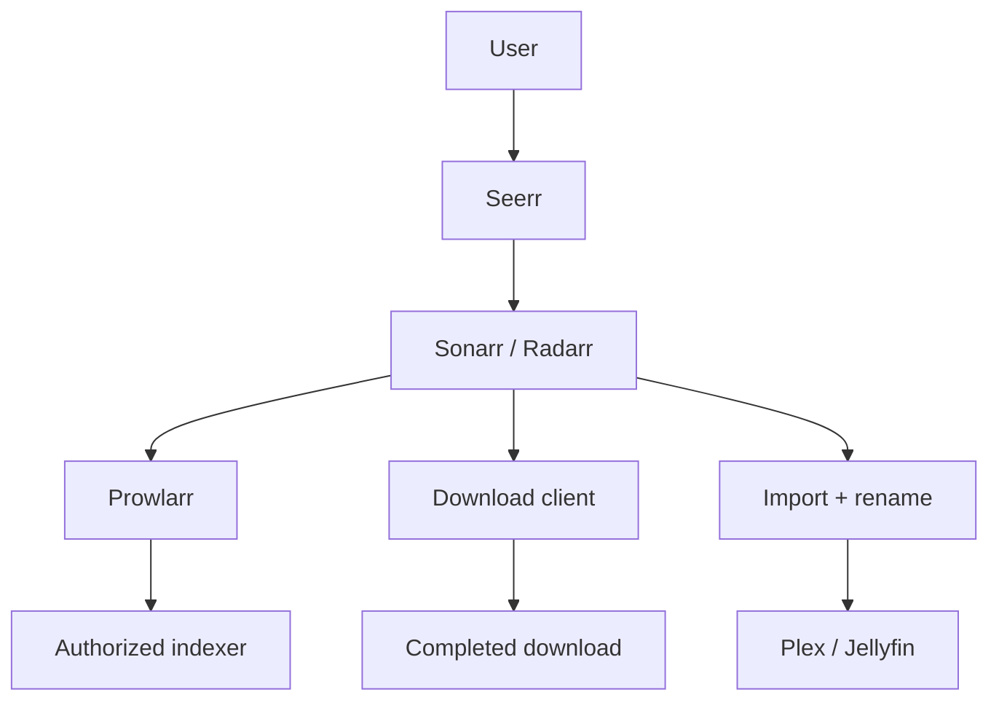

# Class 5 — Prowlarr and the ARR Request Flow

**Lecture:** [IBRACORP — Prowlarr Guide](https://www.youtube.com/watch?v=nPm5pMfk1OA)  
**Time:** 150 minutes  
**Build output:** Prowlarr connected to Sonarr and Radarr with controlled tests

## Scope and legal boundary

Prowlarr manages indexer definitions and makes search results available to compatible applications. This course covers architecture, configuration control, and testing. Use only indexers and content sources you are authorized to use.

## Vocabulary

| Term | Meaning |
|---|---|
| Indexer | Search source for release metadata |
| Application sync | Prowlarr propagating indexer configuration to Sonarr/Radarr |
| Download client | Application that receives a selected job |
| Category | Label used to separate queues and import handling |
| API key | Credential used for application-to-application calls |
| RSS sync | Periodic discovery of newly posted releases; not a full search |
| Interactive search | User-visible candidates for manual selection |
| Automatic search | Application selecting candidates under policy |
| Import | ARR application moving/linking completed content into the library |

## End-to-end architecture



Prowlarr does not replace Sonarr or Radarr. Sonarr/Radarr own the monitored title, quality policy, candidate evaluation, download handoff, and completed-download import. Prowlarr centralizes indexer connectivity and synchronization.

## Service contracts before clicking

Record the following for Prowlarr, Sonarr, Radarr, and each download client:

- Docker service name and internal port.
- LAN address only if humans need it.
- Docker network.
- API credential owner and rotation plan.
- Download category.
- Root folder and container path mappings.
- Health/test button expected result.

Within one Compose network, prefer service DNS names such as `http://sonarr:8989`. From Prowlarr's container, `localhost:8989` points back to Prowlarr and is wrong unless both processes genuinely share a network namespace.

## Applications and synchronization

Adding Sonarr/Radarr to Prowlarr creates an application relationship. The exact sync settings can vary, but the intended result is clear: indexers approved for a target application appear there with the proper categories and settings.

Treat the connection test and the synchronization test as different requirements:

1. **Connection:** Can Prowlarr authenticate to the target API?
2. **Synchronization:** Does the desired indexer configuration actually appear and remain consistent?

## Indexer tests

An indexer test can fail at several layers:

```text
DNS -> TCP/TLS -> provider response -> authentication -> rate limit -> categories -> application policy
```

Do not regenerate every API key because DNS failed. Capture the exact test time, response class, and one hypothesis.

## Download handoff and categories

Sonarr/Radarr normally send a selected release to the download client. Categories keep traffic separated, for example `tv` and `movies`. The client must report completed paths that the ARR container can resolve.

The most reliable beginner layout gives download client and importers a consistent `/data` view:

```text
Host: /srv/data                 Containers: /data
  /torrents                       /torrents
  /usenet                         /usenet
  /media/tv                       /media/tv
  /media/movies                   /media/movies
```

This reduces remote-path mappings and enables hardlinks when source and destination are on the same filesystem.

## Hardlinks

A hardlink gives two directory entries to the same underlying file data. It avoids a second full copy while allowing the downloader to seed from one path and the media library to use another.

Conditions include:

- Same filesystem/device.
- Compatible permissions.
- Application configured to use hardlinks where appropriate.
- Paths presented consistently.

On Linux, compare device and inode values with `stat`. Two paths with the same device and inode refer to the same file data.

## Guided lab

1. Back up all existing ARR configuration databases.
2. Confirm Prowlarr, Sonarr, and Radarr share the intended Docker network.
3. From inside Prowlarr's container, resolve and reach each application by service name.
4. Copy API keys through a private channel; do not place them in the workbook.
5. Add Sonarr and Radarr as applications in Prowlarr and run their connection tests.
6. Add one authorized test indexer and test it.
7. Trigger application sync.
8. In Sonarr/Radarr, verify the expected indexer definition and categories appear.
9. Configure a download client using distinct test categories.
10. Run the application's download-client test.
11. Perform one controlled interactive search and inspect why candidates are accepted or rejected.
12. If permitted, submit a harmless authorized test item and trace it through the queue. Otherwise stop at the search and connection-test evidence.

## Break/fix exercises

### Wrong hostname

Change the Sonarr address in Prowlarr to `localhost`. Observe the failure, explain the container namespace, and restore `http://sonarr:8989` or the recorded service address.

### Wrong category

Use a mismatched test category. Observe how completed-download handling loses the expected association, then restore it.

### Wrong path vocabulary

Present the download client path under one container as `/downloads` and the importer as an unrelated `/incoming`. Diagnose the mismatch from logs; restore a shared `/data` model or a deliberately documented remote-path mapping.

## Troubleshooting matrix

| Symptom | First checks |
|---|---|
| Application test fails | DNS name, port, API URL, API key |
| Indexer test fails | DNS/TLS, provider status, credentials, rate limit |
| Search returns nothing | Categories, capabilities, title/ID mapping, policy filters |
| Job reaches client but never imports | Category, completed status, reported path, permissions |
| Import copies instead of hardlinks | Filesystem device, mappings, hardlink setting, permissions |
| Media server misses item | Final path, naming, library root, scan status |

## Knowledge check

1. What responsibility belongs to Prowlarr versus Sonarr/Radarr?
2. Why are connection and synchronization separate tests?
3. What does a download category accomplish?
4. Why does a consistent `/data` view help?
5. What two `stat` fields prove two paths are hardlinks to the same inode?
6. Why is RSS sync not equivalent to a full historical search?

## Practical gate

- [ ] Prowlarr tests successfully against Sonarr and Radarr.
- [ ] An authorized indexer test passes.
- [ ] Application sync creates the expected definitions.
- [ ] Download-client tests pass with documented categories.
- [ ] One candidate's accept/reject reason is explained.
- [ ] Path mappings and permissions are documented.
- [ ] No API key appears in submitted evidence.

## 2026 correction

Application fields and sync behavior evolve. Follow the current Servarr/Prowlarr documentation for exact UI steps. Preserve the architecture and tests even if labels move.

