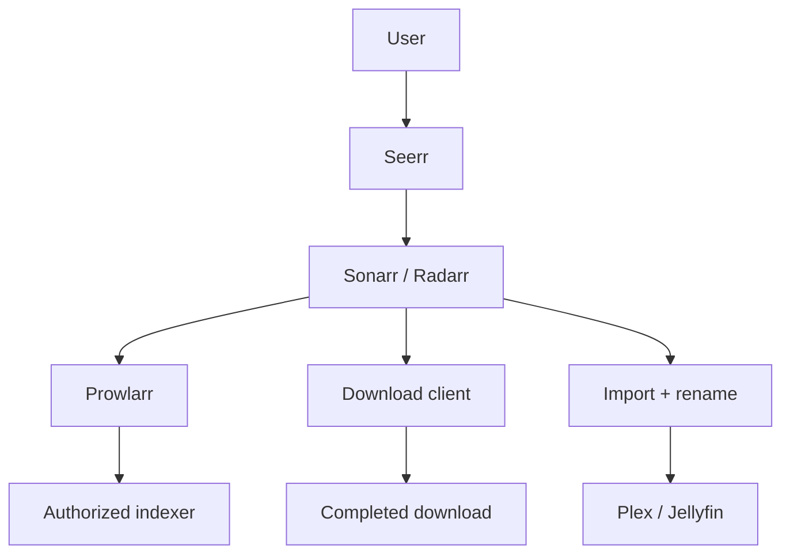

# Class 5 — Prowlarr and the ARR Request Flow

**Lecture:** [IBRACORP — Prowlarr Guide](https://www.youtube.com/watch?v=nPm5pMfk1OA)  
**Time:** 150 minutes  
**Build output:** Prowlarr connected to Sonarr and Radarr with controlled tests

## Scope and legal boundary

Prowlarr manages indexer definitions and makes search results available to compatible applications. This course covers architecture, configuration control, and testing. Use only indexers and content sources you are authorized to use.

## Vocabulary

| Term | Meaning |
|---|---|
| Indexer | Search source for release metadata |
| Application sync | Prowlarr propagating indexer configuration to Sonarr/Radarr |
| Download client | Application that receives a selected job |
| Category | Label used to separate queues and import handling |
| API key | Credential used for application-to-application calls |
| RSS sync | Periodic discovery of newly posted releases; not a full search |
| Interactive search | User-visible candidates for manual selection |
| Automatic search | Application selecting candidates under policy |
| Import | ARR application moving/linking completed content into the library |

## End-to-end architecture



Prowlarr does not replace Sonarr or Radarr. Sonarr/Radarr own the monitored title, quality policy, candidate evaluation, download handoff, and completed-download import. Prowlarr centralizes indexer connectivity and synchronization.

## Service contracts before clicking

Record the following for Prowlarr, Sonarr, Radarr, and each download client:

- Docker service name and internal port.
- LAN address only if humans need it.
- Docker network.
- API credential owner and rotation plan.
- Download category.
- Root folder and container path mappings.
- Health/test button expected result.

Within one Compose network, prefer service DNS names such as `http://sonarr:8989`. From Prowlarr's container, `localhost:8989` points back to Prowlarr and is wrong unless both processes genuinely share a network namespace.

## Applications and synchronization

Adding Sonarr/Radarr to Prowlarr creates an application relationship. The exact sync settings can vary, but the intended result is clear: indexers approved for a target application appear there with the proper categories and settings.

Treat the connection test and the synchronization test as different requirements:

1. **Connection:** Can Prowlarr authenticate to the target API?
2. **Synchronization:** Does the desired indexer configuration actually appear and remain consistent?

## Indexer tests

An indexer test can fail at several layers:

```text
DNS -> TCP/TLS -> provider response -> authentication -> rate limit -> categories -> application policy
```

Do not regenerate every API key because DNS failed. Capture the exact test time, response class, and one hypothesis.

## Download handoff and categories

Sonarr/Radarr normally send a selected release to the download client. Categories keep traffic separated, for example `tv` and `movies`. The client must report completed paths that the ARR container can resolve.

The most reliable beginner layout gives download client and importers a consistent `/data` view:

```text
Host: /srv/data                 Containers: /data
  /torrents                       /torrents
  /usenet                         /usenet
  /media/tv                       /media/tv
  /media/movies                   /media/movies
```

This reduces remote-path mappings and enables hardlinks when source and destination are on the same filesystem.

## Hardlinks

A hardlink gives two directory entries to the same underlying file data. It avoids a second full copy while allowing the downloader to seed from one path and the media library to use another.

Conditions include:

- Same filesystem/device.
- Compatible permissions.
- Application configured to use hardlinks where appropriate.
- Paths presented consistently.

On Linux, compare device and inode values with `stat`. Two paths with the same device and inode refer to the same file data.

## Guided lab

**Assumes:** Sonarr, Radarr, and Prowlarr run on one Compose network (example name `media_net`) with service names `sonarr`, `radarr`, `prowlarr`. Adjust names to match your stack. Use only authorized indexers/content.

Replace `COMPOSE_DIR` with your stack directory. Never paste real API keys into the workbook or screenshots.

1. **Back up ARR config databases before changing anything.**

:::windows
```powershell
cd COMPOSE_DIR
docker compose ps
# Example paths — adjust to your bind mounts:
Copy-Item -Recurse .\prowlarr\config $HOME\backups\prowlarr-$(Get-Date -Format yyyyMMdd) -ErrorAction SilentlyContinue
Copy-Item -Recurse .\sonarr\config $HOME\backups\sonarr-$(Get-Date -Format yyyyMMdd) -ErrorAction SilentlyContinue
Copy-Item -Recurse .\radarr\config $HOME\backups\radarr-$(Get-Date -Format yyyyMMdd) -ErrorAction SilentlyContinue
```
:::

:::linux
```bash
cd COMPOSE_DIR
docker compose ps
mkdir -p ~/backups/arr-$(date +%Y%m%d)
# Adjust paths to your bind mounts:
cp -a ./prowlarr/config ~/backups/arr-$(date +%Y%m%d)/prowlarr 2>/dev/null || true
cp -a ./sonarr/config ~/backups/arr-$(date +%Y%m%d)/sonarr 2>/dev/null || true
cp -a ./radarr/config ~/backups/arr-$(date +%Y%m%d)/radarr 2>/dev/null || true
ls -la ~/backups/arr-$(date +%Y%m%d)
```
:::

2. **Confirm shared Docker network membership.**

:::windows
```powershell
docker network ls
docker network inspect media_net
docker compose ps
```
:::

:::linux
```bash
docker network ls
docker network inspect media_net -f '{{range .Containers}}{{.Name}} {{.IPv4Address}}{{"\n"}}{{end}}'
docker compose ps
```
:::

   All three apps should appear on the same user-defined network.

3. **From inside Prowlarr, resolve and reach Sonarr/Radarr by service name.**

:::windows
```powershell
docker compose exec prowlarr getent hosts sonarr
docker compose exec prowlarr getent hosts radarr
docker compose exec prowlarr wget -qO- http://sonarr:8989/ping
docker compose exec prowlarr wget -qO- http://radarr:7878/ping
```
If the image lacks `wget`/`getent`, use:
```powershell
docker compose exec prowlarr sh -c "command -v curl; command -v wget; ls /"
```
:::

:::linux
```bash
docker compose exec prowlarr getent hosts sonarr
docker compose exec prowlarr getent hosts radarr
docker compose exec -u 0 prowlarr sh -c 'wget -qO- http://sonarr:8989/ping || curl -sf http://sonarr:8989/ping'
docker compose exec -u 0 prowlarr sh -c 'wget -qO- http://radarr:7878/ping || curl -sf http://radarr:7878/ping'
```
:::

4. **Copy API keys privately (UI → Settings → General).**  
   Store them in a password manager—not git, not Discord, not the workbook.

5. **Add Sonarr and Radarr as Applications in Prowlarr (UI) and run connection tests.**  
   Use URLs like `http://sonarr:8989` and `http://radarr:7878` (service DNS), sync categories as required, click **Test**. Do not use `localhost` for cross-container calls.

6. **Optional API ping from the host** (replace KEY; redact output before sharing):

:::windows
```powershell
curl.exe -s "http://127.0.0.1:9696/api/v1/system/status?apikey=YOUR_PROWLARR_KEY"
curl.exe -s "http://127.0.0.1:8989/api/v3/system/status?apikey=YOUR_SONARR_KEY"
```
:::

:::linux
```bash
curl -s "http://127.0.0.1:9696/api/v1/system/status?apikey=YOUR_PROWLARR_KEY" | head -c 200; echo
curl -s "http://127.0.0.1:8989/api/v3/system/status?apikey=YOUR_SONARR_KEY" | head -c 200; echo
```
:::

7. **Add one authorized test indexer in Prowlarr → Test → Sync to apps.**  
   In Sonarr/Radarr → Settings → Indexers, confirm the synced entry and categories.

8. **Configure a download client with distinct test categories** (example: `tv-sonarr`, `movies-radarr`). Run each app’s download-client **Test**.

9. **Controlled interactive search.**  
   In Sonarr or Radarr, interactive-search a monitored test title. Record why at least three candidates are accepted or rejected (quality, CF score, indexer, category)—no need to download if policy forbids it.

10. **Hardlink proof (Linux host)** when a completed file exists in both download and library paths:

:::linux
```bash
stat -c 'device=%d inode=%i path=%n' /data/torrents/example.mkv /data/media/tv/example.mkv
# Same device + inode => hardlink (not a full second copy)
```
:::

:::windows
Hardlinks across bind mounts are a Linux filesystem concern. Run the `stat` check inside the Linux VM/host that holds `/data`. On Windows-only Docker Desktop this class’s hardlink gate may be deferred until Path B storage is Linux.
:::

## Break/fix exercises

### Wrong hostname

In Prowlarr, set Sonarr URL to `http://localhost:8989`, **Test** (expect fail). Explain container localhost. Restore `http://sonarr:8989` and retest.

:::linux
```bash
# From prowlarr container, localhost is prowlarr — not sonarr:
docker compose exec prowlarr sh -c 'wget -qO- http://127.0.0.1:8989/ping || echo EXPECTED_FAIL'
docker compose exec prowlarr sh -c 'wget -qO- http://sonarr:8989/ping || curl -sf http://sonarr:8989/ping'
```
:::

### Wrong category

Mismatch download category vs Sonarr category; observe import confusion; restore matching categories; retest client.

### Wrong path vocabulary

Point client completed path at `/downloads` while Sonarr expects `/data/...`. Read logs for path errors; restore shared `/data` model or document remote path mapping deliberately.

## Troubleshooting matrix

| Symptom | First checks |
|---|---|
| Application test fails | DNS name, port, API URL, API key |
| Indexer test fails | DNS/TLS, provider status, credentials, rate limit |
| Search returns nothing | Categories, capabilities, title/ID mapping, policy filters |
| Job reaches client but never imports | Category, completed status, reported path, permissions |
| Import copies instead of hardlinks | Filesystem device, mappings, hardlink setting, permissions |
| Media server misses item | Final path, naming, library root, scan status |

## Knowledge check

1. What responsibility belongs to Prowlarr versus Sonarr/Radarr?
2. Why are connection and synchronization separate tests?
3. What does a download category accomplish?
4. Why does a consistent `/data` view help?
5. What two `stat` fields prove two paths are hardlinks to the same inode?
6. Why is RSS sync not equivalent to a full historical search?

## Practical gate

- [ ] Prowlarr tests successfully against Sonarr and Radarr.
- [ ] An authorized indexer test passes.
- [ ] Application sync creates the expected definitions.
- [ ] Download-client tests pass with documented categories.
- [ ] One candidate's accept/reject reason is explained.
- [ ] Path mappings and permissions are documented.
- [ ] No API key appears in submitted evidence.

## 2026 correction

Application fields and sync behavior evolve. Follow the current Servarr/Prowlarr documentation for exact UI steps. Preserve the architecture and tests even if labels move.

