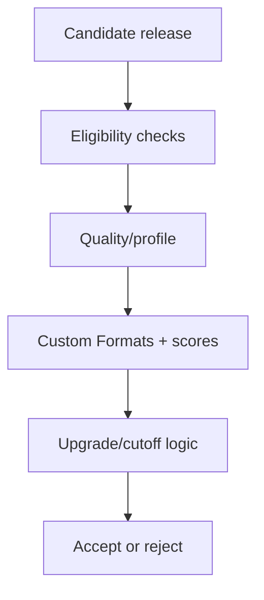

# Class 6 — TRaSH Guides, Quality Profiles, and Custom Formats

**Lecture:** [IBRACORP — TRaSH Guides + Notifiarr](https://www.youtube.com/watch?v=DCxU3Vzaz6k)  
**Time:** 180 minutes  
**Build output:** documented quality policy with controlled scoring tests

## Why this class matters

Installing Sonarr or Radarr is easy. Designing what they should prefer, reject, upgrade, and stop upgrading is the difficult part. TRaSH Guides supplies maintained recommendations; your profile still represents a local policy constrained by display, audio system, storage, bandwidth, and tolerance for upgrades.

## Vocabulary

| Term | Meaning |
|---|---|
| Quality | Technical source/encode class recognized by the ARR application |
| Quality definition | Size limits associated with quality classes |
| Quality profile | Allowed qualities, ordering, upgrade, and cutoff policy |
| Custom Format (CF) | Rule that matches release characteristics |
| CF score | Positive or negative preference applied to a match |
| Minimum CF score | Threshold a candidate must meet |
| Upgrade-until score | Score target that can trigger further upgrades |
| Cutoff | Quality condition after which quality upgrades stop |
| REMUX | Near-direct disc media remuxed into a container |
| WEB-DL | File sourced from a streaming distributor download |
| Blu-ray encode | Compressed encode sourced from Blu-ray |
| DV/HDR | Dynamic-range formats with compatibility considerations |

## The decision model

Candidate selection is not one universal score. The application evaluates availability, monitored state, language, quality, Custom Formats, rejection rules, existing-file state, upgrade settings, and other constraints.

The correct question is not “What is the highest number?” It is “Does the selected result match the intended policy, and will future upgrades stop where we expect?”

## Requirements before profiles

Write the policy in plain language:

- Target resolution: 1080p, 2160p, or separate libraries/profiles.
- Maximum practical file size or storage budget.
- Accepted source classes.
- HDR/Dolby Vision compatibility.
- Preferred audio codecs and channel layouts.
- Language requirements.
- Whether release-group preferences matter.
- Whether remux quality is desired or wasteful for the environment.
- When upgrades should stop.

Example requirement:

> Prefer 1080p WEB-DL or strong Blu-ray encodes, reject unwanted low-quality sources, prefer compatible surround audio, avoid DV-only releases on displays lacking DV, and stop upgrading after the target quality and score are reached.

## Quality definitions versus profiles

Quality definitions bound expected sizes. Profiles decide allowed/ordered qualities and cutoff behavior. Custom Formats express characteristics that the built-in quality class does not fully capture.

Changing a size limit can make releases unavailable even if their quality name is allowed. Changing a cutoff can prevent or cause future upgrades. Changing CF scores can reorder candidates and trigger replacement activity. Treat each as a controlled configuration change.

## Custom Formats

A CF might recognize HDR type, audio codec, streaming service, release group, unwanted edition, or another release-name/media characteristic. A score expresses preference, not certainty. Overlapping CFs can stack, so test sample names rather than assuming one rule wins.

Design principles:

- Use negative scores or explicit rejection for truly unwanted traits.
- Use modest positive scores for preferences.
- Reserve very large weights for hard policy distinctions.
- Document why each score exists.
- Avoid importing every available CF “just in case.”

## Upgrade logic

Four questions must have explicit answers:

1. Are upgrades enabled?
2. What quality cutoff applies?
3. What minimum CF score makes a candidate eligible?
4. What upgrade-until CF score ends score-driven replacement?

A profile can accept a current file yet continue searching forever if upgrade targets are unreachable. It can also stop too early if cutoff or score targets are accidentally satisfied.

## Guided lab

1. Export or back up Sonarr/Radarr configuration.
2. Record current quality definitions and profiles.
3. Select one TRaSH profile as a reference—not as an unexplained copy/paste target.
4. Translate its intent into the local written requirement.
5. Import or create only the required CFs.
6. Assign scores and document each score's reason.
7. Set allowed qualities, order, cutoff, minimum CF score, and upgrade-until score.
8. Use interactive search against a controlled monitored title.
9. For at least five candidates, record:
   - Parsed quality.
   - Matched CFs.
   - Total score.
   - Rejection reason, if any.
   - Whether the result is preferred over the existing file.
10. Adjust only one rule if observed ranking violates the written policy, then repeat.

## Example scoring exercise

Use fictional candidates rather than real copyrighted content:

| Candidate | Traits | Expected policy result |
|---|---|---|
| A | 1080p WEB-DL, desired audio | Strong preference |
| B | 1080p WEB-DL, DV-only incompatible | Reject or penalize |
| C | 1080p Blu-ray encode, preferred group | Competes with A per policy |
| D | 2160p REMUX, enormous file | Reject if outside 1080p/storage requirement |
| E | Low-quality source | Reject |

If the application ranks these differently, investigate the parsed attributes and matching rules rather than editing several scores blindly.

## Break/fix

1. Set an unrealistically high upgrade-until score. Observe why the profile never considers itself complete.
2. Give a minor preference a score larger than a hard compatibility concern. Observe the bad ranking.
3. Temporarily remove the incompatible-HDR rule and inspect candidate eligibility.
4. Restore the backed-up profile and prove the original ranking returns.

## Common mistakes

- Mixing 1080p and 2160p goals without understanding quality ordering.
- Copying scores from a guide without checking hardware compatibility.
- Confusing minimum score with upgrade-until score.
- Allowing DV profiles that produce bad playback on the household display chain.
- Setting file-size limits that exclude every reasonable release.
- Changing global profiles on a live library without a sample evaluation and backup.

## Knowledge check

1. What is the difference between a quality and a Custom Format?
2. Why can multiple CF scores apply to one release?
3. What does cutoff control?
4. What is the risk of an unreachable upgrade-until score?
5. Why should hardware compatibility be written before importing profiles?
6. Does the highest-resolution candidate automatically represent the best local choice?

## Practical gate

- [ ] A plain-language quality requirement exists.
- [ ] Every imported CF has an owner and reason.
- [ ] Five controlled candidates produce expected rankings/rejections.
- [ ] Cutoff and score-upgrade behavior are explained.
- [ ] A backup and rollback path are proven.
- [ ] Storage and playback constraints are represented.

## 2026 correction

TRaSH recommendations and supported sync tooling change. Always use the current guide for profile identifiers and semantics, then verify behavior in the current Sonarr/Radarr release before applying changes broadly.

