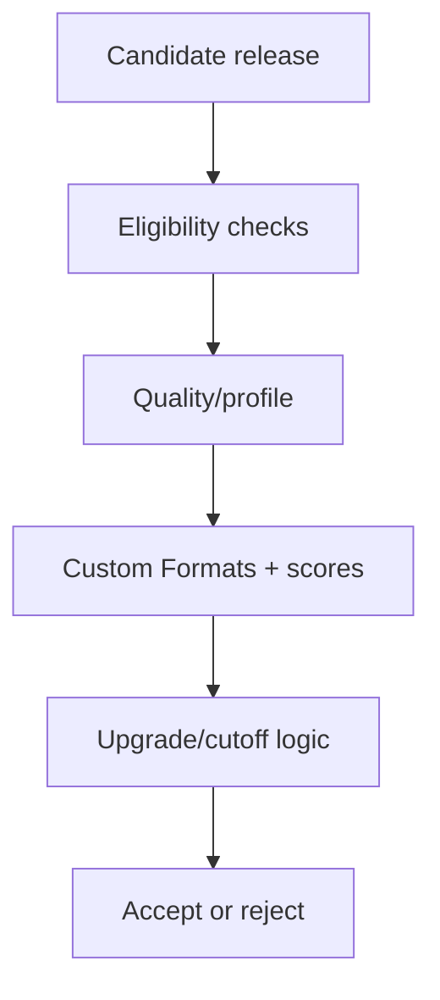

# Class 6 — TRaSH Guides, Quality Profiles, and Custom Formats

**Lecture (optional):** [IBRACORP — TRaSH Guides + Notifiarr](https://www.youtube.com/watch?v=DCxU3Vzaz6k)
**Time:** 180 minutes
**Learning objective:** Given playback and storage constraints, the learner can write a plain-language quality policy, configure Custom Formats and cutoff/upgrade settings, and prove ranking on five controlled candidates.
**Bloom level:** Evaluate / Create
**Build output:** documented quality policy with controlled scoring tests
**Mastery unlock:** ≥80% retrieval target when scored + completed Feynman teach-back + independent practice + all practical gate boxes + workbook evidence.

## Learning objective

Given playback and storage constraints, the learner can write a plain-language quality policy, configure Custom Formats and cutoff/upgrade settings, and prove ranking on five controlled candidates.

## Why this matters

Installing Sonarr or Radarr is easy. Designing what they should prefer, reject, upgrade, and stop upgrading is the difficult part. TRaSH Guides supplies maintained recommendations; your profile still represents a local policy constrained by display, audio system, storage, bandwidth, and tolerance for upgrades.

## Prior-knowledge check

Answer briefly before reading Instruction. Wrong answers are useful — they show what to review.

1. What is a quality profile for?
2. Why might the ‘highest resolution’ release be wrong for your TV?
3. What should you back up before editing profiles?

## Vocabulary

| Term | Meaning |
|---|---|
| Quality | Technical source/encode class recognized by the ARR application |
| Quality definition | Size limits associated with quality classes |
| Quality profile | Allowed qualities, ordering, upgrade, and cutoff policy |
| Custom Format (CF) | Rule that matches release characteristics |
| CF score | Positive or negative preference applied to a match |
| Minimum CF score | Threshold a candidate must meet |
| Upgrade-until score | Score target that can trigger further upgrades |
| Cutoff | Quality condition after which quality upgrades stop |
| REMUX | Near-direct disc media remuxed into a container |
| WEB-DL | File sourced from a streaming distributor download |
| Blu-ray encode | Compressed encode sourced from Blu-ray |
| DV/HDR | Dynamic-range formats with compatibility considerations |

## Instruction

### The decision model

Candidate selection is not one universal score. The application evaluates availability, monitored state, language, quality, Custom Formats, rejection rules, existing-file state, upgrade settings, and other constraints.



The correct question is not “What is the highest number?” It is “Does the selected result match the intended policy, and will future upgrades stop where we expect?”

### Requirements before profiles

Write the policy in plain language:

- Target resolution: 1080p, 2160p, or separate libraries/profiles.
- Maximum practical file size or storage budget.
- Accepted source classes.
- HDR/Dolby Vision compatibility.
- Preferred audio codecs and channel layouts.
- Language requirements.
- Whether release-group preferences matter.
- Whether remux quality is desired or wasteful for the environment.
- When upgrades should stop.

Example requirement:

> Prefer 1080p WEB-DL or strong Blu-ray encodes, reject unwanted low-quality sources, prefer compatible surround audio, avoid DV-only releases on displays lacking DV, and stop upgrading after the target quality and score are reached.

### Quality definitions versus profiles

Quality definitions bound expected sizes. Profiles decide allowed/ordered qualities and cutoff behavior. Custom Formats express characteristics that the built-in quality class does not fully capture.

Changing a size limit can make releases unavailable even if their quality name is allowed. Changing a cutoff can prevent or cause future upgrades. Changing CF scores can reorder candidates and trigger replacement activity. Treat each as a controlled configuration change.

### Custom Formats

A CF might recognize HDR type, audio codec, streaming service, release group, unwanted edition, or another release-name/media characteristic. A score expresses preference, not certainty. Overlapping CFs can stack, so test sample names rather than assuming one rule wins.

Design principles:

- Use negative scores or explicit rejection for truly unwanted traits.
- Use modest positive scores for preferences.
- Reserve very large weights for hard policy distinctions.
- Document why each score exists.
- Avoid importing every available CF “just in case.”

### Upgrade logic

Four questions must have explicit answers:

1. Are upgrades enabled?
2. What quality cutoff applies?
3. What minimum CF score makes a candidate eligible?
4. What upgrade-until CF score ends score-driven replacement?

A profile can accept a current file yet continue searching forever if upgrade targets are unreachable. It can also stop too early if cutoff or score targets are accidentally satisfied.

## Worked example

**I do** — study the reasoning, not just the final answer.

**Bad requirement:** “The library should look good.”

**Better requirement:** “Prefer 1080p WEB-DL or strong Blu-ray encodes; reject unwanted low-quality sources; prefer compatible surround audio; avoid DV-only releases on displays lacking DV; stop upgrading after target quality and CF score are reached.”

Now scoring can be tested against the sentence.

### Example scoring exercise

Keep the in-class scoring table from the lesson. Practice explaining each total out loud.

## Guided practice

**We do** — hints allowed. Check your reasoning against Instruction.

Score three sample release names together using a simple CF table (+/−). Explain the winner out loud.

## Independent practice

**You do** — close the hints. Solve before opening the lab.

Write your household quality sentence. Score five candidates. Change exactly one rule and predict the new ranking before you click save.

## Feynman teach-back

Required. Do not skip.

### Explain
Describe **quality profiles vs Custom Formats vs cutoff/upgrade-until scores** in your own words. No copying the lesson verbatim.

### Simplify
Explain the same idea to a 12-year-old. If you use a technical word, define it.

### Example
Analogy: ordering pizza — ‘make it good’ vs ‘large pepperoni, thin crust, ready in 20 minutes.’

### Weak spot
What part was hard to explain? That is where your understanding is thin.

### Retry
Return to that part of **Instruction**, restudy it, then rewrite a clearer explanation below.

> Mastery note: a completed Feynman teach-back is required before the next class unlocks — “I get it” without explanation does not count.


## Retrieval check

Active recall — write answers without rereading first. Target ≥80% before the gate.

1. What is the difference between a quality and a Custom Format?
2. Why can multiple CF scores apply to one release?
3. What does cutoff control?
4. What is the risk of an unreachable upgrade-until score?
5. Why should hardware compatibility be written before importing profiles?
6. Does the highest-resolution candidate automatically represent the best local choice?

## Guided lab

Work in **one** app first (Sonarr *or* Radarr). Export/backup before edits. TRaSH Guides are a reference for intent—not a blind paste.

1. **Export / back up current quality profiles.**

:::windows
```powershell
cd COMPOSE_DIR
# UI: Settings → General → Backup, download zip to a private folder
# Also copy config bind mount:
Copy-Item -Recurse .\sonarr\config $HOME\backups\sonarr-profiles-$(Get-Date -Format yyyyMMdd) -ErrorAction SilentlyContinue
```
:::

:::linux
```bash
cd COMPOSE_DIR
# UI backup zip AND:
mkdir -p ~/backups/profiles-$(date +%Y%m%d)
cp -a ./sonarr/config ~/backups/profiles-$(date +%Y%m%d)/sonarr 2>/dev/null || true
cp -a ./radarr/config ~/backups/profiles-$(date +%Y%m%d)/radarr 2>/dev/null || true
```
:::

2. **Record current state (workbook table).**  
   For the profile you will change: allowed qualities, order, cutoff, upgrade allowed?, minimum Custom Format score, upgrade-until score, list of Custom Formats + scores.

3. **Optional API dump of profiles** (redact; replace KEY/PORT):

:::linux
```bash
curl -s "http://127.0.0.1:8989/api/v3/qualityprofile?apikey=YOUR_KEY" | head -c 400; echo
curl -s "http://127.0.0.1:8989/api/v3/customformat?apikey=YOUR_KEY" | head -c 400; echo
```
:::

:::windows
```powershell
curl.exe -s "http://127.0.0.1:8989/api/v3/qualityprofile?apikey=YOUR_KEY"
curl.exe -s "http://127.0.0.1:8989/api/v3/customformat?apikey=YOUR_KEY"
```
:::

4. **Write the local requirement in one sentence** (example: “Prefer 1080p WEB, reject incompatible HDR for this TV, allow upgrades until score ≥ X”).

5. **Import or create only the Custom Formats that match that sentence.** Assign scores and write *why* each score exists.

6. **Set qualities, cutoff, min CF score, upgrade-until.** Save the profile.

7. **Interactive search a controlled monitored title.** For ≥5 release candidates, record in the workbook:

```text
release name | quality | CF score | preferred? | reason accepted/rejected
```

8. **If ranking violates the written policy, change only one rule**, save, repeat the five-candidate table.

9. **Prove rollback:** restore from the backup zip or copied config (app stopped if required), reopen profile UI, confirm original scores return.

:::linux
```bash
docker compose stop sonarr
# restore config from ~/backups/... then:
docker compose start sonarr
docker compose logs --tail=50 sonarr
```
:::

## Break / fix

### Break/fix

1. Set an unreachable upgrade-until score; observe endless “not done” behavior; restore.

2. Give a minor preference a higher score than a hard compatibility CF; observe bad ranking; restore.

3. Temporarily remove an incompatible-HDR (or similar) CF; inspect newly eligible junk; restore.

4. Restore backup and prove the five-candidate ranking matches the pre-change table.

## Feedback / common mistakes

- Mixing 1080p and 2160p goals without understanding quality ordering.
- Copying scores from a guide without checking hardware compatibility.
- Confusing minimum score with upgrade-until score.
- Allowing DV profiles that produce bad playback on the household display chain.
- Setting file-size limits that exclude every reasonable release.
- Changing global profiles on a live library without a sample evaluation and backup.

## Practical mastery gate

All boxes must be true before the next class unlocks. If you fail: feedback → targeted review → new practice → reassess.

- [ ] A plain-language quality requirement exists.
- [ ] Every imported CF has an owner and reason.
- [ ] Five controlled candidates produce expected rankings/rejections.
- [ ] Cutoff and score-upgrade behavior are explained.
- [ ] A backup and rollback path are proven.
- [ ] Storage and playback constraints are represented.
- [ ] Prior-knowledge check answered
- [ ] Feynman teach-back completed (Explain, Simplify, Example, Weak spot, Retry)
- [ ] Independent practice completed
- [ ] Retrieval check attempted (target ≥80% when scored)
- [ ] Evidence recorded in workbook / verification matrix

## Reflection

Which score almost violated your hardware constraints, and how did the five-candidate table catch it?

Also answer:

1. What did I learn?
2. What did I struggle with?
3. How does this connect to earlier classes?

## Spiral hook

Class 7 will automate these profiles. When automation drifts, you will re-test the same five-candidate table — the policy sentence remains the source of truth.

## 2026 correction

TRaSH recommendations and supported sync tooling change. Always use the current guide for profile identifiers and semantics, then verify behavior in the current Sonarr/Radarr release before applying changes broadly.
