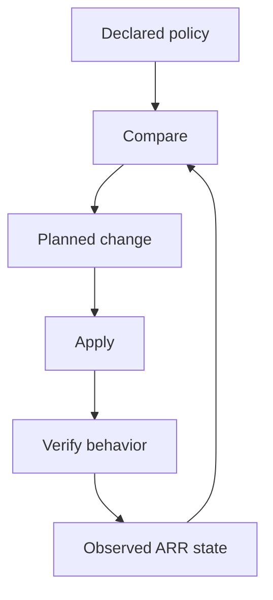

# Class 7 — Reproducible ARR Configuration and Drift Control

**Lecture:** [IBRACORP — Updated TRaSH / Notifiarr Automation](https://www.youtube.com/watch?v=eDlWTze8EKo)  
**Time:** 150 minutes  
**Build output:** backed-up, repeatable profile sync with drift and rollback evidence

## Purpose

Manual clicking can create a correct profile once. Automation aims to keep declared policy synchronized over time. That introduces new hazards: upstream changes, destructive replacement, token exposure, and configuration drift. This class teaches controlled automation rather than blind synchronization.

## Vocabulary

| Term | Meaning |
|---|---|
| Source of truth | Authoritative declaration of intended configuration |
| Drift | Difference between intended and observed state |
| Idempotent | Repeated application converges without unwanted duplication |
| Dry run | Preview of proposed changes without applying them |
| Sync | Reconciliation of target application with declared policy |
| Rollback | Return to a verified previous state |
| Pinning | Selecting an explicit version/revision instead of a moving target |
| Blast radius | Scope of systems or profiles affected by a failure |

## Control-loop model



The loop is incomplete without behavior verification. A tool reporting “sync successful” proves only that its operation completed; it does not prove the resulting release rankings match household requirements.

## Choose one authoritative path

Current environments may use Recyclarr, Notifiarr-supported synchronization, or another maintained method. Avoid having two tools own the same profiles and CF scores unless their responsibilities are explicitly separated. Competing writers create oscillation and confusing drift.

The authoritative record should include:

- Tool and version.
- Configuration file location.
- Target application and profile.
- Guide/profile identifiers.
- Locally intentional score overrides.
- Secret injection method.
- Last successful sync.
- Last verified behavior test.

## Safe rollout pattern

1. Back up application database/configuration.
2. Export or screenshot the current profile in a secret-safe way.
3. Pin the automation tool version.
4. Validate syntax.
5. Run a dry run/preview where supported.
6. Review creations, updates, deletions, and score changes.
7. Apply to one test profile or one application.
8. Run controlled candidate-scoring tests.
9. Expand only after acceptance criteria pass.

## Secrets

API URLs and API keys are credentials. Keep them outside tracked configuration when the tool supports environment or secret injection. Limit filesystem permissions. Rotate a key if it appears in logs, screenshots, shell history, or a repository.

Example conceptual configuration—not a copy/paste guarantee:

```yaml
radarr:
  movies:
    base_url: !env_var RADARR_URL
    api_key: !env_var RADARR_API_KEY
    quality_definition: movie
    quality_profiles:
      - name: HD Balanced
```

Consult the selected tool's current schema for exact syntax.

## Guided lab

1. Create a disposable test profile in Radarr or Sonarr.
2. Record its initial qualities, cutoff, CF list, and scores.
3. Configure one supported sync tool against that test profile.
4. Validate configuration without applying.
5. Capture the proposed diff or detailed log.
6. Apply once.
7. Apply a second time and verify no unwanted duplicates or repeated destructive change occur.
8. Make one intentional manual drift change in the test profile.
9. Run preview again and confirm the drift is detected.
10. Decide whether the automation should overwrite it or whether the source declaration should be changed.
11. Apply the chosen resolution.
12. Run the five-candidate behavior test from Class 6.
13. Restore from backup or reverse the change to prove rollback.

## Change classification

| Change | Risk | Required response |
|---|---:|---|
| Add one positive preference | Low/medium | Preview and sample search |
| Change rejection/large negative score | High | Backup and explicit sample set |
| Change cutoff or upgrade target | High | Evaluate existing-file upgrade impact |
| Change quality-size definitions | High | Test representative file sizes |
| Delete/recreate profiles | High | Check assignments to titles and rollback |
| Tool major-version update | High | Read migration notes and stage separately |

## Break/fix

- **Bad API key:** confirm 401/403 class before changing networks.
- **Bad base URL:** prove DNS and TCP separately.
- **Schema error:** validate against the installed tool version, not a blog post.
- **Unexpected mass change:** stop, preserve logs, restore database/config backup, and compare declared inputs.
- **Oscillating scores:** identify competing writers and establish one owner.
- **Successful sync but wrong results:** return to the behavioral scoring test.

## Knowledge check

1. What is configuration drift?
2. Why is a second idempotency run useful?
3. Why is “sync succeeded” not the final acceptance test?
4. What happens when two tools own the same scores?
5. Which changes deserve a high-risk classification?
6. When should an upstream guide update enter production?

## Practical gate

- [ ] One source of truth is named.
- [ ] Secrets are not embedded in tracked files.
- [ ] Validation/preview is reviewed before apply.
- [ ] A second run creates no unwanted duplicate state.
- [ ] Intentional drift is detected and resolved.
- [ ] Candidate behavior still matches Class 6 requirements.
- [ ] Rollback is demonstrated.

## 2026 correction

Do not assume the automation mechanism shown in an older video remains the recommended integration. Select a currently maintained sync path, use its current schema, and preserve the source-of-truth, preview, verification, and rollback controls taught here.

