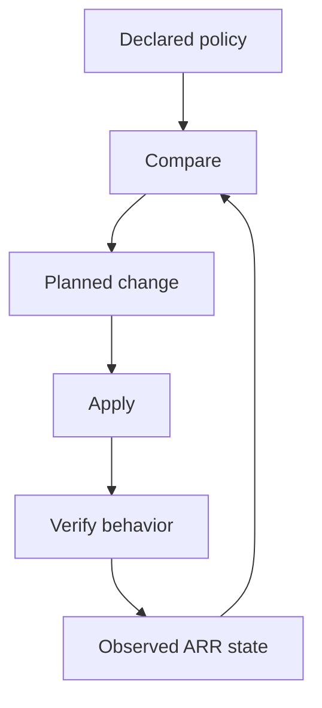

# Class 7 — Reproducible ARR Configuration and Drift Control

**Lecture (optional):** [IBRACORP — Updated TRaSH / Notifiarr Automation](https://www.youtube.com/watch?v=eDlWTze8EKo)
**Time:** 150 minutes
**Learning objective:** Given a known-good profile backup, the learner can choose one authoritative sync path, run dry-run/apply/rollback, and produce a drift report that matches the live apps.
**Bloom level:** Apply / Evaluate
**Build output:** backed-up, repeatable profile sync with drift and rollback evidence
**Mastery unlock:** ≥80% retrieval target when scored + completed Feynman teach-back + independent practice + all practical gate boxes + workbook evidence.

## Learning objective

Given a known-good profile backup, the learner can choose one authoritative sync path, run dry-run/apply/rollback, and produce a drift report that matches the live apps.

## Why this matters

Manual clicking can create a correct profile once. Automation aims to keep declared policy synchronized over time. That introduces new hazards: upstream changes, destructive replacement, token exposure, and configuration drift. This class teaches controlled automation rather than blind synchronization.

## Prior-knowledge check

Answer briefly before reading Instruction. Wrong answers are useful — they show what to review.

1. What is configuration drift?
2. Why is a dry run required before apply?
3. Where do secrets belong (and not belong)?

## Vocabulary

| Term | Meaning |
|---|---|
| Source of truth | Authoritative declaration of intended configuration |
| Drift | Difference between intended and observed state |
| Idempotent | Repeated application converges without unwanted duplication |
| Dry run | Preview of proposed changes without applying them |
| Sync | Reconciliation of target application with declared policy |
| Rollback | Return to a verified previous state |
| Pinning | Selecting an explicit version/revision instead of a moving target |
| Blast radius | Scope of systems or profiles affected by a failure |

## Instruction

### Control-loop model



The loop is incomplete without behavior verification. A tool reporting “sync successful” proves only that its operation completed; it does not prove the resulting release rankings match household requirements.

### Choose one authoritative path

Current environments may use Recyclarr, Notifiarr-supported synchronization, or another maintained method. Avoid having two tools own the same profiles and CF scores unless their responsibilities are explicitly separated. Competing writers create oscillation and confusing drift.

The authoritative record should include:

- Tool and version.
- Configuration file location.
- Target application and profile.
- Guide/profile identifiers.
- Locally intentional score overrides.
- Secret injection method.
- Last successful sync.
- Last verified behavior test.

### Safe rollout pattern

1. Back up application database/configuration.
2. Export or screenshot the current profile in a secret-safe way.
3. Pin the automation tool version.
4. Validate syntax.
5. Run a dry run/preview where supported.
6. Review creations, updates, deletions, and score changes.
7. Apply to one test profile or one application.
8. Run controlled candidate-scoring tests.
9. Expand only after acceptance criteria pass.

### Secrets

API URLs and API keys are credentials. Keep them outside tracked configuration when the tool supports environment or secret injection. Limit filesystem permissions. Rotate a key if it appears in logs, screenshots, shell history, or a repository.

Example conceptual configuration—not a copy/paste guarantee:

```yaml
radarr:
  movies:
    base_url: !env_var RADARR_URL
    api_key: !env_var RADARR_API_KEY
    quality_definition: movie
    quality_profiles:
      - name: HD Balanced
```

Consult the selected tool's current schema for exact syntax.

### Change classification

Before production syncs, label each change: low (cosmetic rename), medium (score tweak), high (cutoff / deletes / mass CF). High-risk needs backup + dry-run + test profile first.

## Worked example

**I do** — study the reasoning, not just the final answer.

**Bad:** Edit scores in the UI *and* in a sync tool with no single owner.

**Better:** Pick one authoritative path (for example Recyclarr *or* Notifiarr — not both fighting), backup → dry run → apply → verify → keep rollback.

## Guided practice

**We do** — hints allowed. Check your reasoning against Instruction.

Classify three changes as safe / review / dangerous with the lesson’s change table open.

## Independent practice

**You do** — close the hints. Solve before opening the lab.

Write your control loop: backup → dry run → apply → verify → drift check → rollback trigger. Name the artifact you keep for each step.

## Feynman teach-back

Required. Do not skip.

### Explain
Describe **why ARR configuration needs an authoritative control loop** in your own words. No copying the lesson verbatim.

### Simplify
Explain the same idea to a 12-year-old. If you use a technical word, define it.

### Example
Analogy: two people editing the same spreadsheet without track changes.

### Weak spot
What part was hard to explain? That is where your understanding is thin.

### Retry
Return to that part of **Instruction**, restudy it, then rewrite a clearer explanation below.

> Mastery note: a completed Feynman teach-back is required before the next class unlocks — “I get it” without explanation does not count.


## Retrieval check

Active recall — write answers without rereading first. Target ≥80% before the gate.

1. What is configuration drift?
2. Why is a second idempotency run useful?
3. Why is “sync succeeded” not the final acceptance test?
4. What happens when two tools own the same scores?
5. Which changes deserve a high-risk classification?
6. When should an upstream guide update enter production?

## Guided lab

Pick **one** supported sync approach you actually run (recyclarr, Notifiarr profiles, manual export/import, or another maintained tool). Pin its version. Use a **disposable test profile**, not your only production profile.

1. **Create a disposable test profile** in Sonarr or Radarr (UI). Name it `otacon-test-profile`. Record initial qualities/cutoff/CF list.

2. **Pin the tool version and show it.**

:::windows
```powershell
# Example if using recyclarr via docker:
docker compose exec recyclarr recyclarr --version
# Or local binary:
recyclarr --version
```
:::

:::linux
```bash
docker compose exec recyclarr recyclarr --version 2>/dev/null || recyclarr --version
command -v recyclarr; type recyclarr
```
:::

3. **Point config at the test profile only.** Validate / dry-run without applying.

:::linux
```bash
# Pattern — exact subcommands depend on current tool docs:
recyclarr config list
recyclarr sync --dry-run
# or: docker compose exec recyclarr recyclarr sync --dry-run
```
:::

:::windows
```powershell
docker compose exec recyclarr recyclarr sync --dry-run
```
:::

4. **Capture the proposed diff/log** to a private file (redact secrets):

:::linux
```bash
recyclarr sync --dry-run 2>&1 | tee ~/backups/recyclarr-dryrun-$(date +%Y%m%d).log | tail -n 40
```
:::

5. **Apply once** to the test profile. Re-open the UI and compare to the dry-run.

6. **Apply a second time (idempotency).** Expect no duplicate CFs / no destructive churn. Save both logs.

7. **Create intentional drift:** manually change one CF score in the test profile UI.

8. **Dry-run again** and confirm the tool detects the drift. Decide: overwrite from source of truth, or update the declaration.

9. **Apply the chosen resolution.** Re-run Class 6’s five-candidate behavior check on a controlled title.

10. **Rollback proof:** restore ARR backup from Class 6/7 start; confirm test profile gone or restored; record commands/UI steps used.

:::linux
```bash
docker compose stop sonarr
# restore config backup
docker compose start sonarr
curl -sf "http://127.0.0.1:8989/ping" && echo SONARR_UP
```
:::

## Break / fix

### Break/fix

1. Run sync twice; prove idempotency in logs.

2. Point two tools at the same profile (or simulate conflicting ownership)—observe fight; pick one owner.

3. Break YAML/config syntax; show validator failure; fix.

4. Restore backup; prove scores match the pre-lab export.

## Feedback / common mistakes

- Skipping evidence and calling it done.
- Changing multiple variables before retesting.
- Moving on without completing Feynman teach-back.

## Practical mastery gate

All boxes must be true before the next class unlocks. If you fail: feedback → targeted review → new practice → reassess.

- [ ] One source of truth is named.
- [ ] Secrets are not embedded in tracked files.
- [ ] Validation/preview is reviewed before apply.
- [ ] A second run creates no unwanted duplicate state.
- [ ] Intentional drift is detected and resolved.
- [ ] Candidate behavior still matches Class 6 requirements.
- [ ] Rollback is demonstrated.
- [ ] Prior-knowledge check answered
- [ ] Feynman teach-back completed (Explain, Simplify, Example, Weak spot, Retry)
- [ ] Independent practice completed
- [ ] Retrieval check attempted (target ≥80% when scored)
- [ ] Evidence recorded in workbook / verification matrix

## Reflection

What would drift look like in your lab tomorrow, and how would you detect it without guessing?

Also answer:

1. What did I learn?
2. What did I struggle with?
3. How does this connect to earlier classes?

## Spiral hook

This control-loop pattern returns for HA dashboards/automations, reverse-proxy config, voice models, and n8n workflows — same discipline, different files.

## 2026 correction

Do not assume the automation mechanism shown in an older video remains the recommended integration. Select a currently maintained sync path, use its current schema, and preserve the source-of-truth, preview, verification, and rollback controls taught here.
