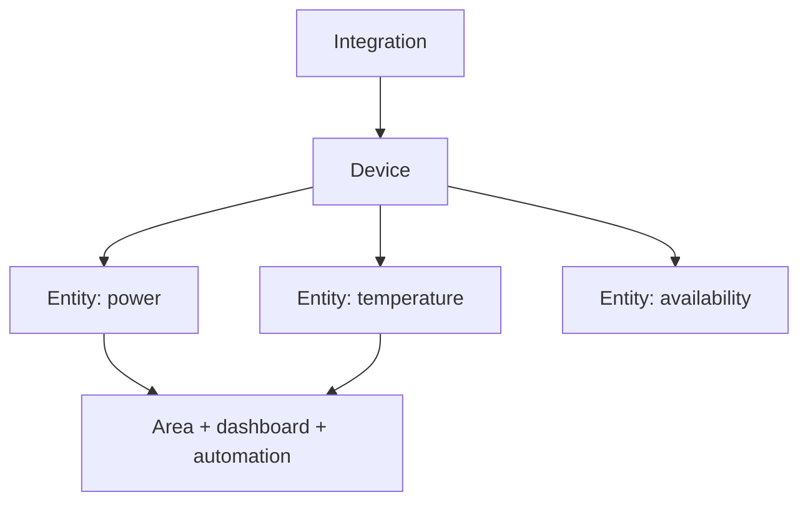

# Class 8 — Home Assistant Foundations

**Lecture:** [Smart Home Junkie — Home Assistant Beginner Guide](https://www.youtube.com/watch?v=Frd-C7ZeZAo)  
**Time:** 150 minutes  
**Build output:** Home Assistant instance with one integration, dashboard, and tested backup

## Outcomes

You will understand instances, integrations, devices, entities, areas, services/actions, states, dashboards, helpers, add-ons, backups, and the separation between Home Assistant OS and containerized installations.

## Object model



An integration connects Home Assistant to a platform or protocol. A device is a physical or logical product. An entity is one controllable or observable property. Automations usually reason over entity state and invoke actions/services.

## Installation choices

### Home Assistant OS

A complete managed appliance model with Supervisor and add-on support. It fits well in a dedicated VM and is the course's default for the capstone.

### Home Assistant Container

Runs Home Assistant Core in Docker. The operator manages surrounding services and does not receive the same managed add-on environment. This is valid, but instructions written for add-ons cannot be copied directly.

Do not combine installation models mentally. First record which model you operate, then follow matching documentation.

## States, actions, and history

An entity has a current state plus attributes. An action changes or requests something. A state value can be `unknown` or `unavailable`; automations must handle these deliberately.

Example:

```text
entity_id: light.office
state: on
attributes: brightness, color_temp, friendly_name
```

Home Assistant's developer tools let you inspect live state and manually invoke actions. These are diagnostic instruments, not merely advanced features.

## Naming and areas

Assign stable, human-readable names. Avoid encoding temporary room names or manufacturer details into every identity. Areas make dashboards and voice sentences more natural.

Good entity management supports:

- Readable automations.
- Useful voice commands.
- Faster troubleshooting.
- Migration when hardware changes.

## Backups

A backup is valuable only if it can be located, protected, and restored. Record:

- Backup scope.
- Creation time and HA version.
- Storage location outside the instance.
- Encryption/recovery information if applicable.
- Restore test result.

Snapshots, VM backups, and HA backups protect different failure modes. Use layers for important systems.

## Guided lab

1. Deploy Home Assistant OS in the VM design from Class 1, or document the existing supported installation.
2. Reserve or otherwise stabilize its LAN address.
3. Complete onboarding with a strong unique credential and correct location/time zone.
4. Add one safe local integration or built-in demo/test entity.
5. Assign the device/entities to an area.
6. Rename one entity to a stable meaningful ID before building dependencies on it.
7. Build a dashboard card showing current state and control.
8. In Developer Tools, inspect the entity's state and attributes.
9. Invoke one safe action manually.
10. Restart Home Assistant and prove the entity and dashboard return.
11. Create a backup and copy it to protected storage.
12. Record the restore procedure; use a disposable environment for a full restore test if production risk is unacceptable.

## Break/fix

Disable the test integration or disconnect the disposable device. Observe the difference between `off`, `unknown`, and `unavailable`. Restore it and measure recovery time.

Change only a dashboard card to point to a nonexistent entity. Prove the backend integration still works and repair the presentation layer without re-pairing the device.

## Troubleshooting layers

```text
Physical power/radio -> IP/protocol -> integration -> device -> entity state -> automation -> dashboard
```

If the dashboard is wrong but Developer Tools shows correct state, the fault is above the entity layer. If the entity is unavailable, dashboard edits will not repair the integration.

## Knowledge check

1. What is the difference between a device and an entity?
2. How does Home Assistant OS differ from Home Assistant Container?
3. Why should `unavailable` not be treated as `off`?
4. What evidence makes a backup credible?
5. Why assign areas before voice automation?

## Practical gate

- [ ] Installation model is documented.
- [ ] One integration supplies a working entity.
- [ ] Entity state and attributes can be inspected.
- [ ] A safe manual action succeeds.
- [ ] Dashboard survives restart.
- [ ] A current backup exists outside the instance.
- [ ] The student can locate the appropriate restore procedure.

## 2026 correction

Home Assistant navigation and terminology change frequently. Use current official documentation for exact menu paths. Preserve the object model and verification steps even when the UI labels differ from the lecture.

