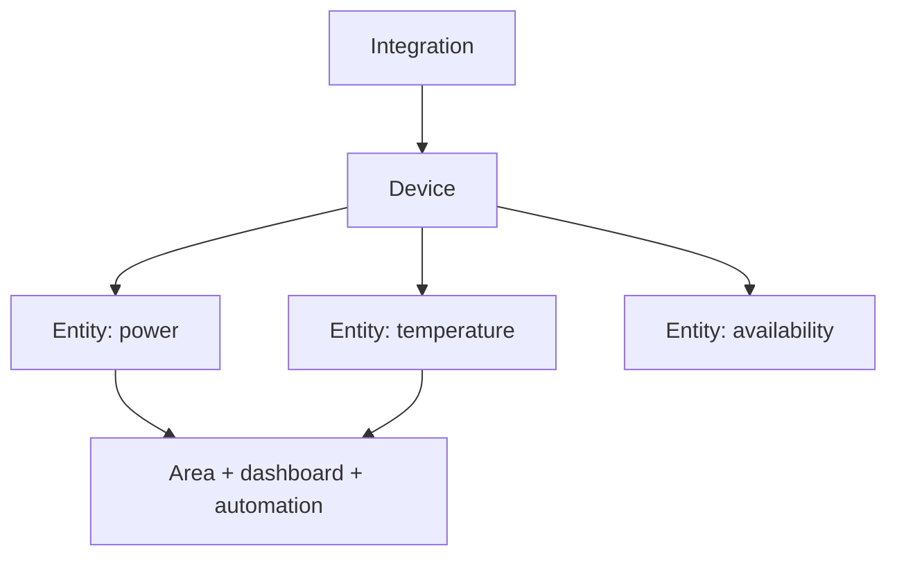

# Class 8 — Home Assistant Foundations

**Lecture (optional):** [Smart Home Junkie — Home Assistant Beginner Guide](https://www.youtube.com/watch?v=Frd-C7ZeZAo)
**Time:** 150 minutes
**Learning objective:** Given a Home Assistant install path, the learner can identify device/entity/area/integration, build a minimal dashboard, and prove backup + restore evidence.
**Bloom level:** Apply
**Build output:** Home Assistant instance with one integration, dashboard, and tested backup
**Mastery unlock:** ≥80% retrieval target when scored + completed Feynman teach-back + independent practice + all practical gate boxes + workbook evidence.

## Learning objective

Given a Home Assistant install path, the learner can identify device/entity/area/integration, build a minimal dashboard, and prove backup + restore evidence.

## Why this matters

Automations and voice are useless on a unnamed mess of entities. Foundations — objects, areas, backups — decide whether later classes are joyful or cursed.

## Prior-knowledge check

Answer briefly before reading Instruction. Wrong answers are useful — they show what to review.

1. What should you back up before experimenting?
2. Why do friendly names matter for automations?
3. What is an integration in plain language?

## Vocabulary

_Add terms as you encounter them in Instruction._

## Instruction

### Originally: Outcomes

You will understand instances, integrations, devices, entities, areas, services/actions, states, dashboards, helpers, add-ons, backups, and the separation between Home Assistant OS and containerized installations.

### Object model



An integration connects Home Assistant to a platform or protocol. A device is a physical or logical product. An entity is one controllable or observable property. Automations usually reason over entity state and invoke actions/services.

### Installation choices

### Home Assistant OS

A complete managed appliance model with Supervisor and add-on support. It fits well in a dedicated VM and is the course's default for the capstone.

### Home Assistant Container

Runs Home Assistant Core in Docker. The operator manages surrounding services and does not receive the same managed add-on environment. This is valid, but instructions written for add-ons cannot be copied directly.

Do not combine installation models mentally. First record which model you operate, then follow matching documentation.

### States, actions, and history

An entity has a current state plus attributes. An action changes or requests something. A state value can be `unknown` or `unavailable`; automations must handle these deliberately.

Example:

```text
entity_id: light.office
state: on
attributes: brightness, color_temp, friendly_name
```

Home Assistant's developer tools let you inspect live state and manually invoke actions. These are diagnostic instruments, not merely advanced features.

### Naming and areas

Assign stable, human-readable names. Avoid encoding temporary room names or manufacturer details into every identity. Areas make dashboards and voice sentences more natural.

Good entity management supports:

- Readable automations.
- Useful voice commands.
- Faster troubleshooting.
- Migration when hardware changes.

### Backups

A backup is valuable only if it can be located, protected, and restored. Record:

- Backup scope.
- Creation time and HA version.
- Storage location outside the instance.
- Encryption/recovery information if applicable.
- Restore test result.

Snapshots, VM backups, and HA backups protect different failure modes. Use layers for important systems.

## Worked example

**I do** — study the reasoning, not just the final answer.

**Bad:** Default entity ids everywhere (`sensor.temperature_3`) and no backup.

**Better:** Name by area + purpose, attach areas, create one dashboard card you can explain, and complete a backup you have actually restored once.

## Guided practice

**We do** — hints allowed. Check your reasoning against Instruction.

Map one physical device → integration → entity → area on paper with assistance.

## Independent practice

**You do** — close the hints. Solve before opening the lab.

Rename/organize three entities and prove a backup artifact exists. Write the restore steps without powering off the wrong host.

## Feynman teach-back

Required. Do not skip.

### Explain
Describe **Home Assistant’s object model: device, entity, area, integration** in your own words. No copying the lesson verbatim.

### Simplify
Explain the same idea to a 12-year-old. If you use a technical word, define it.

### Example
Analogy: a labeled breaker panel vs a box of mystery switches.

### Weak spot
What part was hard to explain? That is where your understanding is thin.

### Retry
Return to that part of **Instruction**, restudy it, then rewrite a clearer explanation below.

> Mastery note: a completed Feynman teach-back is required before the next class unlocks — “I get it” without explanation does not count.


## Retrieval check

Active recall — write answers without rereading first. Target ≥80% before the gate.

1. What is the difference between a device and an entity?
2. How does Home Assistant OS differ from Home Assistant Container?
3. Why should `unavailable` not be treated as `off`?
4. What evidence makes a backup credible?
5. Why assign areas before voice automation?

## Guided lab

**Goal:** a reachable Home Assistant instance, one stable entity, dashboard proof, restart proof, and a backup you can restore from.

Prefer HA OS in a VM (Class 1) or a documented Container install. Record which one you use.

1. **Deploy or document the install.**  
   If new VM: create from Class 1, attach HA OS image per current docs, boot, note the onboarding URL. If Container:

:::linux
```bash
# Example pattern — follow current HA Container docs for exact compose:
mkdir -p ~/ha-config
docker compose ps
# After your compose exists:
curl -sI http://127.0.0.1:8123/ | head
```
:::

:::windows
```powershell
curl.exe -sI http://127.0.0.1:8123/
```
:::

2. **Stabilize the LAN address.** Reserve DHCP or set static IP. Record `http://HA-IP:8123` in the workbook.

:::linux
```bash
ping -c 2 HA-IP
curl -sI http://HA-IP:8123/ | head
```
:::

:::windows
```powershell
ping -n 2 HA-IP
curl.exe -sI http://HA-IP:8123/
```
:::

3. **Complete onboarding** with a strong unique password, correct location/time zone. Do not reuse your email password.

4. **Add one safe local integration** (demo/sun/input helper is fine) or a local device you own.

5. **Assign area + rename entity ID** before automations depend on it (Settings → Devices & services / Entities). Write old→new ID in the workbook.

6. **Dashboard card** showing state + control for that entity.

7. **Developer Tools proof.**

:::linux
```bash
# From a machine that can reach HA — Long-Lived Token in password manager only:
export HA=http://HA-IP:8123
export TOKEN='YOUR_LONG_LIVED_TOKEN'
curl -s -H "Authorization: Bearer $TOKEN" -H "Content-Type: application/json" \
  "$HA/api/states/ENTITY_ID" | head -c 400; echo
```
:::

:::windows
```powershell
$HA = "http://HA-IP:8123"
$TOKEN = "YOUR_LONG_LIVED_TOKEN"
curl.exe -s -H "Authorization: Bearer $TOKEN" -H "Content-Type: application/json" "$HA/api/states/ENTITY_ID"
```
:::

   Also use UI Developer Tools → States / Services to inspect attributes and call one **safe** service (example: toggle an `input_boolean`).

8. **Restart HA and prove recovery.** UI restart or host reboot. Confirm entity + dashboard return. Time the outage in the workbook.

9. **Create a backup** (HA OS: Settings → System → Backups). Copy the backup file off-box.

:::linux
```bash
mkdir -p ~/backups/ha
# Copy from the path your install uses, e.g. backup share or download via UI
ls -lh ~/backups/ha
sha256sum ~/backups/ha/*.tar 2>/dev/null | tee ~/backups/ha/SHA256SUMS
```
:::

:::windows
```powershell
New-Item -ItemType Directory -Force $HOME\backups\ha | Out-Null
Get-FileHash $HOME\backups\ha\* -Algorithm SHA256 | Format-Table
```
:::

10. **Write the restore procedure** in the workbook. If production risk is high, restore into a disposable VM instead of overwriting the live box.

## Break / fix

### Break/fix

1. Rename an entity after a dashboard depends on it—observe break—rename back or update the card.

2. Stop the HA VM/container briefly; confirm UI down; start; confirm recovery.

:::linux
```bash
# Container example:
docker compose stop homeassistant
curl -sI --max-time 3 http://HA-IP:8123/ || echo EXPECTED_DOWN
docker compose start homeassistant
curl -sI http://HA-IP:8123/ | head
```
:::

3. Attempt action on `unavailable` vs `off` entities; record the difference.

## Feedback / common mistakes

```text
power/network -> HA process up -> UI loads -> entity exists -> correct state -> service call -> automation
```

## Practical mastery gate

All boxes must be true before the next class unlocks. If you fail: feedback → targeted review → new practice → reassess.

- [ ] Installation model is documented.
- [ ] One integration supplies a working entity.
- [ ] Entity state and attributes can be inspected.
- [ ] A safe manual action succeeds.
- [ ] Dashboard survives restart.
- [ ] A current backup exists outside the instance.
- [ ] The student can locate the appropriate restore procedure.
- [ ] Prior-knowledge check answered
- [ ] Feynman teach-back completed (Explain, Simplify, Example, Weak spot, Retry)
- [ ] Independent practice completed
- [ ] Retrieval check attempted (target ≥80% when scored)
- [ ] Evidence recorded in workbook / verification matrix

## Reflection

Which naming choice will help future-you at 11pm, and did you actually test restore?

Also answer:

1. What did I learn?
2. What did I struggle with?
3. How does this connect to earlier classes?

## Spiral hook

Class 9 automations target these entities. Classes 11–13 voice actions must speak the same names. Bad naming here becomes voice failure later.

## 2026 correction

Home Assistant navigation and terminology change frequently. Use current official documentation for exact menu paths. Preserve the object model and verification steps even when the UI labels differ from the lecture.
