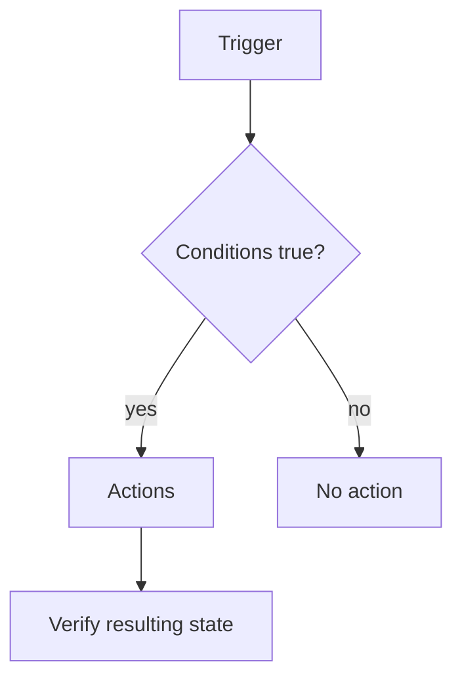

# Class 9 — Home Assistant Automations as Testable Logic

**Lecture:** [NetworkChuck — Home Assistant](https://www.youtube.com/watch?v=k02P5nghmfs)  
**Time:** 150 minutes  
**Build output:** one automation with positive, negative, restart, and failure tests

## Automation model

An automation has three core parts:

```text
WHEN trigger occurs
IF conditions are true
THEN perform actions
```

Triggers begin evaluation. Conditions guard execution. Actions express intended changes. This separation matters when diagnosing “it did not run.”



## Example requirement

> When the office test switch turns on after sunset, turn on the office test light at 40 percent. Do nothing during daytime. If the light is unavailable, create a persistent notification.

This requirement is measurable. It identifies trigger, condition, nominal action, exception behavior, and expected state.

## State versus event

A state trigger reacts when an entity changes state. An event trigger reacts to a bus event. Time, sun, template, webhook, zone, device, and other trigger families express different initiation mechanisms. Pick the type that matches the requirement rather than the one easiest to click.

## Modes and concurrency

Automation modes control what happens when a new trigger occurs while a prior run is active:

| Mode | Behavior |
|---|---|
| single | Ignore or warn on overlapping trigger |
| restart | Stop prior run and begin newest |
| queued | Run invocations in order |
| parallel | Run multiple invocations concurrently |

The right mode depends on safety and intent. A door announcement may use queued behavior; a motion-controlled timer may use restart; parallel actions can create races if they modify the same system.

## Traces

Automation traces show which trigger fired, condition result, path taken, variables, and action errors. Use the trace before editing unrelated devices or reinstalling an integration.

## Guided lab

Create two helpers if safe physical devices are unavailable: an input boolean as the trigger and a light helper or persistent notification as the output.

1. Write the requirement and acceptance criteria first.
2. Build a trigger from the boolean turning on.
3. Add a condition based on another helper representing “allowed.”
4. Add the nominal action.
5. Add logging or a persistent notification that records the test run.
6. Select an intentional automation mode.
7. Test positive case: trigger true and condition true.
8. Test negative case: trigger true and condition false.
9. Test repeated/rapid triggers and verify mode behavior.
10. Restart Home Assistant and repeat the positive test.
11. Inspect trace details for all cases.

## Monitoring the homelab

Apply the same model to infrastructure without allowing HA to hide faults:

- Trigger: Plex or a monitored endpoint becomes unavailable for a defined duration.
- Condition: maintenance mode is off.
- Action: notify the owner and capture context.

Auto-restarts can be added only after detecting, confirming, limiting retries, and alerting on repeated failure. Otherwise automation can erase evidence and create restart loops.

## Break/fix

1. Change the condition so it is false. Confirm the trace stops at the condition.
2. Point the action to a nonexistent entity. Confirm the trigger/condition pass and the action fails.
3. Set a delay, trigger twice, and observe mode behavior.
4. Disable the automation and confirm manual entity control still works.

## Failure taxonomy

| Symptom | Likely layer |
|---|---|
| No trace exists | Trigger did not fire or automation disabled |
| Trace stops at condition | Guard evaluated false/unknown |
| Action shows error | Target/action/service/data issue |
| Action succeeds but device unchanged | Integration/device/physical layer |
| Works manually but not after restart | Initialization, unavailable state, or timing |

## Knowledge check

1. What is the difference between a trigger and a condition?
2. Why test a negative case?
3. When is `restart` mode useful?
4. What does an automation trace prove?
5. Why should an auto-restart loop have a retry limit?

## Practical gate

- [ ] Requirement and acceptance criteria are written.
- [ ] Positive test passes.
- [ ] Negative test prevents the action.
- [ ] Repeated-trigger behavior matches the selected mode.
- [ ] The trace identifies each path.
- [ ] Restart does not break the automation.
- [ ] Failure behavior creates useful evidence.

## 2026 correction

Current Home Assistant uses action-oriented terminology in places where old material may say “call service.” Follow the current editor/schema while retaining trigger-condition-action logic and trace-based diagnosis.

