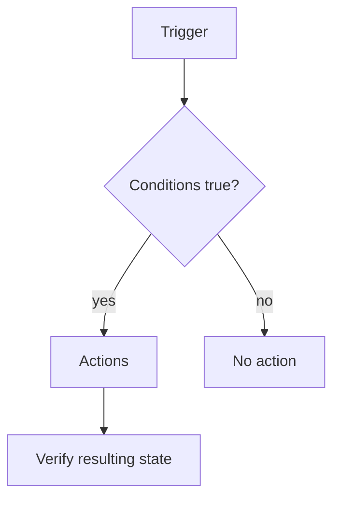

# Class 9 — Home Assistant Automations as Testable Logic

**Lecture:** [NetworkChuck — Home Assistant](https://www.youtube.com/watch?v=k02P5nghmfs)  
**Time:** 150 minutes  
**Build output:** one automation with positive, negative, restart, and failure tests

## Automation model

An automation has three core parts:

```text
WHEN trigger occurs
IF conditions are true
THEN perform actions
```

Triggers begin evaluation. Conditions guard execution. Actions express intended changes. This separation matters when diagnosing “it did not run.”



## Example requirement

> When the office test switch turns on after sunset, turn on the office test light at 40 percent. Do nothing during daytime. If the light is unavailable, create a persistent notification.

This requirement is measurable. It identifies trigger, condition, nominal action, exception behavior, and expected state.

## State versus event

A state trigger reacts when an entity changes state. An event trigger reacts to a bus event. Time, sun, template, webhook, zone, device, and other trigger families express different initiation mechanisms. Pick the type that matches the requirement rather than the one easiest to click.

## Modes and concurrency

Automation modes control what happens when a new trigger occurs while a prior run is active:

| Mode | Behavior |
|---|---|
| single | Ignore or warn on overlapping trigger |
| restart | Stop prior run and begin newest |
| queued | Run invocations in order |
| parallel | Run multiple invocations concurrently |

The right mode depends on safety and intent. A door announcement may use queued behavior; a motion-controlled timer may use restart; parallel actions can create races if they modify the same system.

## Traces

Automation traces show which trigger fired, condition result, path taken, variables, and action errors. Use the trace before editing unrelated devices or reinstalling an integration.

## Guided lab

Build one automation with explicit acceptance tests. Prefer helpers (`input_boolean`) so you never need real hardware risk.

1. **Write requirement + acceptance criteria first** (workbook):

```text
When test_trigger turns on AND test_allowed is on → turn on test_lamp (helper)
Notify/log that the run happened
Mode: single (or restart — pick one and defend it)
```

2. **Create helpers** (UI → Helpers): `input_boolean.test_trigger`, `input_boolean.test_allowed`, `input_boolean.test_lamp`.

3. **Build automation:** trigger = test_trigger turns on; condition = test_allowed is on; actions = turn on test_lamp + persistent notification / logbook.

4. **Positive test:**

:::linux
```bash
export HA=http://HA-IP:8123 TOKEN='YOUR_TOKEN'
call() { curl -s -H "Authorization: Bearer $TOKEN" -H "Content-Type: application/json" -d "$2" "$HA/api/services/$1"; echo; }
# turn allowed on, trigger on:
call input_boolean/turn_on '{"entity_id":"input_boolean.test_allowed"}'
call input_boolean/turn_on '{"entity_id":"input_boolean.test_trigger"}'
curl -s -H "Authorization: Bearer $TOKEN" "$HA/api/states/input_boolean.test_lamp"
```
:::

:::windows
```powershell
# Use Developer Tools → Services, or:
$H=@{Authorization="Bearer YOUR_TOKEN"; "Content-Type"="application/json"}
Invoke-RestMethod -Headers $H -Method Post -Uri "http://HA-IP:8123/api/services/input_boolean/turn_on" -Body '{"entity_id":"input_boolean.test_allowed"}'
Invoke-RestMethod -Headers $H -Method Post -Uri "http://HA-IP:8123/api/services/input_boolean/turn_on" -Body '{"entity_id":"input_boolean.test_trigger"}'
Invoke-RestMethod -Headers $H -Uri "http://HA-IP:8123/api/states/input_boolean.test_lamp"
```
:::

   Expect lamp on + notification. Open **Traces** and save a screenshot (no secrets).

5. **Negative test:** allowed off, trigger on → lamp must stay off; trace stops at condition.

6. **Rapid triggers:** flip trigger quickly; confirm mode behavior matches your choice (`single` vs `restart`).

7. **Restart HA** and repeat the positive test once.

8. **Inspect traces** for all cases; write pass/fail in the workbook.

## Monitoring the homelab

Optional stretch: notify when a critical binary sensor / container health helper fails—still use a helper first.

## Break/fix

1. Force condition false; confirm trace stops at condition.

2. Point action at a nonexistent entity; confirm trigger/condition pass and action errors in trace.

3. Add a delay; trigger twice; observe mode.

4. Disable automation; prove manual helper control still works.

## Knowledge check

1. What is the difference between a trigger and a condition?
2. Why test a negative case?
3. When is `restart` mode useful?
4. What does an automation trace prove?
5. Why should an auto-restart loop have a retry limit?

## Practical gate

- [ ] Requirement and acceptance criteria are written.
- [ ] Positive test passes.
- [ ] Negative test prevents the action.
- [ ] Repeated-trigger behavior matches the selected mode.
- [ ] The trace identifies each path.
- [ ] Restart does not break the automation.
- [ ] Failure behavior creates useful evidence.

## 2026 correction

Current Home Assistant uses action-oriented terminology in places where old material may say “call service.” Follow the current editor/schema while retaining trigger-condition-action logic and trace-based diagnosis.

