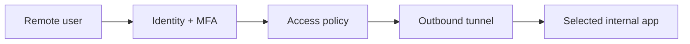

# Class 10 — Secure Remote Access Without Public Admin Panels

**Lecture:** [NetworkChuck — Cloudflare Tunnel / Remote Access](https://www.youtube.com/watch?v=ey4u7OUAF3c)  
**Time:** 150 minutes  
**Build output:** authenticated remote path or documented VPN alternative with denial tests

## Security objective

Remote access must not mean publishing every admin interface to the internet. The objective is a narrow, authenticated path with encrypted transport, least privilege, logs, revocation, and a rollback plan.

## Threat model

Assets include Home Assistant control, ARR API keys, download clients, media libraries, cameras, door controls, and internal topology. Threats include password reuse, token theft, software vulnerabilities, incorrect access policies, exposed origin ports, and session theft.

## Architecture choices

### VPN/mesh access

The remote device joins a private network and reaches services as if on an authorized internal segment. This is usually the simplest mental model for owner/admin access.

### Outbound tunnel with access policy

A connector initiates an outbound tunnel to a provider. A policy layer authenticates the user before proxying to a selected internal service.

The tunnel encrypts and routes traffic; it does not automatically create a good authorization policy. An accidentally public hostname can still be dangerous.

## Rules for this course

- Never expose qBittorrent, SABnzbd, Sonarr, Radarr, Prowlarr, Proxmox, or Docker APIs directly to the public internet.
- Prefer VPN access for administrative tools.
- If publishing Home Assistant through a supported proxy/tunnel pattern, require strong identity controls and follow HA proxy configuration guidance.
- Do not disable TLS validation as a permanent fix.
- Keep origin services LAN-bound where possible.
- Store tunnel credentials as secrets and rotate after exposure.

## Cloudflare concepts

| Term | Meaning |
|---|---|
| Tunnel connector | Local process creating outbound connectivity |
| Public hostname | External hostname mapped through the tunnel |
| Origin service | Internal destination reached by the connector |
| Access policy | Identity/attribute rules that allow or deny requests |
| Service token | Machine-to-machine credential where supported |
| MFA | Additional authentication factor |

## Guided lab

Choose either the VPN path or tunnel-plus-access path. Use a disposable internal web service first—not a production admin panel.

### Common preparation

1. Back up the target service.
2. Record internal URL, port, protocol, and expected host headers.
3. Confirm the service is not already exposed by router port forwarding or UPnP.
4. Define allowed identities and denied cases.

### Tunnel path

1. Create the tunnel using current official instructions.
2. Run the connector with least privilege.
3. Map one test hostname to one test origin.
4. Create an Access policy that allows only the intended identity with MFA.
5. Test from an external network in a signed-out browser: access must be denied or redirected to authentication.
6. Authenticate with an allowed identity: access must succeed.
7. Test a disallowed identity: access must fail.
8. Stop the connector: external access must fail closed while the internal service remains reachable locally.

### VPN path

1. Enroll one remote client with its own identity.
2. Authorize only required subnets/services.
3. Prove the client can reach the test origin.
4. Prove it cannot reach a deliberately excluded service.
5. Revoke the device/identity and confirm access ends.

## Reverse proxy awareness

Home Assistant and other applications may need trusted-proxy and forwarded-header configuration. Trust only the actual proxy addresses/ranges. Overly broad trusted-proxy settings can let clients spoof source information.

## Break/fix and security tests

- Remove the allow rule and confirm denial.
- Use an incorrect origin port and diagnose from connector logs without weakening authentication.
- Stop DNS resolution and distinguish hostname failure from origin failure.
- Revoke one session or device and measure how quickly access disappears.
- Confirm no unexpected router ports are open from an external perspective using an authorized method.

## Knowledge check

1. Does an encrypted tunnel automatically enforce user authorization?
2. Why are ARR admin panels poor candidates for public exposure?
3. What is the origin service?
4. What does fail closed mean in this lab?
5. Why is a per-device identity better than sharing one reusable credential?
6. What should happen when the connector stops?

## Practical gate

- [ ] One documented remote-access pattern is selected.
- [ ] MFA or equivalent strong identity control protects human access.
- [ ] Signed-out and disallowed-user tests fail.
- [ ] Allowed access works from an external network.
- [ ] Connector/device revocation is demonstrated.
- [ ] No direct public ARR/downloader/Proxmox port exists.
- [ ] Rollback removes the external path without breaking local use.

## 2026 correction

Provider dashboards, policy syntax, and product names change. Use current official Cloudflare or selected VPN documentation. The security requirements—narrow exposure, explicit identity, denial testing, revocation, and fail-closed behavior—remain the authority.

