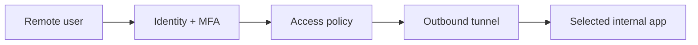

# Class 10 — Secure Remote Access Without Public Admin Panels

**Lecture:** [NetworkChuck — Cloudflare Tunnel / Remote Access](https://www.youtube.com/watch?v=ey4u7OUAF3c)  
**Time:** 150 minutes  
**Build output:** authenticated remote path or documented VPN alternative with denial tests

## Security objective

Remote access must not mean publishing every admin interface to the internet. The objective is a narrow, authenticated path with encrypted transport, least privilege, logs, revocation, and a rollback plan.

## Threat model

Assets include Home Assistant control, ARR API keys, download clients, media libraries, cameras, door controls, and internal topology. Threats include password reuse, token theft, software vulnerabilities, incorrect access policies, exposed origin ports, and session theft.

## Architecture choices

### VPN/mesh access

The remote device joins a private network and reaches services as if on an authorized internal segment. This is usually the simplest mental model for owner/admin access.

### Outbound tunnel with access policy

A connector initiates an outbound tunnel to a provider. A policy layer authenticates the user before proxying to a selected internal service.



The tunnel encrypts and routes traffic; it does not automatically create a good authorization policy. An accidentally public hostname can still be dangerous.

## Rules for this course

- Never expose qBittorrent, SABnzbd, Sonarr, Radarr, Prowlarr, Proxmox, or Docker APIs directly to the public internet.
- Prefer VPN access for administrative tools.
- If publishing Home Assistant through a supported proxy/tunnel pattern, require strong identity controls and follow HA proxy configuration guidance.
- Do not disable TLS validation as a permanent fix.
- Keep origin services LAN-bound where possible.
- Store tunnel credentials as secrets and rotate after exposure.

## Cloudflare concepts

| Term | Meaning |
|---|---|
| Tunnel connector | Local process creating outbound connectivity |
| Public hostname | External hostname mapped through the tunnel |
| Origin service | Internal destination reached by the connector |
| Access policy | Identity/attribute rules that allow or deny requests |
| Service token | Machine-to-machine credential where supported |
| MFA | Additional authentication factor |

## Guided lab

**Security objective:** remote access without opening ARR/HA admin ports to the whole internet. Pick **one** path: outbound tunnel + Access policy **or** VPN/mesh. Do both only if you have time.

### Common preparation

1. **Back up the target service** (HA backup or reverse-proxy config copy).

2. **Record origin details** in the workbook: internal URL (`http://HA-IP:8123`), port, TLS or not, expected hostname.

3. **Prove you are not already exposed.**

:::linux
```bash
# From the HA/Docker host — list listeners (look for 8123/8096/8989 published on 0.0.0.0 unexpectedly)
ss -lntp | egrep '8123|8096|8989|7878|9696' || true
# From an external network (phone LTE), try http://PUBLIC-IP:8123 — expect failure
```
:::

:::windows
```powershell
netstat -ano | findstr "8123 8989 7878"
# External test from cellular network browser to your public IP — expect fail
```
:::

4. **Define allow/deny identities** (who may authenticate; who must fail).

### Tunnel path (example: Cloudflare Tunnel + Access)

Follow **current** official tunnel docs for connector install. Then:

1. Create tunnel; run connector with least privilege (dedicated user/service).

:::linux
```bash
# Pattern after install — service name varies by distro/docs:
sudo systemctl status cloudflared --no-pager
sudo journalctl -u cloudflared -n 50 --no-pager
```
:::

:::windows
```powershell
Get-Service cloudflared -ErrorAction SilentlyContinue
# Or check the connector logs from the vendor's install path
```
:::

2. Map one test hostname → one origin (`http://HA-IP:8123` or localhost connector side).

3. Access policy: allow only your identity + MFA.

4. **External signed-out browser:** must deny or redirect to auth.

5. **Allowed identity:** must succeed.

6. **Disallowed identity / other account:** must fail.

7. **Fail closed:** stop connector; external access fails; LAN `http://HA-IP:8123` still works.

:::linux
```bash
sudo systemctl stop cloudflared
curl -sI --max-time 5 https://YOUR-TUNNEL-HOST/ || echo EXPECTED_EXTERNAL_FAIL
curl -sI http://HA-IP:8123/ | head
sudo systemctl start cloudflared
```
:::

### VPN path

1. Enroll one remote client with its own identity/key.

2. Authorize only required subnets (HA LAN), not “full house flat”.

3. Connect VPN; prove `curl http://HA-IP:8123` works.

:::linux
```bash
ping -c 2 HA-IP
curl -sI http://HA-IP:8123/ | head
```
:::

:::windows
```powershell
ping -n 2 HA-IP
curl.exe -sI http://HA-IP:8123/
```
:::

4. Prove an excluded service/IP fails.

5. Revoke device/identity; confirm access ends; remove test grants you no longer need.

## Reverse proxy awareness

If you terminate TLS on a proxy, record host headers and whether HA `trusted_proxies` (or equivalent) is required—follow current HA docs.

## Break/fix and security tests

1. Stop connector / disconnect VPN → external fail, LAN ok.

2. Remove MFA temporarily in a controlled test only if policy allows—then restore MFA immediately.

3. Attempt access with a second account that should be denied.

## Knowledge check

1. Does an encrypted tunnel automatically enforce user authorization?
2. Why are ARR admin panels poor candidates for public exposure?
3. What is the origin service?
4. What does fail closed mean in this lab?
5. Why is a per-device identity better than sharing one reusable credential?
6. What should happen when the connector stops?

## Practical gate

- [ ] One documented remote-access pattern is selected.
- [ ] MFA or equivalent strong identity control protects human access.
- [ ] Signed-out and disallowed-user tests fail.
- [ ] Allowed access works from an external network.
- [ ] Connector/device revocation is demonstrated.
- [ ] No direct public ARR/downloader/Proxmox port exists.
- [ ] Rollback removes the external path without breaking local use.

## 2026 correction

Provider dashboards, policy syntax, and product names change. Use current official Cloudflare or selected VPN documentation. The security requirements—narrow exposure, explicit identity, denial testing, revocation, and fail-closed behavior—remain the authority.

