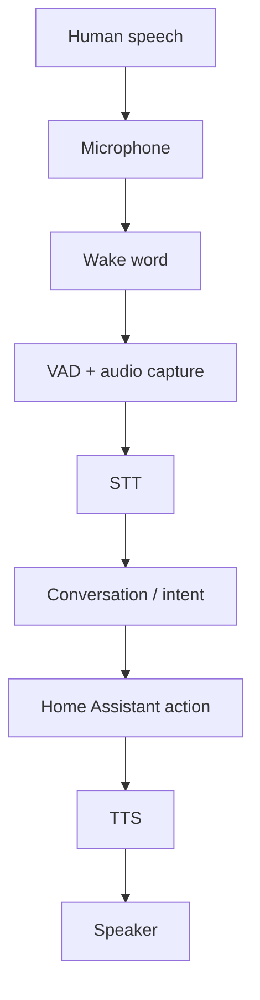

# Class 11 — Local Voice Architecture and Fault Isolation

**Lecture:** [Everything Smart Home — Local Smart Home Voice](https://www.youtube.com/watch?v=w9BbjUowmnE)  
**Time:** 120 minutes  
**Build output:** voice-pipeline test record with one test per stage

## Core principle

Never test the entire voice pipeline first. Each stage transforms an input into an output. Capture the boundary result and prove it before moving forward.



## Vocabulary

| Acronym | Meaning | Boundary output |
|---|---|---|
| VAD | Voice Activity Detection | Start/end of utterance |
| STT/ASR | Speech to Text / Automatic Speech Recognition | Transcript |
| NLU | Natural-language understanding | Intent and slots/entities |
| HA | Home Assistant | State/action result |
| TTS | Text to Speech | Audio waveform/stream |
| Wake word | Local keyword detector | Detection event |

## Signal chain

Microphone quality, gain, distance, echo, noise, sample format, and clipping affect everything downstream. An LLM cannot recover words that were never captured. Begin with a recorded audio sample and listen to it.

### Wake word

Wake-word detection should occur before expensive STT in a typical always-listening satellite. Tune for the environment: too sensitive causes false activations; not sensitive enough causes misses. Measure both false rejects and false accepts.

### VAD and endpointing

VAD determines when speech begins and ends. If endpointing cuts early, the transcript may miss the final noun. If it waits too long, latency increases. Diagnose timing from captured audio length and pipeline timestamps.

### STT

STT turns captured audio into text. Its test result is the transcript, not whether a light eventually changes. Use a known sentence and acceptance rule.

### Conversation and intent

The conversation layer interprets text. Deterministic home-control sentences should produce a clear intent and target. Open-ended LLM responses and smart-home commands may use different agents or routing policies.

### Action

Home Assistant must be able to perform the action from text/manual developer tools before voice is involved.

### TTS and playback

TTS produces audio; the output device must play it. Test synthesis and playback separately so a muted speaker is not blamed on Piper.

## Guided lab

Test the voice chain **one layer at a time**. Do not run full wake→action until layers 1–10 pass.

1. **Record raw mic audio** (arecord/Audacity/Phone). Confirm intelligible, not clipped.

:::linux
```bash
# Example if ALSA device exists on the satellite/host:
arecord -l
arecord -d 5 -f cd /tmp/voice-raw.wav
aplay /tmp/voice-raw.wav
ls -l /tmp/voice-raw.wav
```
:::

:::windows
```powershell
# Record with Voice Recorder / Audacity; save to Desktop\voice-raw.wav
Get-Item $HOME\Desktop\voice-raw.wav | Format-List Name, Length, LastWriteTime
```
:::

2. **Wake word:** 10 attempts at fixed distance → record detections / misses.

3. **False activations:** 10 unrelated phrases → record false wakes.

4. **VAD/endpointing:** confirm start/end do not chop words (inspect recording or pipeline debug).

5. **STT alone:** submit the same audio/phrase to configured STT; save transcript text in workbook.

6. **Assist text path:** paste that exact transcript into HA Assist; record intent + target entity.

7. **Action alone:** call the HA service manually; confirm entity changes.

8. **TTS alone:** synthesize a fixed phrase; confirm audio file/stream exists.

9. **Playback alone:** play a known WAV/MP3 on the target speaker.

:::linux
```bash
aplay /usr/share/sounds/alsa/Front_Center.wav 2>/dev/null || ffplay -autoexit -nodisp /tmp/test.wav
```
:::

10. **Full pipeline** only after 1–9 pass. Time wake→action latency; log failures by layer.

## Acceptance criteria example

```text
Wake detect ≥ 8/10 at 1m
False wakes ≤ 1/10
STT exact match ≥ 4/5 fixed phrases
Assist maps to correct intent 5/5 when given perfect text
TTS intelligible 5/5
E2E success ≥ 7/10 from seating position
```

## Symptom-to-layer diagnosis

| Symptom | Check layer first |
|---|---|
| Never wakes | Mic / wake model |
| Wakes but silence | VAD / transport |
| Wrong words | STT / noise / model |
| Right words, wrong action | Assist / expose entities |
| Action ok, no voice back | TTS / speaker |

## Break/fix

Mute mic; confirm wake fails. Unmute. Play TTS with speaker unplugged; confirm synthesis may succeed while playback fails—record both.

## Knowledge check

1. Why does a correct HA action not prove STT quality?
2. What does VAD control?
3. Which artifact proves STT behavior?
4. Why test TTS synthesis separately from playback?
5. What should be tested before adding an LLM conversation agent?

## Practical gate

- [ ] Raw microphone sample is acceptable.
- [ ] Wake-word hit/miss evidence is recorded.
- [ ] STT transcript meets criterion.
- [ ] Text-only HA command works.
- [ ] TTS and speaker pass separately.
- [ ] Stage timestamps identify latency.
- [ ] End-to-end command passes.

## 2026 correction

Home Assistant voice pipelines and supported hardware continue to evolve. Use current HA voice documentation for UI and integration steps; preserve boundary testing regardless of the selected satellite or agent.

