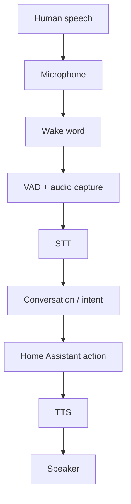

# Class 11 — Local Voice Architecture and Fault Isolation

**Lecture:** [Everything Smart Home — Local Smart Home Voice](https://www.youtube.com/watch?v=w9BbjUowmnE)  
**Time:** 120 minutes  
**Build output:** voice-pipeline test record with one test per stage

## Core principle

Never test the entire voice pipeline first. Each stage transforms an input into an output. Capture the boundary result and prove it before moving forward.

## Vocabulary

| Acronym | Meaning | Boundary output |
|---|---|---|
| VAD | Voice Activity Detection | Start/end of utterance |
| STT/ASR | Speech to Text / Automatic Speech Recognition | Transcript |
| NLU | Natural-language understanding | Intent and slots/entities |
| HA | Home Assistant | State/action result |
| TTS | Text to Speech | Audio waveform/stream |
| Wake word | Local keyword detector | Detection event |

## Signal chain

Microphone quality, gain, distance, echo, noise, sample format, and clipping affect everything downstream. An LLM cannot recover words that were never captured. Begin with a recorded audio sample and listen to it.

### Wake word

Wake-word detection should occur before expensive STT in a typical always-listening satellite. Tune for the environment: too sensitive causes false activations; not sensitive enough causes misses. Measure both false rejects and false accepts.

### VAD and endpointing

VAD determines when speech begins and ends. If endpointing cuts early, the transcript may miss the final noun. If it waits too long, latency increases. Diagnose timing from captured audio length and pipeline timestamps.

### STT

STT turns captured audio into text. Its test result is the transcript, not whether a light eventually changes. Use a known sentence and acceptance rule.

### Conversation and intent

The conversation layer interprets text. Deterministic home-control sentences should produce a clear intent and target. Open-ended LLM responses and smart-home commands may use different agents or routing policies.

### Action

Home Assistant must be able to perform the action from text/manual developer tools before voice is involved.

### TTS and playback

TTS produces audio; the output device must play it. Test synthesis and playback separately so a muted speaker is not blamed on Piper.

## Guided lab

Use the sentence: **“Turn on the office test light.”** Replace the entity only with a safe test device/helper.

1. Record raw microphone audio. Confirm the sentence is intelligible, not clipped, and sufficiently loud.
2. Trigger the wake word ten times at a fixed distance; record detections.
3. Speak ten unrelated phrases; record false activations.
4. Capture VAD start/end or recorded utterance and confirm no word is cut.
5. Submit the audio to the configured STT service and save the transcript.
6. Enter the exact transcript directly into Home Assistant Assist.
7. Confirm the recognized intent and target.
8. Invoke the corresponding HA action manually.
9. Send a fixed phrase to TTS and capture whether synthesis succeeds.
10. Play known audio through the target speaker.
11. Run the complete pipeline only after steps 1–10 pass.

## Acceptance criteria example

| Stage | Criterion |
|---|---|
| Microphone | Clear recording without clipping |
| Wake word | At least 9/10 expected detections in test position; false accepts documented |
| VAD | Complete sentence retained |
| STT | Correct action and target words |
| Intent | Correct domain/action/entity selected |
| HA | Entity reaches expected state |
| TTS | Full phrase synthesized intelligibly |
| Speaker | Known sample plays at usable volume |
| End to end | Action and response complete within recorded latency target |

## Symptom-to-layer diagnosis

| Symptom | Investigate first |
|---|---|
| No wake indication | Microphone, wake engine, model, threshold |
| Wake occurs; transcript is gibberish | Captured audio, gain/noise, STT language/model |
| Transcript correct; wrong device | Names, areas, exposed entities, intent resolution |
| Device changes; no spoken answer | TTS request, output route, speaker volume |
| Works once; then hangs | session state, stream close, concurrency, timeouts |
| Slow response | stage timestamps; do not guess |

## Break/fix

Introduce one controlled fault at a time: mute input, use the wrong STT language, rename the test entity, mute output. Predict the expected boundary failure, observe it, and restore the original state.

## Knowledge check

1. Why does a correct HA action not prove STT quality?
2. What does VAD control?
3. Which artifact proves STT behavior?
4. Why test TTS synthesis separately from playback?
5. What should be tested before adding an LLM conversation agent?

## Practical gate

- [ ] Raw microphone sample is acceptable.
- [ ] Wake-word hit/miss evidence is recorded.
- [ ] STT transcript meets criterion.
- [ ] Text-only HA command works.
- [ ] TTS and speaker pass separately.
- [ ] Stage timestamps identify latency.
- [ ] End-to-end command passes.

## 2026 correction

Home Assistant voice pipelines and supported hardware continue to evolve. Use current HA voice documentation for UI and integration steps; preserve boundary testing regardless of the selected satellite or agent.

