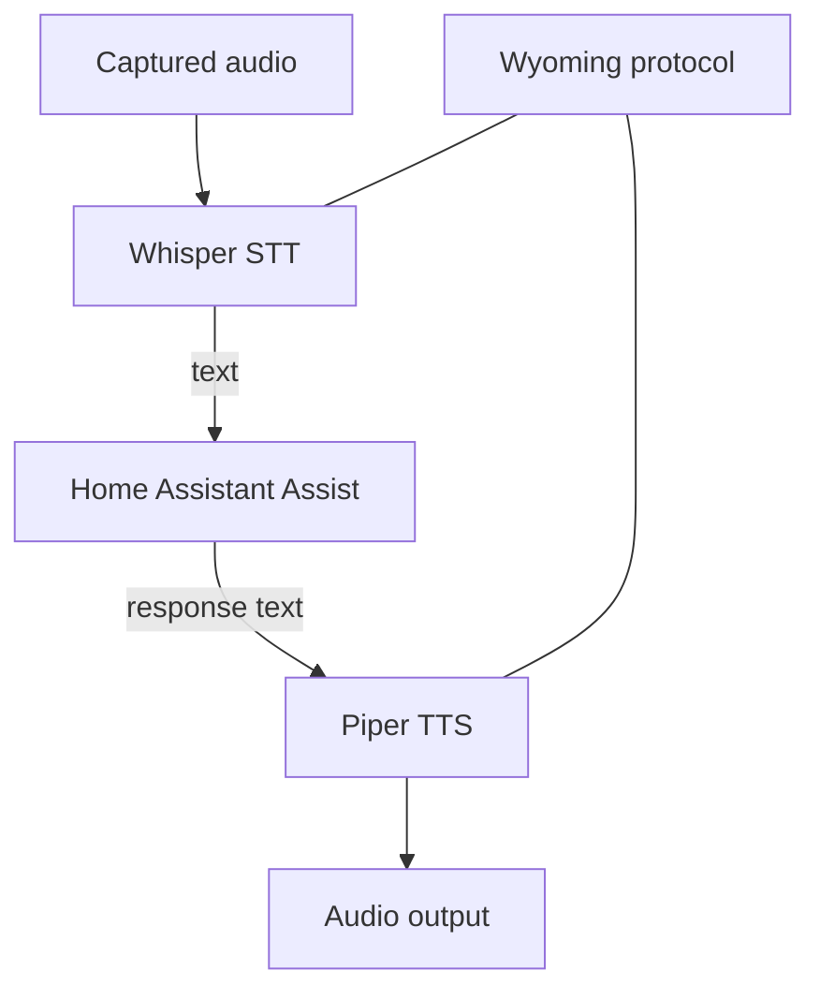

# Class 12 — Whisper, Piper, and Wyoming

**Lecture:** [Home Assistant Voice — Whisper + Piper](https://www.youtube.com/watch?v=1eZJPhR30ek)  
**Time:** 180 minutes  
**Build output:** local STT and TTS providers integrated and benchmarked separately

## Architecture

Whisper provides speech recognition. Piper provides speech synthesis. Wyoming is a protocol used to connect compatible voice services and satellites. Home Assistant orchestrates the Assist pipeline.



These are distinct services. A Wyoming endpoint being reachable does not prove the model is loaded, the language is correct, or the audio is good.

## Compute and model tradeoffs

Larger STT models can improve recognition but cost memory and latency. CPU-only inference may be acceptable for short commands but slow for conversation. GPU acceleration adds drivers, device access, model compatibility, and resource competition. Establish a baseline before optimizing.

Record:

- STT model and language.
- Compute device.
- Cold and warm latency.
- Test phrase accuracy.
- Real-time factor if available.
- Concurrent-request behavior.

Piper voices have language, speaker, sample-rate, and voice-model characteristics. A voice file and matching metadata/config must remain paired. Voice tuning can change speed and variation; test intelligibility before personality.

## Network contract

For every Wyoming service, record host/service name, port, network path, protocol role, health method, model/voice, and logs location. Do not publish voice-service ports to the public internet.

Test layers:

```text
DNS -> TCP port -> Wyoming handshake/discovery -> model load -> inference -> output quality
```

## Guided lab — STT

1. **Deploy Whisper via current HA Wyoming docs** (add-on, container, or supervised path you actually support).

:::linux
```bash
docker compose ps | egrep -i 'whisper|wyoming' || true
ss -lntp | egrep '10300|10301' || true
curl -sv telnet://127.0.0.1:10300 2>&1 | head
```
:::

:::windows
```powershell
docker compose ps
# Confirm the Wyoming STT endpoint host/port from your docs, then:
Test-NetConnection -ComputerName 127.0.0.1 -Port 10300
```
:::

2. **Confirm model/language loaded** in logs.

:::linux
```bash
docker compose logs --tail=100 whisper 2>/dev/null || docker compose logs --tail=100 | egrep -i 'whisper|model'
```
:::

3. **Connect Wyoming STT in Home Assistant** (Settings → Devices → add Wyoming).

4. **Fixed phrase set** (workbook)—run each **3 times**, record transcript + cold/warm latency:

```text
turn on test lamp
turn off test lamp
what time is it
set timer for five minutes
ignore this please
```

5. **Change only one variable** (model size, mic distance, or noise) and repeat one phrase set.

## Guided lab — TTS

1. **Deploy Piper** per current docs; keep voice model + metadata together.

:::linux
```bash
docker compose ps | egrep -i 'piper|wyoming' || true
ss -lntp | egrep '10200|10201' || true
```
:::

2. **Add Wyoming TTS in HA**; select the Piper voice.

3. **Synthesize five fixed responses** (UI media player / `tts.speak` service). Confirm no clipping.

4. **Measure synthesis latency vs playback latency** separately.

5. **Stress strings:** numbers, abbreviations, entity names, one long sentence.

6. **Change one voice parameter only** (if supported); compare intelligibility.

## Resource contention test

1. STT baseline idle  
2. STT while LLM generating (if present)  
3. TTS baseline  
4. TTS during STT  

:::linux
```bash
# Host pressure snapshot while testing:
free -h
uptime
docker stats --no-stream
```
:::

:::windows
```powershell
Get-Process | Sort-Object CPU -Descending | Select-Object -First 10
docker stats --no-stream
```
:::

Record latency, memory, errors, thermal/fan behavior.

## Break/fix

1. Point HA at the wrong Wyoming port; confirm failure mode; restore.

2. Remove Piper metadata mismatch deliberately; observe error; restore matching pair.

3. Saturate CPU with a disposable load; rerun one STT phrase; compare latency.

## Knowledge check

1. What does Wyoming provide versus Whisper?
2. Why record cold and warm latency?
3. What does a reachable TCP port fail to prove?
4. Why keep Piper model and metadata together?
5. How can an LLM interfere with STT even when both work independently?
6. Which variable should change in a controlled comparison?

## Practical gate

- [ ] Whisper endpoint is locally reachable through the intended path.
- [ ] Five-phrase transcript results are recorded.
- [ ] Cold/warm latency is measured.
- [ ] Piper produces complete intelligible output.
- [ ] Network, model, and audio faults can be distinguished.
- [ ] Resource-contention behavior is known.
- [ ] Neither voice service is publicly exposed.

## 2026 correction

Projects, repositories, add-ons, and model backends change. Use the current Home Assistant integration/add-on guidance and currently maintained Piper/Whisper implementations. Do not follow an old image name or abandoned repository solely because a video shows it.

