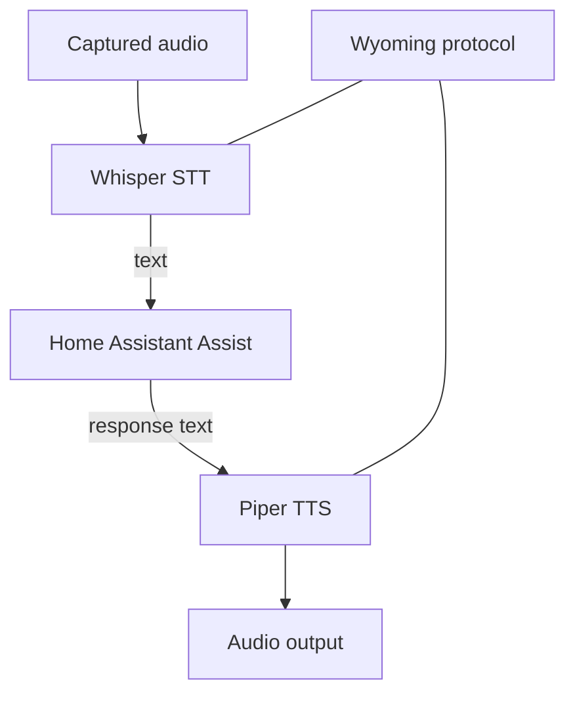

# Class 12 — Whisper, Piper, and Wyoming

**Lecture (optional):** [Home Assistant Voice — Whisper + Piper](https://www.youtube.com/watch?v=1eZJPhR30ek)
**Time:** 180 minutes
**Learning objective:** Given CPU/RAM constraints, the learner can deploy local Whisper (STT) and Piper (TTS) via Wyoming, benchmark them separately, and record latency/quality tradeoffs before integration.
**Bloom level:** Apply / Evaluate
**Build output:** local STT and TTS providers integrated and benchmarked separately
**Mastery unlock:** ≥80% retrieval target when scored + completed Feynman teach-back + independent practice + all practical gate boxes + workbook evidence.

## Learning objective

Given CPU/RAM constraints, the learner can deploy local Whisper (STT) and Piper (TTS) via Wyoming, benchmark them separately, and record latency/quality tradeoffs before integration.

## Why this matters

Voice feels ‘AI magic’ until a tiny host thrashes. Separate STT/TTS proof prevents false blame on Home Assistant or the satellite.

## Prior-knowledge check

Answer briefly before reading Instruction. Wrong answers are useful — they show what to review.

1. What network contract do Wyoming services need?
2. Why might a larger Whisper model be a bad choice on a small NUC?
3. What evidence proves STT alone works?

## Vocabulary

_Add terms as you encounter them in Instruction._

## Instruction

### Architecture

Whisper provides speech recognition. Piper provides speech synthesis. Wyoming is a protocol used to connect compatible voice services and satellites. Home Assistant orchestrates the Assist pipeline.



These are distinct services. A Wyoming endpoint being reachable does not prove the model is loaded, the language is correct, or the audio is good.

### Compute and model tradeoffs

Larger STT models can improve recognition but cost memory and latency. CPU-only inference may be acceptable for short commands but slow for conversation. GPU acceleration adds drivers, device access, model compatibility, and resource competition. Establish a baseline before optimizing.

Record:

- STT model and language.
- Compute device.
- Cold and warm latency.
- Test phrase accuracy.
- Real-time factor if available.
- Concurrent-request behavior.

Piper voices have language, speaker, sample-rate, and voice-model characteristics. A voice file and matching metadata/config must remain paired. Voice tuning can change speed and variation; test intelligibility before personality.

### Network contract

For every Wyoming service, record host/service name, port, network path, protocol role, health method, model/voice, and logs location. Do not publish voice-service ports to the public internet.

Test layers:

```text
DNS -> TCP port -> Wyoming handshake/discovery -> model load -> inference -> output quality
```

### Resource contention test

1. STT baseline idle  
2. STT while LLM generating (if present)  
3. TTS baseline  
4. TTS during STT  

:::linux
```bash
# Host pressure snapshot while testing:
free -h
uptime
docker stats --no-stream
```
:::

:::windows
```powershell
Get-Process | Sort-Object CPU -Descending | Select-Object -First 10
docker stats --no-stream
```
:::

Record latency, memory, errors, thermal/fan behavior.

## Worked example

**I do** — study the reasoning, not just the final answer.

**Bad:** Wire wake→STT→HA→TTS→speaker on day one with the biggest model.

**Better:** Prove STT with a known sentence; prove TTS with a known phrase; measure resource contention; only then integrate.

## Guided practice

**We do** — hints allowed. Check your reasoning against Instruction.

Run the STT known-sentence check with notes open; record text output.

## Independent practice

**You do** — close the hints. Solve before opening the lab.

Benchmark two settings (or note why you cannot) and recommend one for your hardware with numbers.

## Feynman teach-back

Required. Do not skip.

### Explain
Describe **what Whisper, Piper, and Wyoming each contribute** in your own words. No copying the lesson verbatim.

### Simplify
Explain the same idea to a 12-year-old. If you use a technical word, define it.

### Example
Analogy: ears (STT), mouth (TTS), and the headset cable standard (Wyoming).

### Weak spot
What part was hard to explain? That is where your understanding is thin.

### Retry
Return to that part of **Instruction**, restudy it, then rewrite a clearer explanation below.

> Mastery note: a completed Feynman teach-back is required before the next class unlocks — “I get it” without explanation does not count.


## Retrieval check

Active recall — write answers without rereading first. Target ≥80% before the gate.

1. What does Wyoming provide versus Whisper?
2. Why record cold and warm latency?
3. What does a reachable TCP port fail to prove?
4. Why keep Piper model and metadata together?
5. How can an LLM interfere with STT even when both work independently?
6. Which variable should change in a controlled comparison?

## Guided lab

1. **Deploy Whisper via current HA Wyoming docs** (add-on, container, or supervised path you actually support).

:::linux
```bash
docker compose ps | egrep -i 'whisper|wyoming' || true
ss -lntp | egrep '10300|10301' || true
curl -sv telnet://127.0.0.1:10300 2>&1 | head
```
:::

:::windows
```powershell
docker compose ps
# Confirm the Wyoming STT endpoint host/port from your docs, then:
Test-NetConnection -ComputerName 127.0.0.1 -Port 10300
```
:::

2. **Confirm model/language loaded** in logs.

:::linux
```bash
docker compose logs --tail=100 whisper 2>/dev/null || docker compose logs --tail=100 | egrep -i 'whisper|model'
```
:::

3. **Connect Wyoming STT in Home Assistant** (Settings → Devices → add Wyoming).

4. **Fixed phrase set** (workbook)—run each **3 times**, record transcript + cold/warm latency:

```text
turn on test lamp
turn off test lamp
what time is it
set timer for five minutes
ignore this please
```

5. **Change only one variable** (model size, mic distance, or noise) and repeat one phrase set.

1. **Deploy Piper** per current docs; keep voice model + metadata together.

:::linux
```bash
docker compose ps | egrep -i 'piper|wyoming' || true
ss -lntp | egrep '10200|10201' || true
```
:::

2. **Add Wyoming TTS in HA**; select the Piper voice.

3. **Synthesize five fixed responses** (UI media player / `tts.speak` service). Confirm no clipping.

4. **Measure synthesis latency vs playback latency** separately.

5. **Stress strings:** numbers, abbreviations, entity names, one long sentence.

6. **Change one voice parameter only** (if supported); compare intelligibility.

## Break / fix

### Break/fix

1. Point HA at the wrong Wyoming port; confirm failure mode; restore.

2. Remove Piper metadata mismatch deliberately; observe error; restore matching pair.

3. Saturate CPU with a disposable load; rerun one STT phrase; compare latency.

## Feedback / common mistakes

- Skipping evidence and calling it done.
- Changing multiple variables before retesting.
- Moving on without completing Feynman teach-back.

## Practical mastery gate

All boxes must be true before the next class unlocks. If you fail: feedback → targeted review → new practice → reassess.

- [ ] Whisper endpoint is locally reachable through the intended path.
- [ ] Five-phrase transcript results are recorded.
- [ ] Cold/warm latency is measured.
- [ ] Piper produces complete intelligible output.
- [ ] Network, model, and audio faults can be distinguished.
- [ ] Resource-contention behavior is known.
- [ ] Neither voice service is publicly exposed.
- [ ] Prior-knowledge check answered
- [ ] Feynman teach-back completed (Explain, Simplify, Example, Weak spot, Retry)
- [ ] Independent practice completed
- [ ] Retrieval check attempted (target ≥80% when scored)
- [ ] Evidence recorded in workbook / verification matrix

## Reflection

What latency/quality tradeoff did you accept, and what resource limit forced it?

Also answer:

1. What did I learn?
2. What did I struggle with?
3. How does this connect to earlier classes?

## Spiral hook

Class 13 demands these providers still work with the internet disconnected. Keep the separate tests — you will reuse them under failure.

## 2026 correction

Projects, repositories, add-ons, and model backends change. Use the current Home Assistant integration/add-on guidance and currently maintained Piper/Whisper implementations. Do not follow an old image name or abandoned repository solely because a video shows it.
