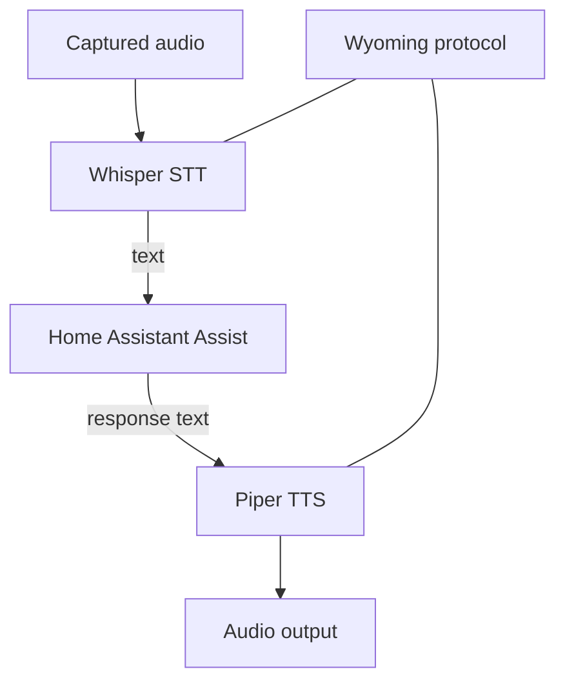

# Class 12 — Whisper, Piper, and Wyoming

**Lecture:** [Home Assistant Voice — Whisper + Piper](https://www.youtube.com/watch?v=1eZJPhR30ek)  
**Time:** 180 minutes  
**Build output:** local STT and TTS providers integrated and benchmarked separately

## Architecture

Whisper provides speech recognition. Piper provides speech synthesis. Wyoming is a protocol used to connect compatible voice services and satellites. Home Assistant orchestrates the Assist pipeline.



These are distinct services. A Wyoming endpoint being reachable does not prove the model is loaded, the language is correct, or the audio is good.

## Compute and model tradeoffs

Larger STT models can improve recognition but cost memory and latency. CPU-only inference may be acceptable for short commands but slow for conversation. GPU acceleration adds drivers, device access, model compatibility, and resource competition. Establish a baseline before optimizing.

Record:

- STT model and language.
- Compute device.
- Cold and warm latency.
- Test phrase accuracy.
- Real-time factor if available.
- Concurrent-request behavior.

Piper voices have language, speaker, sample-rate, and voice-model characteristics. A voice file and matching metadata/config must remain paired. Voice tuning can change speed and variation; test intelligibility before personality.

## Network contract

For every Wyoming service, record host/service name, port, network path, protocol role, health method, model/voice, and logs location. Do not publish voice-service ports to the public internet.

Test layers:

```text
DNS -> TCP port -> Wyoming handshake/discovery -> model load -> inference -> output quality
```

## Guided lab — STT

1. Select a supported Whisper deployment from current Home Assistant documentation.
2. Start it locally and confirm the intended model/language loads.
3. Connect it to Home Assistant through the supported Wyoming integration path.
4. Record a fixed set of five phrases:
   - “Turn on the office light.”
   - “Set the bedroom temperature to seventy-two degrees.”
   - “Is Plex online?”
   - One household member/device name.
   - One phrase spoken with background noise.
5. Run each phrase three times.
6. Record transcript, cold/warm latency, and errors.
7. Change only one variable—model, microphone distance, or noise control—and repeat.

## Guided lab — TTS

1. Select a compatible Piper voice and matching metadata.
2. Connect the Piper Wyoming endpoint.
3. Synthesize five fixed responses.
4. Confirm none are clipped at the beginning or end.
5. Measure synthesis latency separately from playback latency.
6. Test numbers, abbreviations, punctuation, entity names, and one long sentence.
7. Change one voice parameter only if the implementation supports it and compare intelligibility.

## Resource contention test

If Whisper and an LLM share a GPU or CPU, perform:

1. STT baseline at idle.
2. STT while the LLM is generating.
3. TTS baseline.
4. TTS during STT.
5. Record latency, memory pressure, errors, and thermal/power behavior.

Route or schedule workloads based on evidence. “GPU available” does not mean simultaneous models fit or meet latency targets.

## Break/fix

- Wrong STT language: observe systematic transcript errors; restore language/model.
- Missing/mismatched Piper metadata: observe load failure and repair the model pair.
- Closed port: distinguish TCP failure from model failure.
- Slow model: compare cold versus warm request and compute saturation.
- Audio format mismatch: inspect sample rate/channels/encoding across the boundary.

## Knowledge check

1. What does Wyoming provide versus Whisper?
2. Why record cold and warm latency?
3. What does a reachable TCP port fail to prove?
4. Why keep Piper model and metadata together?
5. How can an LLM interfere with STT even when both work independently?
6. Which variable should change in a controlled comparison?

## Practical gate

- [ ] Whisper endpoint is locally reachable through the intended path.
- [ ] Five-phrase transcript results are recorded.
- [ ] Cold/warm latency is measured.
- [ ] Piper produces complete intelligible output.
- [ ] Network, model, and audio faults can be distinguished.
- [ ] Resource-contention behavior is known.
- [ ] Neither voice service is publicly exposed.

## 2026 correction

Projects, repositories, add-ons, and model backends change. Use the current Home Assistant integration/add-on guidance and currently maintained Piper/Whisper implementations. Do not follow an old image name or abandoned repository solely because a video shows it.

