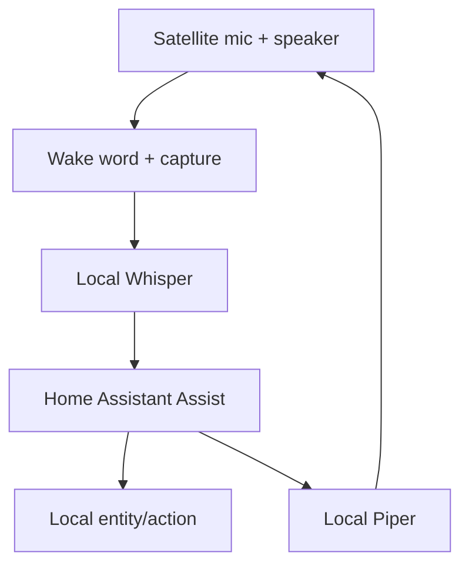

# Class 13 — Completely Local Smart Speaker Capstone

**Lecture (optional):** [Completely Private Local Smart Voice Assistant](https://www.youtube.com/watch?v=2qr6-89BTAQ)
**Time:** 240 minutes
**Learning objective:** Given working STT/TTS providers, the learner can integrate wake → action → spoken response and prove an internet-disconnected end-to-end pass with staged gates.
**Bloom level:** Create / Evaluate
**Build output:** wake-to-action-to-spoken-response system that passes with internet disconnected
**Mastery unlock:** ≥80% retrieval target when scored + completed Feynman teach-back + independent practice + all practical gate boxes + workbook evidence.

## Learning objective

Given working STT/TTS providers, the learner can integrate wake → action → spoken response and prove an internet-disconnected end-to-end pass with staged gates.

## Why this matters

Integrate a voice satellite, wake-word engine, VAD/audio transport, Whisper, Home Assistant Assist, local intent or conversation processing, Piper, and speaker playback. The final privacy requirement is demonstrated behavior under WAN disconnection—not a marketing label.

## Prior-knowledge check

Answer briefly before reading Instruction. Wrong answers are useful — they show what to review.

1. Which Class 11 stage tests already pass?
2. What HA action will you trigger by voice?
3. How will you prove the WAN is down during the test?

## Vocabulary

_Add terms as you encounter them in Instruction._

## Instruction

### System boundary



Optional local LLM conversation belongs behind a routing decision. Deterministic home-control commands should not require an open-ended model unless the design explicitly accepts the latency and failure modes.

### Satellite responsibilities

Depending on hardware/software, the satellite may handle microphone capture, wake word, VAD, audio streaming, playback, LED state, and local buttons. Record where each responsibility executes; otherwise failures are impossible to localize.

Example responsibility map:

| Function | Location |
|---|---|
| Microphone capture | Satellite |
| Wake word | Satellite or central service—choose and record |
| STT | Local server |
| Intent/action | Home Assistant |
| LLM, if used | Local compute node |
| TTS | Local server |
| Playback | Satellite |

### Progressive integration gates

Do not skip gates:

### Gate A — audio hardware

Record and play a known sample locally. Validate device selection, gain, clipping, channels, sample rate, echo, and speaker route.

### Gate B — wake word

Run repeated positive and negative trials. Record threshold/model and test distance.

### Gate C — STT

Prove the known sentence transcript. Preserve captured audio for comparison.

### Gate D — HA understanding

Enter transcript as text. Confirm correct intent, area, entity, and action.

### Gate E — action

Confirm entity reaches the requested state and record HA trace/log.

### Gate F — TTS and playback

Synthesize a fixed response and play it through the satellite.

### Gate G — end to end

Speak wake word and command. Capture timestamps at wake, end-of-speech, transcript, intent, state change, synthesis, and playback.

### Gate H — offline privacy

Disconnect WAN access while preserving the LAN. Repeat the full command and a second informational command that is defined as local. Verify DNS or cloud dependencies do not silently block the pipeline.

### Local LLM routing

If you add an LLM, whitelist only low-risk intents. Lights/locks/garage need deterministic intents—not open-ended chat.

### Reliability and recovery

Document restart order: network → HA → Wyoming STT/TTS → satellite. Keep a known-good backup of HA and satellite config.

## Worked example

**I do** — study the reasoning, not just the final answer.

**Bad acceptance:** “It worked once while Wi-Fi was up.”

**Better:** Progressive gates — wake only → STT → intent/action → TTS → full path — then repeat with internet disconnected and record the pass.

## Guided practice

**We do** — hints allowed. Check your reasoning against Instruction.

Execute the progressive integration gates in order with the checklist open.

## Independent practice

**You do** — close the hints. Solve before opening the lab.

Run the disconnected exam. Document exact evidence (photos/logs redacted) for pass or the first failing stage.

## Feynman teach-back

Required. Do not skip.

### Explain
Describe **what ‘completely local smart speaker’ actually requires** in your own words. No copying the lesson verbatim.

### Simplify
Explain the same idea to a 12-year-old. If you use a technical word, define it.

### Example
Analogy: a flashlight that still works when the power grid is down — vs one that needs a cloud app to turn on.

### Weak spot
What part was hard to explain? That is where your understanding is thin.

### Retry
Return to that part of **Instruction**, restudy it, then rewrite a clearer explanation below.

> Mastery note: a completed Feynman teach-back is required before the next class unlocks — “I get it” without explanation does not count.


## Retrieval check

Active recall — write answers without rereading first. Target ≥80% before the gate.

1. What proves the system is local?
2. Why preserve LAN connectivity during the WAN-disconnect test?
3. Which commands should bypass an open-ended LLM?
4. Why record function location in the responsibility map?
5. What timestamps isolate latency?
6. Why limit the entities exposed to voice control?

## Guided lab

Complete gates **in order**. Do not skip to end-to-end.

1. **Inventory** satellite hardware, mic, speaker, network, power, OS/firmware versions (workbook table).

2. **Stable identity.** Set hostname + reserved IP. Restrict firewall to required LAN flows only.

:::linux
```bash
hostnamectl
ip -br addr
ping -c 2 HA-IP
ping -c 2 STT-HOST
```
:::

:::windows
```powershell
hostname
ipconfig
ping -n 2 HA-IP
```
:::

3. **Pin audio devices explicitly** (card/device names), not “default” indices that shuffle after reboot.

:::linux
```bash
arecord -l
aplay -l
# Save chosen device strings in workbook
```
:::

4. **Gate A — audio:** record + playback sample; save file hash/path.

5. **Gate B — wake:** one wake model; 10/10 log sheet.

6. **Gate C — STT path:** Wyoming/satellite transport → transcript proof (Class 12 commands).

7. **Gate D — HA understanding:** Assist intent from perfect text; expose only needed entities.

8. **Gate E — action:** service call changes entity.

9. **Gate F — TTS + playback:** hear response on satellite speaker.

10. **Gate G — E2E:** 10 attempts from seating position; log latency + failure layer.

:::linux
```bash
# Example timing wrapper around a manual attempt log:
date -Is | tee -a ~/voice-e2e.log
# after each attempt append: PASS/FAIL layer=... ms=...
```
:::

11. **Gate H — offline privacy:** disable WAN for the test segment **without** killing LAN routing to HA/STT/TTS.

:::linux
```bash
# Example idea only — use your router/firewall controls preferentially:
# On a test client VLAN, block 0.0.0.0/0 except RFC1918.
ping -c 1 1.1.1.1 || echo WAN_BLOCKED_OK
ping -c 1 HA-IP && echo LAN_HA_OK
```
:::

   Repeat one local voice command successfully. Restore WAN. Confirm normal operation.

12. **Responsibility map:** write which box does wake/STT/intent/TTS/playback and where logs live.

## Break / fix

### Break/fix exam

1. Unplug speaker — note which gate fails.  
2. Stop STT container — note failure layer.  
3. Block HA from satellite — Assist must fail closed.  
4. Restore each fault before the next.

## Feedback / common mistakes

- Skipping evidence and calling it done.
- Changing multiple variables before retesting.
- Moving on without completing Feynman teach-back.

## Practical mastery gate

All boxes must be true before the next class unlocks. If you fail: feedback → targeted review → new practice → reassess.

- [ ] Gates A–F pass independently.
- [ ] Ten end-to-end trials are recorded.
- [ ] Wake, STT, action, and response latency are measurable.
- [ ] A hidden fault is isolated without reinstalling the stack.
- [ ] WAN-disconnected command and spoken response pass.
- [ ] Recovery from one service restart is proven.
- [ ] Voice permissions expose only necessary entities.
- [ ] Prior-knowledge check answered
- [ ] Feynman teach-back completed (Explain, Simplify, Example, Weak spot, Retry)
- [ ] Independent practice completed
- [ ] Retrieval check attempted (target ≥80% when scored)
- [ ] Evidence recorded in workbook / verification matrix

## Reflection

Did the disconnected test change your architecture confidence? What remains fragile?

Also answer:

1. What did I learn?
2. What did I struggle with?
3. How does this connect to earlier classes?

## Spiral hook

Capstone will ask for this evidence again. n8n (14) must not sneak cloud dependencies into the voice path without labeling them.

## 2026 correction

Use the lecture as a system-integration example. Hardware support, satellites, add-ons, repositories, and Home Assistant pipeline screens change. Current official documentation and the staged acceptance tests in this class govern the build.
