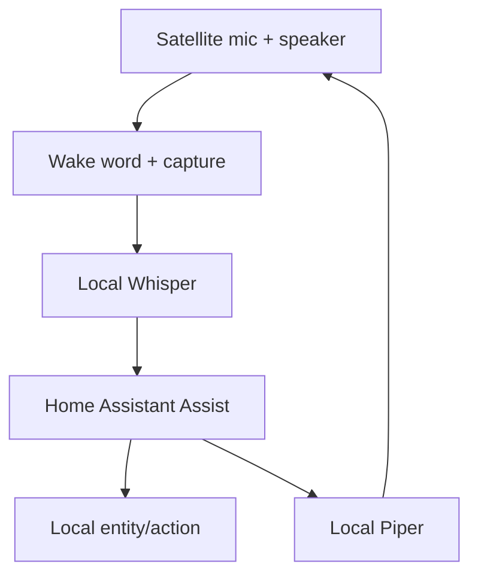

# Class 13 — Completely Local Smart Speaker Capstone

**Lecture:** [Completely Private Local Smart Voice Assistant](https://www.youtube.com/watch?v=2qr6-89BTAQ)  
**Time:** 240 minutes  
**Build output:** wake-to-action-to-spoken-response system that passes with internet disconnected

## Mission

Integrate a voice satellite, wake-word engine, VAD/audio transport, Whisper, Home Assistant Assist, local intent or conversation processing, Piper, and speaker playback. The final privacy requirement is demonstrated behavior under WAN disconnection—not a marketing label.

## System boundary



Optional local LLM conversation belongs behind a routing decision. Deterministic home-control commands should not require an open-ended model unless the design explicitly accepts the latency and failure modes.

## Satellite responsibilities

Depending on hardware/software, the satellite may handle microphone capture, wake word, VAD, audio streaming, playback, LED state, and local buttons. Record where each responsibility executes; otherwise failures are impossible to localize.

Example responsibility map:

| Function | Location |
|---|---|
| Microphone capture | Satellite |
| Wake word | Satellite or central service—choose and record |
| STT | Local server |
| Intent/action | Home Assistant |
| LLM, if used | Local compute node |
| TTS | Local server |
| Playback | Satellite |

## Progressive integration gates

Do not skip gates:

### Gate A — audio hardware

Record and play a known sample locally. Validate device selection, gain, clipping, channels, sample rate, echo, and speaker route.

### Gate B — wake word

Run repeated positive and negative trials. Record threshold/model and test distance.

### Gate C — STT

Prove the known sentence transcript. Preserve captured audio for comparison.

### Gate D — HA understanding

Enter transcript as text. Confirm correct intent, area, entity, and action.

### Gate E — action

Confirm entity reaches the requested state and record HA trace/log.

### Gate F — TTS and playback

Synthesize a fixed response and play it through the satellite.

### Gate G — end to end

Speak wake word and command. Capture timestamps at wake, end-of-speech, transcript, intent, state change, synthesis, and playback.

### Gate H — offline privacy

Disconnect WAN access while preserving the LAN. Repeat the full command and a second informational command that is defined as local. Verify DNS or cloud dependencies do not silently block the pipeline.

## Guided build

1. Inventory satellite hardware, microphone, speaker, network, power, and firmware/software versions.
2. Give the satellite a stable identity/address and restrict it to the required LAN/VLAN flows.
3. Configure the audio devices explicitly rather than relying on changing default card numbers.
4. Complete Gate A and save a sample.
5. Configure one wake model and complete Gate B.
6. Connect audio transport/Wyoming satellite path and complete Gate C.
7. Select the Home Assistant voice pipeline containing the verified STT, conversation/intent path, and TTS provider.
8. Expose only the required test entities to Assist.
9. Complete Gates D–F separately.
10. Complete Gate G ten times from the expected use position.
11. Record latency distribution and failure categories.
12. Disable WAN at the router/firewall for the test segment without disrupting LAN routing.
13. Complete Gate H.
14. Restore WAN and verify normal service.

## Local LLM routing

If adding Ollama or another local model, define two classes:

```text
Home control -> deterministic Assist intent/action
Open conversation -> local LLM agent
```

Test ambiguous commands and ensure the LLM cannot invoke unrestricted actions. Expose only necessary entities and apply Home Assistant permissions/policies supported by the current platform.

## Reliability and recovery

Define expected behavior for:

- Satellite reboot.
- STT service restart.
- TTS service restart.
- Home Assistant restart.
- Network interruption.
- LLM unavailable.
- Wake engine unavailable.

The system should recover automatically where safe, announce or signal degraded state where possible, and avoid infinite restart loops.

## Break/fix exam

An instructor or partner introduces one hidden fault from this list:

- Wrong microphone device.
- Wake-word service stopped.
- STT language changed.
- HA entity renamed/unexposed.
- Piper endpoint stopped.
- Speaker muted.
- Firewall blocks one Wyoming flow.

The student must identify the failed boundary using measurements, repair only that boundary, and rerun the gate. Full reinstallation is a failed diagnostic approach unless corruption is proven.

## Knowledge check

1. What proves the system is local?
2. Why preserve LAN connectivity during the WAN-disconnect test?
3. Which commands should bypass an open-ended LLM?
4. Why record function location in the responsibility map?
5. What timestamps isolate latency?
6. Why limit the entities exposed to voice control?

## Practical gate

- [ ] Gates A–F pass independently.
- [ ] Ten end-to-end trials are recorded.
- [ ] Wake, STT, action, and response latency are measurable.
- [ ] A hidden fault is isolated without reinstalling the stack.
- [ ] WAN-disconnected command and spoken response pass.
- [ ] Recovery from one service restart is proven.
- [ ] Voice permissions expose only necessary entities.

## 2026 correction

Use the lecture as a system-integration example. Hardware support, satellites, add-ons, repositories, and Home Assistant pipeline screens change. Current official documentation and the staged acceptance tests in this class govern the build.

