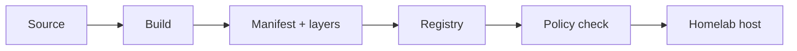

# Class 28 — Docker Images, Tags, Registries, and Provenance

**Module:** Docker, Storage & Permissions  
**Difficulty:** Beginner · **Duration:** 90 minutes · **Lab risk:** Low  
**Mastery:** ≥80% knowledge check, completed lab evidence, Feynman teach-back, and rollback plan

## Objective

By the end, you can explain image layers, repositories, tags, manifests, registries, image IDs, and digests; inspect a local image; distinguish convenient naming from immutable identity; and record enough provenance to reproduce or investigate a deployment.

## Why It Matters

`app:latest` tells an operator what someone called an image, not exactly which content ran. Tags can move. Registries can be compromised. Architectures can resolve to different manifests. A homelab that records registry, repository, tag, digest, source, and update decision can roll forward deliberately and roll back to known content.

## Prior-Knowledge Check

1. What is the difference between an image and a running container?
2. What do you think `:latest` guarantees?
3. Where would you look to determine which image a running container uses?

## Instruction

An image is an immutable template assembled from content-addressed layers and configuration. A container adds a writable runtime layer and process state. A registry stores and distributes image manifests and blobs. A repository groups related images, while a tag is a mutable name inside that repository.

An image reference can be convenient (`registry/repository:tag`) or immutable (`registry/repository@sha256:digest`). The digest identifies a manifest by cryptographic hash. A multi-platform tag may first resolve to an index that selects a platform-specific manifest, so record platform as well as digest when reproducibility matters.

Image provenance answers: Who produced it? From what source? Through which build? What exact content was retrieved? What was scanned or signed? Which policy approved it? Labels, SBOMs, signatures, attestations, registry audit data, and pinned digests strengthen the answer, but no single field proves everything.

Use a controlled promotion pattern:

1. Discover a candidate tag.
2. Resolve and record its digest and platform.
3. Review source, release notes, SBOM/scan/signature evidence available to your environment.
4. Test the immutable candidate.
5. Promote the recorded digest.
6. Retain the last known-good reference and configuration for rollback.

Do not place registry credentials in image names, Dockerfiles, shell history, or lesson evidence. Prefer short-lived credentials and the platform's credential store.

## Visual 1 — Image Supply Path



The trust decision spans the entire path; pulling successfully proves availability, not trust.

## Visual 2 — Name Versus Identity

```mermaid
flowchart TD
  T[Tag: app:1.4] -->|can be reassigned| D1[Digest A]
  T -. later .-> D2[Digest B]
  P[app@sha256:Digest-A] -->|fixed identity| D1
```

## Worked Example

An operator records `example/app:stable`, deploys it, and later recreates the container. The tag now resolves to a different digest. The configuration looks unchanged, but the binary content changed. Recording and approving `example/app@sha256:…` would make the change visible and reversible.

## Guided Practice

### Build and Inspect a Network-Free Image

### Safety and prerequisites

- Use a non-production Docker host.
- Commands create only `/opt/lab-classroom/class28/` and a local image named `academy-c28:1.0`.
- No registry login or network pull is required.
- Confirm Docker access is authorized; Docker socket access is host-administrative.

```bash
LAB=/opt/lab-classroom/class28
sudo install -d -o "$(id -u)" -g "$(id -g)" "$LAB"
printf 'Homelab Academy Class 28\n' > "$LAB/proof.txt"
printf '%s\n' \
  'FROM scratch' \
  'LABEL org.opencontainers.image.title="academy-c28"' \
  'LABEL org.opencontainers.image.source="Homelab Academy Class 28"' \
  'COPY proof.txt /proof.txt' \
  > "$LAB/Dockerfile"
docker build --pull=false -t academy-c28:1.0 "$LAB"
docker image inspect academy-c28:1.0 > "$LAB/image-inspect.json"
docker image history --no-trunc academy-c28:1.0 | tee "$LAB/image-history.txt"
docker image ls --no-trunc academy-c28:1.0
```

### Verification checkpoints

```bash
test -s "$LAB/image-inspect.json" && echo 'PASS: inspection captured'
docker image inspect academy-c28:1.0 --format '{{ index .Config.Labels "org.opencontainers.image.title" }}'
docker image inspect academy-c28:1.0 --format 'ID={{.Id}} Created={{.Created}}'
sha256sum "$LAB/Dockerfile" "$LAB/proof.txt" | tee "$LAB/source-sha256.txt"
```

Expected: the label prints `academy-c28`; the image ID begins with `sha256:`; source hashes are recorded. A locally built image normally has no registry digest until pushed/pulled through a registry.

## Independent Practice

Choose one non-sensitive image already present on your lab host. Create a provenance record containing its full reference, image ID, RepoDigests if present, creation time, architecture, OCI labels, source/release link, approval decision, and last known-good reference. Do not pull a new image solely for this exercise.

## Feynman Teach-Back

Explain to a beginner why a tag is like a movable label while a digest is like a fingerprint. Then explain why a fingerprint still does not tell you whether the producer or build process should be trusted.

## Knowledge Check

1. Can a tag be reassigned?  
2. What does a digest identify?  
3. Why might one tag resolve differently on amd64 and arm64?  
4. What is the difference between an image ID and a registry digest?  
5. Name three useful provenance artifacts.  
6. Why is `latest` a poor production change-control policy?

## Answer Key

1. Yes; tags are mutable registry references.  
2. Content referenced by a cryptographic manifest hash.  
3. A multi-platform index can select different platform manifests.  
4. The local image ID identifies local image configuration/content; RepoDigest records registry manifest identity.  
5. Examples: source URL, SBOM, signature, attestation, build record, scan report, OCI labels, approved digest.  
6. It hides which version/content will resolve and makes rollback ambiguous.

## Troubleshooting

| Symptom | Likely cause | Safe response |
|---|---|---|
| Cannot connect to Docker | Daemon stopped, wrong context, or unauthorized socket access | Check `docker context show`, service status, and approved access; do not loosen socket permissions |
| Build tries to reach a registry | Dockerfile base is not `scratch` or BuildKit behavior differs | Recheck the exact Dockerfile and retain `--pull=false` |
| `RepoDigests` is empty | Image was built locally and not associated with a registry manifest | Record image ID and source hashes; do not invent a digest |
| Architecture differs | Tag resolved through a multi-platform manifest | Record platform and platform-specific digest |

## Security and Rollback

- Treat registries and build pipelines as supply-chain trust boundaries.
- Never expose `/var/run/docker.sock` to an untrusted container.
- Prefer immutable digests for promoted deployments while preserving a human-readable tag in documentation.
- Keep secrets out of layers; deleting a later layer does not erase a secret from earlier history.

Rollback removes only the labeled lab image after confirming no dependent container exists:

```bash
docker ps -a --filter ancestor=academy-c28:1.0
docker image rm academy-c28:1.0
```

Preserve `/opt/lab-classroom/class28/` until evidence is graded; remove it later only with an explicitly reviewed path.

## Reflection

What image identity information does your current homelab record, and what would you need during a supply-chain incident?

## Video Narration Notes

Open with two containers using the same tag but different digests. Animate the tag moving between fingerprints. Demonstrate the network-free build, inspect the image ID and labels, then close with the rule: tags communicate intent; digests preserve identity; provenance supports trust.
