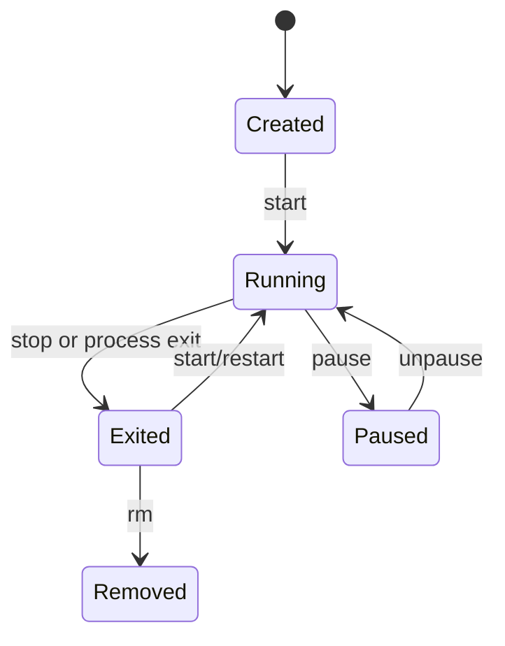
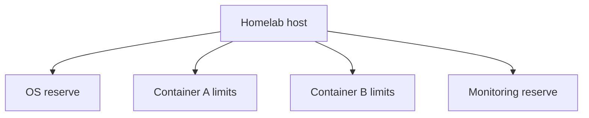

# Class 29: Container Lifecycle and Resource Controls

**Module:** Docker, Storage & Permissions  
**Difficulty:** Beginner · **Duration:** 90 minutes · **Lab risk:** Low  
**Mastery:** ≥80% knowledge check, verified bounded container, Feynman teach-back, and rollback

## Objective

Explain container states and signals; distinguish create, start, run, stop, kill, restart, pause, and remove; apply memory, CPU, PID, and restart controls; and verify the effective configuration instead of trusting the command line.

## Why It Matters

A container without boundaries can exhaust memory, spawn excessive processes, or compete with Plex, Home Assistant, databases, and storage jobs. A restart loop can turn a small fault into constant disk and CPU pressure. Explicit lifecycle and resource policies make failures observable and contained.

## Prior-Knowledge Check

1. Does stopping a container delete its writable layer?
2. What signal should an application normally receive before forced termination?
3. What happens when a workload has no explicit memory limit?

## Instruction

`docker create` defines a container without starting it. `docker start` runs an existing container. `docker run` combines create and start. `docker stop` sends the configured stop signal, waits a grace period, then forces termination if necessary. `docker kill` sends a signal immediately; its default is `SIGKILL`. `docker rm` deletes container metadata and its writable layer but does not automatically delete every mounted volume.

Container state is not application health. `running` means a process exists. A health check can provide application-specific evidence, but a poor health check can create false confidence. Restart policies respond to process exit, not to every kind of application malfunction.

Resource controls depend on Linux kernel capabilities and cgroups. Memory limits bound allocation; CPU controls bound scheduling share or quota; PID limits reduce process-fork exhaustion. Reserve host capacity for the operating system and monitoring. Apply limits based on measurement, then test failure behavior.

Useful evidence includes `docker inspect`, `docker stats --no-stream`, `docker events`, exit codes, OOM indicators, and application logs. An exit code is a clue, not a complete root cause.

## Visual 1: Lifecycle



## Visual 2: Shared Host Boundary



## Worked Example

A media scanner with no memory limit consumes nearly all RAM. The kernel kills a database process instead, and several applications fail. The correct response is not merely an automatic restart: reserve host memory, set measured limits, observe peak usage, and test the scanner's behavior when constrained.

## Guided Practice

### Observe a Bounded Lifecycle

### Safety and prerequisites

- Authorized non-production Docker host with internet access only if `busybox:1.36.1` is not cached.
- Creates one image cache entry and containers labeled `academy.class=29`.
- The container has a 64 MiB memory cap and 64-process cap.

```bash
LAB=/opt/lab-classroom/class29
sudo install -d -o "$(id -u)" -g "$(id -g)" "$LAB"
docker pull busybox:1.36.1
docker create \
  --name academy-c29 \
  --label academy.class=29 \
  --memory 64m \
  --cpus 0.50 \
  --pids-limit 64 \
  --restart no \
  busybox:1.36.1 sh -c 'echo started; sleep 20; echo completed'
docker inspect academy-c29 --format 'state={{.State.Status}} memory={{.HostConfig.Memory}} nano_cpus={{.HostConfig.NanoCpus}} pids={{.HostConfig.PidsLimit}} restart={{.HostConfig.RestartPolicy.Name}}' | tee "$LAB/before-start.txt"
docker start academy-c29
docker stats --no-stream academy-c29 | tee "$LAB/stats.txt"
docker wait academy-c29 | tee "$LAB/exit-code.txt"
docker inspect academy-c29 --format 'state={{.State.Status}} exit={{.State.ExitCode}} oom={{.State.OOMKilled}}' | tee "$LAB/after-exit.txt"
```

### Verification checkpoints

```bash
grep -F 'memory=67108864' "$LAB/before-start.txt"
grep -F 'pids=64' "$LAB/before-start.txt"
grep -F 'state=exited exit=0 oom=false' "$LAB/after-exit.txt"
docker ps -a --filter label=academy.class=29 --format '{{.Names}} {{.Status}}'
```

Expected: created before start, running briefly, then exited with code 0; the inspected controls match the requested limits.

## Independent Practice

Write a resource budget for three real homelab workloads. Include measured idle/peak memory, CPU behavior, PID expectations, criticality, restart policy, health evidence, and host reserve. Do not change production limits during this assignment.

## Feynman Teach-Back

Explain why a restart policy is like asking a circuit breaker to reset: useful for a transient trip, harmful when it repeatedly re-energizes a persistent fault. Include the difference between process state and application health.

## Knowledge Check

1. What two operations does `docker run` combine?  
2. What is the normal difference between `stop` and default `kill`?  
3. Does `running` prove the application is healthy?  
4. What does a PID limit help contain?  
5. Why reserve resources for the host?  
6. When can `restart: always` be harmful?

## Answer Key

1. Create and start.  
2. `stop` requests graceful termination before forcing; default `kill` sends immediate `SIGKILL`.  
3. No. It proves only that the container's primary process is running.  
4. Runaway or malicious process creation.  
5. The kernel, storage, networking, monitoring, and recovery tools must remain functional.  
6. During a persistent configuration or dependency failure that creates a rapid restart loop.

## Troubleshooting

| Symptom | Likely cause | Safe response |
|---|---|---|
| Container exits immediately | Command completed or failed | Inspect exit code and logs before changing restart policy |
| Memory limit ignored or rejected | Host/cgroup capability difference | Inspect Docker info and cgroup mode; do not claim a limit is active without inspection |
| OOMKilled is true | Workload exceeded memory allowance | Preserve evidence, measure need, and review host reserve before increasing |
| Name already exists | Previous lab container remains | Inspect it; remove only `academy-c29` if it belongs to this lab |
| `docker stats` misses the run | Container completed too quickly | Increase the disposable sleep duration and repeat after removing the old container |

## Security and Rollback

- Resource limits reduce availability risk but do not replace least privilege.
- Avoid `--privileged`, broad capabilities, host PID namespace, and Docker socket mounts.
- Validate restart behavior so failures do not become invisible loops.
- Record limits in Compose/configuration as code.

Rollback:

```bash
docker rm -f academy-c29 2>/dev/null || true
docker ps -a --filter label=academy.class=29
```

The cached BusyBox image may be retained for later labs. Remove it only after checking that no other container uses it.

## Reflection

Which service in your homelab would cause the most collateral damage if it exhausted memory, and what evidence would justify its limit?

## Video Narration Notes

Show the state diagram, then the container changing from created to running to exited. Highlight inspected limits, not just typed flags. Finish with a split-screen: restart loop versus bounded, observable failure.
