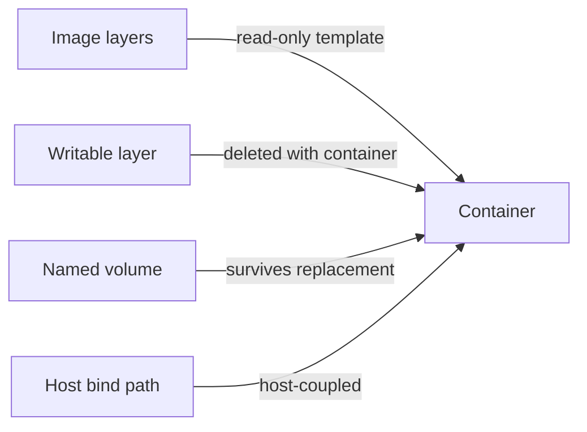
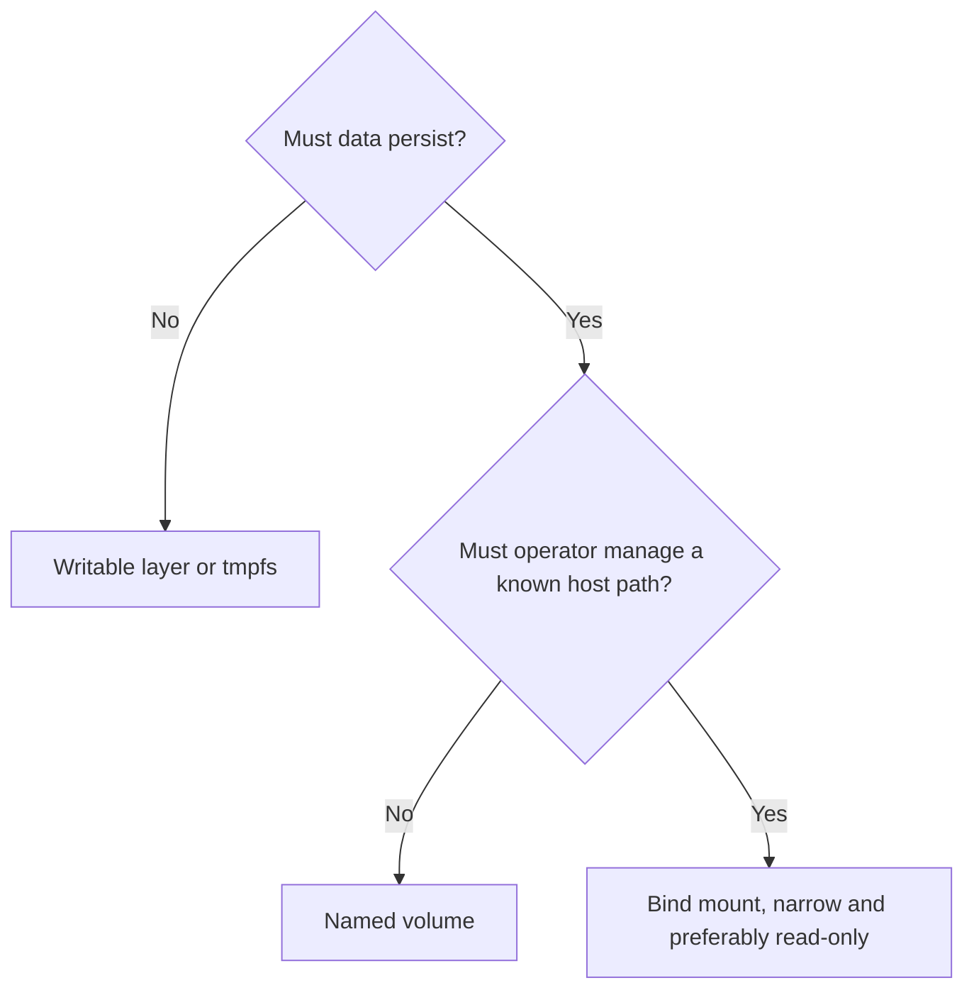

# Class 30 — Docker Volumes and Bind Mounts

**Module:** Docker, Storage & Permissions  
**Difficulty:** Beginner · **Duration:** 100 minutes · **Lab risk:** Low  
**Mastery:** ≥80% knowledge check, verified backup/restore, Feynman teach-back, and rollback

## Objective

Distinguish a container writable layer, named volume, bind mount, and tmpfs mount; select storage intentionally; back up and restore a named volume; verify persistence; and identify the host exposure created by bind mounts.

## Why It Matters

Containers are replaceable; application data often is not. Storing a database only in a container's writable layer turns routine recreation into data loss. Mounting `/` or an oversized host directory creates a different danger: the container receives access to host data it never needed.

## Prior-Knowledge Check

1. What happens to a container's writable layer when the container is removed?
2. Who chooses the host path for a bind mount?
3. Does copying a running database directory always create a consistent backup?

## Instruction

The writable layer belongs to one container and should hold disposable runtime changes. A named volume is managed through Docker and can be attached to replacement containers. A bind mount maps an explicit host path, which is useful for configuration or operator-managed datasets but couples the workload to host layout and permissions. A tmpfs mount stores ephemeral data in memory and disappears when the container stops.

Choose based on lifecycle and ownership:

- Named volume: application-owned durable data with Docker-managed location.
- Bind mount: operator-owned file/path that must be visible at a known host location.
- Read-only bind mount: configuration or reference data the container must not alter.
- tmpfs: sensitive or temporary data that should not persist, within memory constraints.

A mount hides image content at the same container path for as long as it is attached. Backups must match application consistency requirements. A stopped single-file application may tolerate filesystem-level archiving; databases often require application-aware dumps, snapshots, or coordinated quiescence.

## Visual 1 — Storage Lifetimes



## Visual 2 — Selection Guide



## Worked Example

A container writes configuration to `/config` without a mount. The operator updates by removing and recreating it, and the configuration disappears. The correct design attaches durable storage at `/config`, backs it up using an application-consistent method, and tests restoration before relying on it.

## Guided Practice

### Persist, Back Up, and Restore

### Safety and prerequisites

- Authorized non-production Docker host.
- Uses `busybox:1.36.1`, named volumes `academy-c30` and `academy-c30-restore`, and `/opt/lab-classroom/class30/`.
- Verify names before removal; never substitute a production volume.

```bash
LAB=/opt/lab-classroom/class30
sudo install -d -o "$(id -u)" -g "$(id -g)" "$LAB/backups"
docker volume create --label academy.class=30 academy-c30
docker run --rm --label academy.class=30 \
  -v academy-c30:/data \
  busybox:1.36.1 sh -c 'printf "durable-class-30\n" > /data/proof.txt; sync'
docker run --rm -v academy-c30:/data:ro busybox:1.36.1 cat /data/proof.txt
docker run --rm \
  -v academy-c30:/from:ro \
  -v "$LAB/backups":/to \
  busybox:1.36.1 sh -c 'cd /from && tar czf /to/academy-c30.tgz .'
sha256sum "$LAB/backups/academy-c30.tgz" | tee "$LAB/backups/academy-c30.sha256"
docker volume create --label academy.class=30 academy-c30-restore
docker run --rm \
  -v academy-c30-restore:/to \
  -v "$LAB/backups":/from:ro \
  busybox:1.36.1 sh -c 'cd /to && tar xzf /from/academy-c30.tgz'
docker run --rm -v academy-c30-restore:/data:ro busybox:1.36.1 cat /data/proof.txt
```

### Verification checkpoints

```bash
test -s "$LAB/backups/academy-c30.tgz" && echo 'PASS: backup exists'
(cd "$LAB/backups" && sha256sum -c academy-c30.sha256)
test "$(docker run --rm -v academy-c30-restore:/data:ro busybox:1.36.1 cat /data/proof.txt)" = 'durable-class-30' && echo 'PASS: restore verified'
docker volume ls --filter label=academy.class=30
```

Expected: the restored volume contains the marker and the stored archive hash verifies.

## Independent Practice

For one real service, map every writable container path and classify it as disposable, cache, configuration, user data, database state, secret, or log. Choose volume/bind/tmpfs, backup method, retention, restore test, ownership, and read-only settings. Do not change the live service yet.

## Feynman Teach-Back

Explain why a container is a replaceable appliance, a named volume is a detachable data drawer, and a bind mount is a doorway into a specific host room. Explain why the doorway should be as narrow as possible.

## Knowledge Check

1. Which storage normally survives container deletion?  
2. What makes a bind mount host-coupled?  
3. What happens to image files hidden beneath a mountpoint?  
4. When is tmpfs useful?  
5. Why is a successful archive command insufficient backup proof?  
6. Why can a raw database-directory copy be inconsistent?

## Answer Key

1. Named volumes and host bind data survive, unless explicitly deleted.  
2. It names a specific host path and inherits its layout and permissions.  
3. They remain in the image but are obscured while the mount is attached.  
4. For bounded temporary or sensitive data that should disappear on stop.  
5. Recovery must be tested by restoring and verifying content/application behavior.  
6. Files can change during the copy or require database-aware consistency coordination.

## Troubleshooting

| Symptom | Likely cause | Safe response |
|---|---|---|
| Data disappears after recreation | Path was in writable layer or wrong mount target | Inspect mounts and restore from verified backup; do not keep recreating |
| Empty bind directory appears | Host source path was wrong or auto-created by short syntax | Stop, inspect exact host path, and prefer explicit validated paths |
| Permission denied | Numeric UID/GID or mode/ACL mismatch | Record container identity and host permissions; continue in Class 33 |
| Backup archive exists but restore fails | Wrong archive root, corruption, or permissions | Verify hash, list archive, restore to a new disposable volume |
| Volume removal reports in use | A container still references it | List dependent containers; do not force-remove unknown storage |

## Security and Rollback

- Never mount the Docker socket for convenience.
- Avoid broad host mounts such as `/`, `/etc`, or a user's entire home directory.
- Use `:ro` when writes are unnecessary.
- Keep credentials outside ordinary images and backups; encrypt backups containing sensitive state.

After grading, remove only the two labeled lab volumes:

```bash
docker ps -a --filter volume=academy-c30 --filter volume=academy-c30-restore
docker volume inspect academy-c30 academy-c30-restore
docker volume rm academy-c30 academy-c30-restore
```

If either inspection shows unexpected data or dependencies, stop instead of deleting it.

## Reflection

Which data in your current containers would be lost during recreation, and when was its last verified restore?

## Video Narration Notes

Visually remove a container while its named volume remains, then attach the restored volume to a replacement container. Contrast that with a narrow read-only bind mount. Close on: persistence is a design decision; backup is proven only by restoration.
