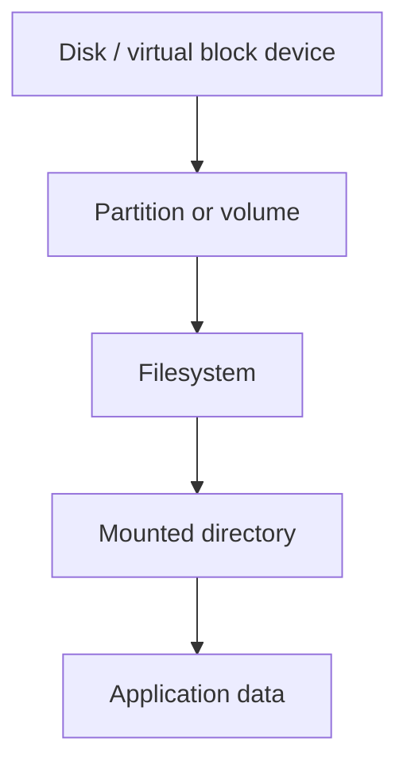
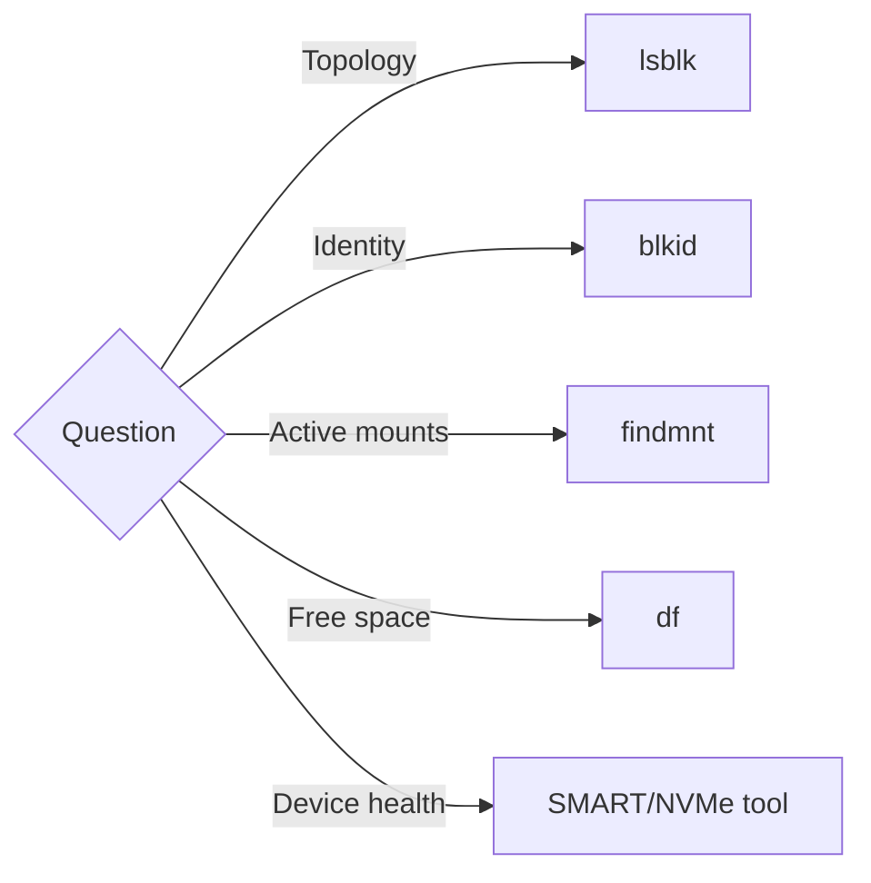

# Class 31 — Linux Disks, Partitions, and Filesystems

**Module:** Docker, Storage & Permissions  
**Difficulty:** Beginner · **Duration:** 100 minutes · **Lab risk:** Medium if boundaries are ignored; Low within the provided image-file lab  
**Mastery:** ≥80% knowledge check, verified filesystem image, Feynman teach-back, and rollback

## Objective

Trace the hierarchy from physical or virtual disk to partition table, partition, filesystem, and mountpoint; interpret `lsblk`, `blkid`, `findmnt`, and `df`; create a filesystem only inside a regular lab image file; and recognize destructive storage operations before running them.

## Why It Matters

Storage commands often succeed immediately and destroy evidence just as quickly. Confusing a disk with a partition, a filesystem with a mountpoint, or free space with disk health can erase data or hide the real problem. A homelab operator must identify the exact layer before changing it.

## Prior-Knowledge Check

1. Is `/mnt/media` a disk, filesystem, or mountpoint?
2. What is the difference between `/dev/sdb` and `/dev/sdb1`?
3. Does `df` report SMART health?

## Instruction

A disk is the underlying block device. A partition table describes subdivisions. A partition is a block-device region. A filesystem organizes files and metadata inside a block device or image. A mount attaches a filesystem to the directory tree. Linux can also use LVM, RAID, encryption, network filesystems, and datasets, so not every stack is simply disk → partition → filesystem.

Use evidence by layer:

- `lsblk`: block topology, sizes, filesystem hints, and mountpoints.
- `blkid`: filesystem type, label, and UUID signatures.
- `findmnt`: active mount relationships and options.
- `df`: allocated/available filesystem space.
- `du`: space attributable to visible directory entries.
- SMART/NVMe tools: device health indicators; separate from filesystem capacity.

Formatting creates filesystem structures and normally overwrites existing signatures. Partitioning changes the device map. Both require verified targets, backups, maintenance windows, and rollback/recovery planning. Never choose a target only because it “looks like the new disk.” Record model, serial, size, transport, existing signatures, and mounts.

The lab uses a regular sparse file, not a block device. `mkfs.ext4 -F` is intentionally destructive to that one file, so the command verifies the target is a regular file inside the class directory first.

## Visual 1 — Storage Stack



## Visual 2 — Choose the Evidence Tool



## Worked Example

`df` reports 95% usage under `/srv/media`. The underlying disk may be healthy, failing, thin-provisioned, or part of a larger stack; `df` alone cannot tell. Start with `findmnt` to identify the source, `lsblk` for topology, and the device/storage platform's health evidence before planning capacity work.

## Guided Practice

### Safe Filesystem Image

### Safety and prerequisites

- Requires `truncate`, `mkfs.ext4`, and preferably `blkid`/`dumpe2fs`.
- The target must remain exactly `/opt/lab-classroom/class31/academy-c31.img`.
- Do not substitute any `/dev/*` path.

```bash
LAB=/opt/lab-classroom/class31
sudo install -d -o "$(id -u)" -g "$(id -g)" "$LAB"
lsblk -o NAME,TYPE,SIZE,FSTYPE,LABEL,UUID,MOUNTPOINTS | tee "$LAB/lsblk-before.txt"
findmnt --real | tee "$LAB/findmnt-before.txt"
df -hT | tee "$LAB/df-before.txt"
truncate -s 128M "$LAB/academy-c31.img"
test -f "$LAB/academy-c31.img" && test ! -b "$LAB/academy-c31.img" || { echo 'REFUSE: target boundary failed'; exit 1; }
mkfs.ext4 -F -L ACADEMY31 "$LAB/academy-c31.img"
file "$LAB/academy-c31.img" | tee "$LAB/file-signature.txt"
blkid "$LAB/academy-c31.img" | tee "$LAB/blkid.txt"
dumpe2fs -h "$LAB/academy-c31.img" 2>/dev/null | sed -n '1,35p' | tee "$LAB/ext4-header.txt"
```

### Verification checkpoints

```bash
grep -F 'ext4 filesystem data' "$LAB/file-signature.txt"
grep -F 'LABEL="ACADEMY31"' "$LAB/blkid.txt"
grep -F 'TYPE="ext4"' "$LAB/blkid.txt"
test "$(stat -c %s "$LAB/academy-c31.img")" -eq 134217728 && echo 'PASS: bounded 128 MiB image'
```

Expected: the regular file contains an ext4 filesystem with label `ACADEMY31`; no physical block device is modified or mounted.

## Independent Practice

Create a read-only storage map for one homelab host. Include device model/serial, block hierarchy, filesystem types, labels, UUIDs, mountpoints, capacity, backup role, and health-monitoring method. Redact serials before public sharing.

## Feynman Teach-Back

Explain a disk as land, a partition as a surveyed lot, a filesystem as the filing system built on the lot, and a mountpoint as the address where Linux exposes it. Explain where the analogy breaks for LVM, RAID, and network storage.

## Knowledge Check

1. What does a partition table describe?  
2. Can a filesystem exist in a regular image file?  
3. What question does `findmnt` answer?  
4. Why can `du` and `df` disagree?  
5. Does high filesystem use prove disk failure?  
6. What must be verified before `mkfs` targets a real device?

## Answer Key

1. The layout and types of partitions on a disk.  
2. Yes, as demonstrated by the bounded lab image.  
3. Which source is mounted where, with which type and options.  
4. Deleted-open files, snapshots, reserved blocks, mount boundaries, permissions, or sparse/allocation differences.  
5. No; capacity and device health are separate layers.  
6. Exact identity, topology, mounts, signatures, backups, change approval, and recovery plan.

## Troubleshooting

| Symptom | Likely cause | Safe response |
|---|---|---|
| `mkfs.ext4` missing | Filesystem utilities absent | Stop and document the prerequisite; do not install packages automatically |
| `blkid` prints nothing | Tool/permission/signature probing difference | Use `file` and `dumpe2fs -h`; preserve the image for review |
| `lsblk` shows unexpected topology | LVM, RAID, encryption, loop, or virtualization layer | Map every layer before any change |
| `df` full but `du` smaller | Deleted-open files or hidden/mounted data | Inspect mounts and open deleted files; do not delete random directories |
| Boundary test fails | Target changed or became a block device | Stop immediately; never continue with `mkfs` |

## Security and Rollback

- Storage inventories can reveal infrastructure identifiers; redact before publishing.
- Untrusted removable media may contain hostile filesystems; mount with policy-appropriate restrictions and avoid automatic execution.
- Encryption protects data at rest only when keys and recovery materials are managed securely.

Rollback is deleting only the regular lab image after verifying the boundary:

```bash
LAB=/opt/lab-classroom/class31
test -f "$LAB/academy-c31.img" && test ! -b "$LAB/academy-c31.img" && rm -- "$LAB/academy-c31.img"
test ! -e "$LAB/academy-c31.img" && echo 'PASS: lab image removed'
```

## Reflection

Which storage layer do you most often skip when diagnosing a capacity or reliability problem?

## Video Narration Notes

Start with `/mnt/media` and peel backward through mount, filesystem, partition, and disk. Put a red boundary around `/dev/*`, then demonstrate the safe image-file filesystem. End by matching each diagnostic question to its evidence tool.
