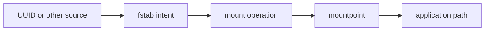
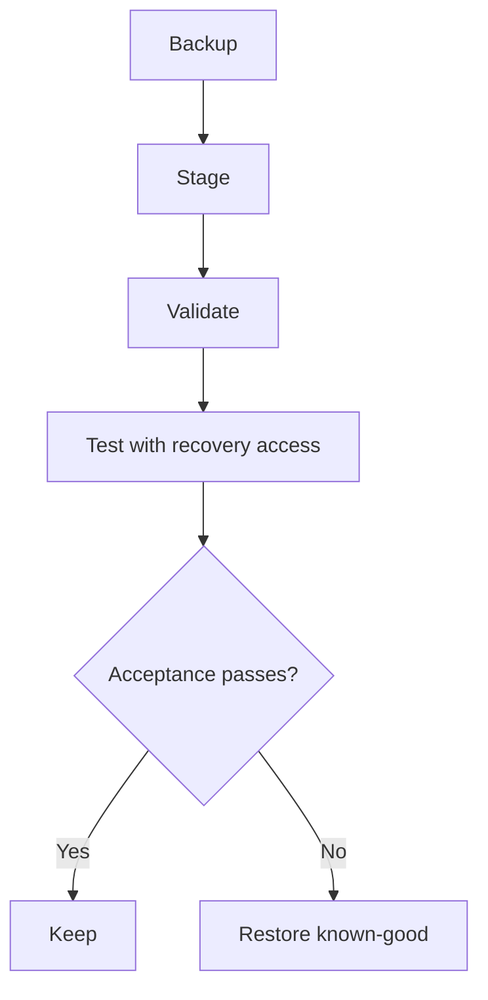

# Class 32 — Mounts, UUIDs, and fstab

**Module:** Docker, Storage & Permissions  
**Difficulty:** Beginner · **Duration:** 90 minutes · **Lab risk:** Low because the live mount table and `/etc/fstab` are not changed  
**Mastery:** ≥80% knowledge check, validated staged entry, Feynman teach-back, and recovery plan

## Objective

Explain mounting and mount options; identify filesystems by UUID/label; read `fstab`; stage and validate a persistent mount entry without changing boot configuration; and plan recovery from an invalid or unavailable mount.

## Why It Matters

A manual mount can work today and disappear after reboot. A bad persistent mount can delay boot, drop a host into emergency mode, or expose data with unsafe options. Device names such as `/dev/sdb1` can change; persistent identity and tested failure behavior matter.

## Prior-Knowledge Check

1. What connects a filesystem to a directory?
2. Why might `/dev/sdb1` become `/dev/sdc1`?
3. What would you back up before editing `/etc/fstab`?

## Instruction

Mounting attaches a filesystem source to a directory. The mountpoint's previous visible contents are hidden while the mount is active. Active state is visible through `findmnt` and `/proc/self/mountinfo`; persistent intent is commonly declared in `/etc/fstab`.

An `fstab` row contains source, mountpoint, filesystem type, options, dump field, and fsck pass. Sources may use `UUID=`, `LABEL=`, device path, or network syntax. UUIDs usually remain stable across device-name reordering, but cloning a filesystem can duplicate a UUID and reformatting creates a new one.

Options express behavior and security. `ro`, `nosuid`, `nodev`, and `noexec` may reduce risk for suitable data, but can break workloads that legitimately require writes, device nodes, set-ID behavior, or execution. `nofail` and systemd timeout/automount options can improve availability for noncritical devices, but must match service dependencies.

Safe change sequence:

1. Identify the exact source and current mounts.
2. Back up `/etc/fstab` and record permissions/ownership.
3. Create and verify the mountpoint.
4. Stage the proposed row in a separate file.
5. Validate syntax and source expectations.
6. Test in a maintenance window with recovery access available.
7. Verify application behavior and reboot behavior.
8. Restore the known-good file if acceptance checks fail.

## Visual 1 — Mount Decision



## Visual 2 — Safe Change Gate



## Worked Example

A media disk is configured as `/dev/sdb1`. A new controller changes enumeration and another disk receives that name. A UUID-based entry better expresses which filesystem was intended, but only after verifying that the UUID is unique and belongs to the correct data.

## Guided Practice

### Stage, Never Activate

### Safety and prerequisites

- Uses the Class 31 image if available, or a clearly fake UUID for syntax practice.
- Writes only under `/opt/lab-classroom/class32/`.
- Does not mount anything or modify `/etc/fstab`.

```bash
LAB=/opt/lab-classroom/class32
sudo install -d -o "$(id -u)" -g "$(id -g)" "$LAB/mnt/academy31"
findmnt --real -o SOURCE,TARGET,FSTYPE,OPTIONS | tee "$LAB/active-mounts.txt"
if test -f /opt/lab-classroom/class31/academy-c31.img; then
  UUID_VALUE=$(blkid -s UUID -o value /opt/lab-classroom/class31/academy-c31.img)
else
  UUID_VALUE=11111111-2222-3333-4444-555555555555
fi
printf 'UUID=%s %s ext4 defaults,nofail,nodev,nosuid 0 2\n' \
  "$UUID_VALUE" "$LAB/mnt/academy31" > "$LAB/fstab.staged"
cat "$LAB/fstab.staged"
findmnt --verify --verbose --tab-file "$LAB/fstab.staged" 2>&1 | tee "$LAB/findmnt-verify.txt" || true
```

`findmnt --verify` may warn that a filesystem image or fake UUID is not an attached block device. That expected source warning is evidence; syntax errors are not.

### Verification checkpoints

```bash
test -s "$LAB/fstab.staged" && echo 'PASS: staged entry exists'
awk 'NF==6 && $1 ~ /^UUID=/ && $3=="ext4" {ok=1} END{exit !ok}' "$LAB/fstab.staged" && echo 'PASS: six-field ext4 entry'
grep -F "$LAB/mnt/academy31" "$LAB/fstab.staged"
test "$(wc -l < "$LAB/fstab.staged")" -eq 1 && echo 'PASS: one controlled entry'
```

## Independent Practice

Review one real noncritical mount read-only. Record source identity, target, type, options, boot criticality, dependent services, timeout behavior, monitoring, and recovery access. Propose a staged improvement but do not alter production `fstab`.

## Feynman Teach-Back

Explain why a UUID is a filesystem's name tag, a mountpoint is its doorway into the Linux tree, and `fstab` is the boot-time instruction sheet. Explain how a wrong instruction can affect boot even when the data is intact.

## Knowledge Check

1. What does a mountpoint do?  
2. Why prefer a UUID over `/dev/sdX` in many persistent mounts?  
3. What are the six `fstab` fields?  
4. Does `nofail` make a mount correct or secure?  
5. What can a mount hide?  
6. Why is out-of-band or console recovery useful before testing boot mounts?

## Answer Key

1. Exposes a filesystem at a directory in the unified tree.  
2. Device enumeration can change, while filesystem UUID normally persists.  
3. Source, target, type, options, dump, fsck pass.  
4. No; it changes failure handling only.  
5. Existing contents beneath the mountpoint while mounted.  
6. A bad entry can disrupt normal boot or remote access.

## Troubleshooting

| Symptom | Likely cause | Safe response |
|---|---|---|
| UUID not found | Wrong ID, device unavailable, reformatted, or not attached | Verify with `blkid`/`lsblk`; do not replace with a guessed device path |
| Wrong filesystem type | Staged type does not match on-disk signature | Read the signature and correct the staged entry |
| Boot waits for missing disk | Critical/default dependency and timeout behavior | Use recovery access, restore known-good configuration, then redesign noncritical behavior |
| Files seem missing at mountpoint | Another filesystem covers the directory | Inspect `findmnt`; do not assume deletion |
| Application cannot execute/write | Mount options or permissions prohibit it | Confirm requirement; change only the narrow option in an approved window |

## Security and Rollback

- Use the narrowest options compatible with the workload.
- Network mounts carry credential, trust, and availability concerns beyond local filesystems.
- Never paste secrets directly into broadly readable mount configuration.
- A successful `mount -a` does not replace application and reboot verification.

Lab rollback removes the staged file only:

```bash
LAB=/opt/lab-classroom/class32
test -f "$LAB/fstab.staged" && rm -- "$LAB/fstab.staged"
```

Real rollback: restore the timestamped known-good `/etc/fstab`, validate it, unmount only the affected noncritical mount when safe, and reboot only with recovery access and an approved window.

## Reflection

Which mounts in your homelab are boot-critical, and which should fail without preventing the host from starting?

## Video Narration Notes

Show a device name changing while a UUID remains attached to the intended filesystem. Build the six-field row visually, run staged verification, and emphasize that the lesson never edits `/etc/fstab` or performs a real mount.
