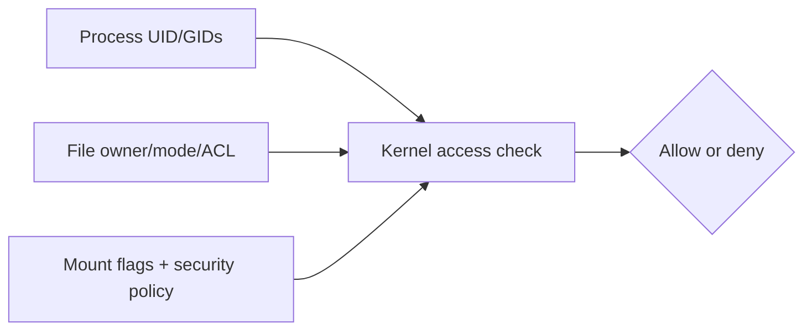
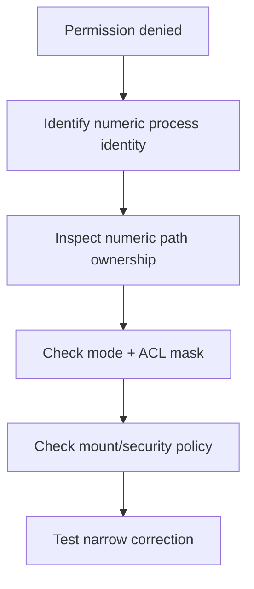

# Class 33 — PUID, PGID, ACLs, and Container File Access

**Module:** Docker, Storage & Permissions  
**Difficulty:** Intermediate · **Duration:** 100 minutes · **Lab risk:** Low  
**Mastery:** ≥80% knowledge check, one verified allowed/denied access test, Feynman teach-back, and rollback

## Objective

Explain numeric UID/GID identity across host and containers; distinguish mode bits from ACLs; diagnose bind-mount access failures; test access using an explicit container user; and design least-privilege ownership without using world-writable shortcuts.

## Why It Matters

Linux authorizes numeric identities, not matching display names. A container user named `media` may be UID 1000 while the host's `media` is UID 1500. The names look aligned, but the kernel sees different principals. Permission failures then tempt operators toward `chmod 777`, which trades a diagnosis problem for an access-control problem.

## Prior-Knowledge Check

1. Which number identifies the current user to the kernel?
2. What do owner, group, and other mode bits control?
3. What extra capability does an ACL provide?

## Instruction

Every process has effective numeric user and group identities plus supplementary groups. Files have numeric owner/group, mode bits, and possibly ACL entries. On a bind mount, the same host inode is evaluated against the container process's numeric identity. A username inside `/etc/passwd` is only a label for a number.

PUID/PGID are conventions used by some container images: an entrypoint reads environment variables and runs or configures the application with those IDs. Docker itself does not universally interpret `PUID` or `PGID`; verify each image's documentation and effective process identity.

Diagnosis order:

1. Identify the path and whether it is a bind mount or volume.
2. Inspect container process UID, GID, and supplementary groups.
3. Inspect host numeric ownership (`ls -ln`) and every parent directory.
4. Inspect mode bits and ACLs (`getfacl`).
5. Inspect mount mode/options and read-only state.
6. Consider SELinux/AppArmor or network-filesystem identity mapping.
7. Test the smallest controlled change and verify both access and isolation.

ACLs allow named/numeric users or groups to receive permissions beyond the three basic classes. The ACL mask limits effective permissions for named users/groups and the owning group. Default ACLs on directories influence newly created children; they do not retroactively repair existing files.

## Visual 1 — Access Evaluation



## Visual 2 — Diagnostic Funnel



## Worked Example

A container is configured with `PUID=1000`, but the host data is owned by UID 1500 and mode `0750`. The container cannot traverse or write. `chmod 777` would expose the directory to every local identity. Better options include running the process with the intended existing identity, assigning a controlled shared group, or adding a narrow ACL after documenting the ownership model.

## Guided Practice

### Prove Allowed and Denied Writes

### Safety and prerequisites

- Authorized Docker host with `busybox:1.36.1` cached from earlier labs or approved for pull.
- Uses only `/opt/lab-classroom/class33/`.
- Does not create users, recursively change ownership, or use `777`.

```bash
LAB=/opt/lab-classroom/class33
sudo install -d -o "$(id -u)" -g "$(id -g)" -m 0750 "$LAB/shared"
printf 'host-created\n' > "$LAB/shared/host.txt"
chmod 0640 "$LAB/shared/host.txt"
id | tee "$LAB/host-identity.txt"
ls -ldn "$LAB" "$LAB/shared" | tee "$LAB/numeric-directories.txt"
ls -ln "$LAB/shared/host.txt" | tee "$LAB/numeric-file.txt"
docker run --rm \
  --user "$(id -u):$(id -g)" \
  -v "$LAB/shared":/data \
  busybox:1.36.1 sh -c 'id; printf "matching-id-write\n" > /data/matching.txt; cat /data/host.txt'
if docker run --rm \
  --user 65534:65534 \
  -v "$LAB/shared":/data \
  busybox:1.36.1 sh -c 'printf "unexpected\n" > /data/denied.txt'; then
  echo 'FAIL: unrelated identity unexpectedly wrote'
  exit 1
else
  echo 'PASS: unrelated identity denied as expected'
fi
ls -ln "$LAB/shared" | tee "$LAB/after-tests.txt"
```

Optional ACL observation, without broadening access:

```bash
if command -v getfacl >/dev/null 2>&1; then getfacl -p "$LAB/shared" | tee "$LAB/shared.acl.txt"; else echo 'SKIP: getfacl unavailable'; fi
```

### Verification checkpoints

```bash
test -f "$LAB/shared/matching.txt" && echo 'PASS: matching numeric identity wrote'
test ! -e "$LAB/shared/denied.txt" && echo 'PASS: denied write left no file'
test "$(stat -c %a "$LAB/shared")" = 750 && echo 'PASS: directory not world-writable'
stat -c 'uid=%u gid=%g mode=%a path=%n' "$LAB/shared" "$LAB/shared/matching.txt"
```

## Independent Practice

Select one non-sensitive container with a bind mount. Record the process UID/GID, host ownership, parent-directory traversal bits, ACL, mount mode, Compose user/PUID/PGID settings, and the minimal intended readers/writers. Propose a correction without applying it to production.

## Feynman Teach-Back

Explain to someone why two users with the same name can still be different to Linux. Use numbered badges as the analogy, then explain how a group and ACL can grant narrow access without opening the door to everyone.

## Knowledge Check

1. Does Linux authorize a filename using usernames or numeric IDs?  
2. Does Docker universally implement PUID/PGID variables?  
3. What permission does a directory need for traversal?  
4. What does the ACL mask affect?  
5. Why is `chmod 777` usually the wrong repair?  
6. Name two non-mode-bit causes of denial.

## Answer Key

1. Numeric UID/GID values, with names as user-space labels.  
2. No; individual images may implement the convention.  
3. Execute/search permission.  
4. Effective permissions for named users, named groups, and the owning-group class.  
5. It grants unnecessary access and hides the identity/design mismatch.  
6. Read-only mount, ACL mask, SELinux/AppArmor, network identity mapping, missing parent traversal, or supplementary-group mismatch.

## Troubleshooting

| Symptom | Likely cause | Safe response |
|---|---|---|
| Correct-looking username still denied | Numeric UID/GID mismatch | Compare `id` and `ls -ln`; trust numbers |
| File mode allows group, process denied | Process lacks group or ACL mask restricts | Inspect supplementary groups and `getfacl` |
| Directory listing works but file open fails | File-specific mode/ACL or read-only mount | Inspect the exact file and mount, not just parent |
| Works as root only | Root bypass/capability masks underlying design | Restore non-root execution and correct ownership/access narrowly |
| New files differ from old files | umask, default ACL, or application creation behavior | Inspect defaults and one newly created file |
| NAS path behaves differently | NFS/CIFS identity mapping or server-side ACL | Inspect mount options and server policy before host chmod/chown |

## Security and Rollback

- Prefer non-root container processes and the smallest required access.
- Avoid recursive `chown` on large or shared datasets without an inventory and rollback plan.
- Do not use world-writable permissions as a diagnostic shortcut.
- Treat Docker socket access as host administration regardless of file ownership lesson goals.
- Back up ACLs with `getfacl -R` before approved ACL changes and restore with `setfacl --restore` when appropriate.

Lab rollback removes only files created inside the verified class directory:

```bash
LAB=/opt/lab-classroom/class33
test -d "$LAB/shared" && test "$LAB" = /opt/lab-classroom/class33 && rm -f -- "$LAB/shared/matching.txt" "$LAB/shared/denied.txt" "$LAB/shared/host.txt"
rmdir -- "$LAB/shared" 2>/dev/null || true
```

## Reflection

Where does your homelab currently depend on broad permissions because the intended numeric ownership model is undocumented?

## Video Narration Notes

Put a UID number above a host process and a container process while hiding their usernames. Reveal that matching names have different numbers. Demonstrate one allowed and one denied write, then show the diagnostic funnel and reject `777` as a shortcut.
