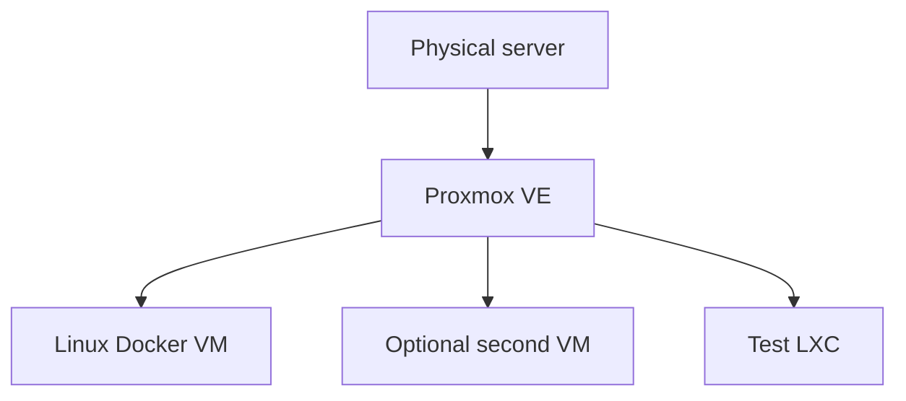
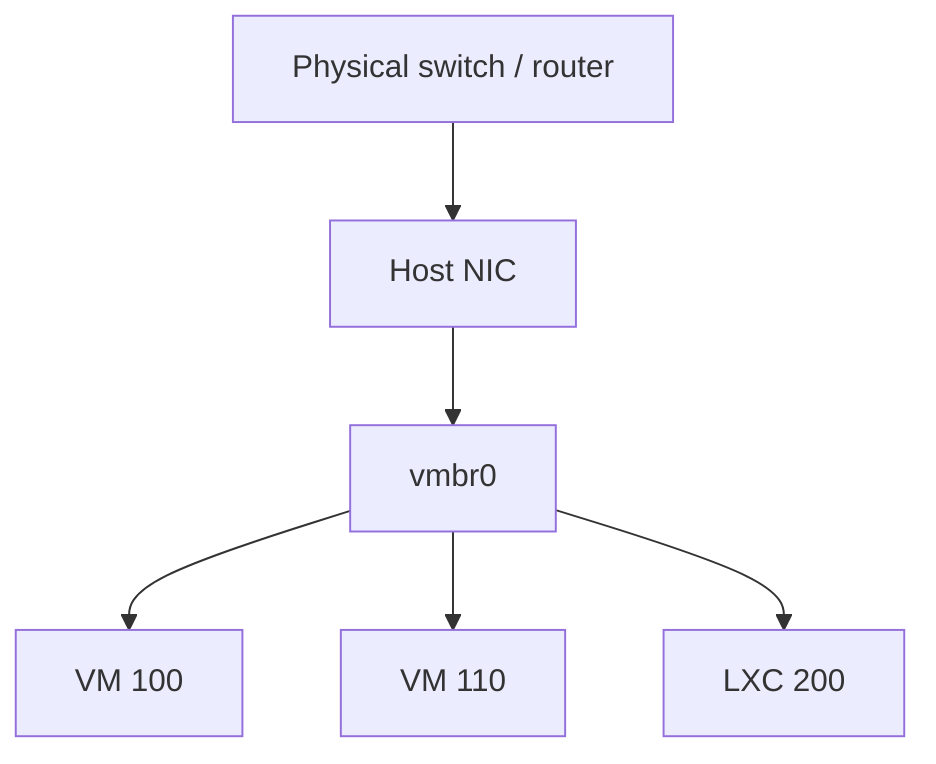

# Reading — Virtual machines & Proxmox

**Module:** Module 1 — Infrastructure & Addressing  
**Topic:** 01 — Virtual machines & Proxmox  
**Activity type:** Reading / reference (Learn)  
**Bloom focus:** Apply  
**Links to outcome:** Given a host and a guest requirement, the learner can choose Type 1 vs Type 2 virtualization, create a working Linux guest (VirtualBox or Proxmox), and prove networking, DNS, and SSH with recorded evidence.

## Why this matters

Without a safe practice machine, every later Docker, ARR, Home Assistant, and voice experiment risks your daily desktop. Virtualization is the sandboxed foundation the rest of the Academy builds on.

## Vocabulary

| Term | Meaning |
|---|---|
| Host | The real machine (or OS) that owns the hardware |
| Guest | A VM or container that thinks it is “the” computer |
| Hypervisor | Software that creates fake hardware and schedules guests |
| Type 2 hypervisor | App installed on Windows/macOS/Linux (example: VirtualBox) |
| Type 1 hypervisor | Installed on bare metal; the hypervisor *is* the host OS (example: Proxmox VE) |
| KVM/QEMU | Linux virtualization stack used under Proxmox VMs |
| LXC | Linux system container that shares the host kernel |
| ISO | Install-disc image used to install an operating system |
| vCPU | CPU time presented to a guest (scheduled, not always exclusive) |
| Bridge | Virtual switch connecting guests to each other and/or the LAN |
| NAT (guest network) | Guest shares the host’s internet path; often not a full peer on your LAN |
| Bridged (guest network) | Guest gets an address on the real LAN like another PC |
| Snapshot | Freeze-frame of a guest you can restore later |
| Clone | Full copy of a guest for experiments or backup-like recovery |
| `vmbr0` | Common name of Proxmox’s primary Linux bridge |

## Core reading

### Originally: What you will learn

You will understand what a virtual machine really is (a full computer living inside another computer), why hypervisors exist, the difference between Type 2 (app-on-your-OS) and Type 1 (OS replaced by the hypervisor), and how to stand up a safe practice box without risking your daily desktop. You will also learn how VMs differ from LXC, how storage and networking attach to guests, and why this Academy puts Docker inside a Linux VM later.

### What a virtual machine is

Open your laptop. Inside the case sit real parts: CPU, RAM, storage, network chip. An operating system (Windows, macOS, or Linux) sits on top and turns those parts into something you can use.

A **virtual machine** is another complete computer that lives *inside* that setup. It gets virtual CPU, virtual RAM, a virtual disk, and a virtual network card. The guest OS boots, paints a desktop, and runs programs. From the guest’s point of view, it is the only computer in the room. From your point of view, it is software sharing your real hardware.

You do not need a second physical PC just to try Linux, practice networking, or break configuration on purpose. You carve out a slice of what you already own.

### Why you want one

Three reasons show up again and again in real labs:

1. **Safe practice.** Mess up the guest. Delete it. Rebuild it. Your daily host OS stays untouched.
2. **Learn other operating systems.** Run Ubuntu, Debian, a server trial, or a second Windows install without repartitioning your only disk.
3. **Isolation when you experiment.** Labs, scrapers, new stacks, and “what if I change this?” work are safer inside a guest—especially if you keep sharing features (clipboard, folders, bridged LAN) turned down until you need them.

Virtualization is not a toy idea. It is how cloud providers and most serious IT shops pack many systems onto fewer machines. Learning it once pays off for the rest of this Academy.

### Hypervisors: Type 2 vs Type 1

The **hypervisor** is the piece that performs the “computer inside a computer” trick.

| | Type 2 | Type 1 |
|---|---|---|
| Where it lives | App on your existing OS | Installed on the hardware itself |
| Everyday example | VirtualBox on a Windows laptop | Proxmox VE on a spare PC |
| Who owns the hardware | Your host OS shares RAM/CPU with the hypervisor | Hypervisor owns the hardware and feeds guests |
| Best for | Learning on the machine you already use | Always-on labs, more guests, more RAM for VMs |
| Tradeoff | Easy and free; host OS still eats resources | Requires dedicating (or wiping) a machine; more power |

Both types create guests. Type 2 asks the host OS for resources. Type 1 sits closer to the metal and usually gives you more room for bigger labs.

This class supports **both paths**. The Academy’s default for later classes is a **dedicated Proxmox host** (Type 1). If you only have one laptop today, start with **VirtualBox** (Type 2), finish the gate with a working guest, then move Proxmox onto spare hardware when you can.

```text
Type 2 (laptop path)
  Hardware → Windows/macOS/Linux → VirtualBox → Guest OS

Type 1 (Academy default)
  Hardware → Proxmox VE → VM / LXC guests
```

### Firmware: turn on hardware virtualization

Modern guests expect 64-bit virtualization support in the CPU. In firmware (BIOS/UEFI) look for **Intel VT-x / VMX** or **AMD-V / SVM** and set it to **Enabled**. Keys vary by vendor (`Del`, `F2`, `F10`, `F12`). Change only that setting, save, and reboot. Without it, many 64-bit guests will refuse to start or run poorly.

### Path A — Type 2 on your daily computer (VirtualBox)

Use this when you do not yet have a spare PC.

1. Download the guest **ISO** you want (Ubuntu Desktop/Server is a solid first choice). Start the download early; ISOs are large.
2. Install **VirtualBox** for your host OS from the official site. Accept defaults.
3. Install the matching **Extension Pack** if you need USB passthrough and related extras.
4. Create a new VM: name it, choose Linux + a 64-bit Debian/Ubuntu-class type, give it modest RAM (often 2 GB to start on a 8–16 GB host), create a dynamically allocated virtual disk (20 GB+), and assign more than one vCPU only if your host has cores to spare—stay under about half your physical cores.
5. Attach the ISO as the virtual optical drive and start the VM.
6. Install the guest OS. Guided partitioning of the *virtual* disk is safe for your host disk; you are formatting the fake drive, not your Windows/macOS partition.
7. Learn the **host key** (often Right Ctrl on Windows/Linux) so you can release the mouse/keyboard back to the host.

**Power features worth using on day one**

- **Pause** — freeze the guest like pausing a game; resumes where you left off.
- **Save state** — close the guest and reopen later with apps still open.
- **Snapshot** — take a restore point before a risky change; roll back if it breaks.
- **Clone** — duplicate a known-good machine before you thrash a copy.

**Network modes (keep this mental model)**

- **NAT** — guest reaches the internet through the host; it is usually *not* a full peer on your home LAN. Good default for isolation.
- **Bridged** — guest appears on the LAN with its own address. Convenient for SSH from other devices; less isolation.

Clipboard sharing, drag-and-drop, and shared folders are convenient and weaken isolation. Leave them off until you understand the tradeoff.

### Path B — Type 1 on spare hardware (Proxmox VE)

Use this when you have an old laptop/desktop (or a small server) you can dedicate. This is the path later Academy classes assume.

Proxmox replaces the previous OS on that machine. Back up anything you care about first. Prefer a **wired Ethernet** uplink for the host; bridging Wi-Fi is a common pain point.

High-level install flow:

1. Download the current Proxmox VE ISO and write it to USB (on Windows, imaging tools often need **DD mode**, not a naive ISO copy).
2. Boot the target machine from USB (set boot order in firmware if needed).
3. Install Proxmox: accept the license, choose the target disk, set locale, set a strong `root` password, set hostname and management IP/gateway/DNS.
4. Remove the USB, reboot, and open `https://SERVER-IP:8006` from another computer. Trust the self-signed certificate warning for a local lab, or replace the cert later.
5. Ignore the “no subscription” nag if you are on the free/no-subscription path; the hypervisor still works.
6. Upload guest ISOs to storage that allows **ISO image** content.
7. Create a VM, attach the ISO, install Linux, enable SSH.
8. Optionally create an LXC from a template to feel the speed difference.

**Single-disk storage note:** fresh installs sometimes leave usable space split oddly between `local` and `local-lvm`. Before you fill the host with disks, confirm which storage accepts **disk images** and that you have the capacity you expect. Official Proxmox docs cover resizing; do that housecleaning *before* you depend on the box.



### VM vs LXC vs Docker

A **VM** has its own kernel. An **LXC** shares the Proxmox host kernel. That one fact drives most tradeoffs:

| Decision | VM | LXC |
|---|---:|---:|
| Own kernel | Yes | No |
| Windows guest | Yes | No |
| Stronger boundary | Yes | No |
| Lower overhead | No | Yes |
| Full OS flexibility | Yes | Limited to compatible Linux userspace |

**Docker** is an application-container platform. It is not a synonym for VM or LXC. The beginner architecture for this Academy is:

```text
Proxmox → Debian/Ubuntu VM → Docker Engine → applications
```

That avoids nesting Docker inside LXC (and the storage/device headaches that follow) before you understand each layer.

### Resource allocation

vCPUs are scheduled. Four vCPUs does not mean four cores locked forever. **RAM is less forgiving:** the host plus every running guest need real memory. Leave headroom for the hypervisor, disk cache, backups, and spikes. On a laptop Type 2 setup, watch Task Manager / Activity Monitor / `htop` with your normal apps open before you gift the guest huge RAM.

### Storage

Capacity and **content type** are separate. A storage target may allow ISOs, VM disks, container filesystems, backups, or only some of those. Free space on the wrong content type still blocks “Create disk.” Dynamically allocated virtual disks grow as used; fixed disks reserve space up front (sometimes faster, always hungrier).

### Networking on Proxmox

`vmbr0` behaves like a virtual Ethernet switch. Guest NICs attach to the bridge; the bridge attaches to a physical NIC; frames can reach the LAN.



Manage Proxmox from a second device at `https://SERVER-IP:8006`. The management workstation can be Windows, Linux, or macOS.

### Isolation vs convenience (both paths)

The guest is valuable because it is a sandboxed world. Every convenience feature—bridged LAN, shared clipboard, shared folders, USB passthrough—makes the sandbox thinner. For learning and break/fix work, start strict. Open doors on purpose, one at a time, and write down what you changed.

## Worked example (study this)

**I do** — study the reasoning, not just the final answer.

**Bad approach:** Install experimental servers directly on your daily Windows/macOS desktop “to save time.”

**Better approach:** Create a disposable guest (Type 2 VirtualBox now, or Type 1 Proxmox on spare hardware), take a snapshot before risky changes, and prove SSH + DNS inside the guest before installing anything else.

**Why better:** Failure stays inside the guest. Snapshots give rollback. The host OS you use for school/work stays untouched.

## Current correction

Use current official VirtualBox and Proxmox documentation for installer screens, Extension Pack pairing, and supported versions. Video walkthroughs age; the model (host/guest, Type 1 vs Type 2, snapshot discipline, NAT vs bridge) stays. Prefer current ISOs and release notes over any year-stamped screenshot.

## Next

1. Open the **Lesson** for prior-knowledge check, guided practice, and **required Feynman teach-back**.
2. Then complete **Lab**, **Homework**, and **Quiz** for this topic.
