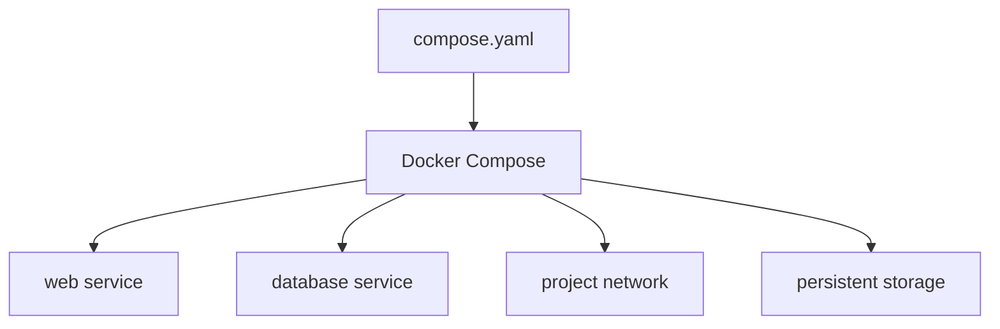

# Reading — Docker Compose & persistence

**Module:** Module 1 — Infrastructure & Addressing  
**Topic:** 02 — Docker Compose & persistence  
**Activity type:** Reading / reference (Learn)  
**Bloom focus:** Apply / Create  
**Links to outcome:** Given a multi-step `docker run` intent, the learner can write a Compose file with services, ports, environment, and persistent mounts, then recreate the stack without data loss.

## Why this matters

Shell history is not a system design. If your stack only exists as remembered commands, you cannot rebuild after failure — and every later ARR/HA/voice service will be fragile.

## Vocabulary

You will distinguish image, container, registry, service, volume, and bind mount; read YAML; convert `docker run` intent into Compose; manage environment values; publish ports; add healthchecks; and prove data persistence.

| Term | Meaning |
|---|---|
| Image | Immutable application filesystem and metadata |
| Container | Running or stopped instance created from an image |
| Registry | Image distribution service |
| Compose project | Related services described in one YAML model |
| Bind mount | Host path mapped into a container |
| Named volume | Docker-managed persistent storage |
| Environment variable | Runtime configuration passed as key/value data |
| Port publish | Mapping from host port to container port |
| Healthcheck | Command that reports application readiness/health |

## Core reading

A long `docker run` command records configuration only in shell history and human memory. Compose stores the desired state in a file that can be reviewed, versioned without secrets, validated, and redeployed.



YAML uses indentation to express structure. Spaces matter; tabs and misalignment can change or invalidate the model. A minimal service declares an image, name or project identity, restart behavior, storage, networks, ports, and environment.

```yaml
services:
  demo:
    image: nginx:stable
    ports:
      - "8080:80"
    restart: unless-stopped
```

The left side of `8080:80` is the host port; the right side is the port inside the container.

### Persistence

Containers are replaceable. Persistent state must live outside the writable container layer.

```yaml
services:
  app:
    image: example/app:1.2.3
    volumes:
      - ./config:/config
```

Destroying and recreating the container should not destroy `./config`. This is a requirement to test, not an assumption.

### Paths and identity

Linux container processes use numeric user and group IDs. A container can see a bind-mounted path yet fail to write if the host permissions do not match the container identity. Record PUID/PGID or equivalent ownership decisions in the service contract.

Windows students should run the production-like lab inside the Linux VM from Class 1. Windows path syntax, Desktop file sharing, WSL filesystems, and case sensitivity add variables that distract from the container model.

### Secrets

An `.env` file can reduce repetition, but it is not encryption. Do not commit API keys, passwords, or tunnel tokens. Prefer purpose-built secrets mechanisms where supported, restrict file permissions, and keep a safe recovery record.

### Lifecycle

```bash
docker compose config
docker compose pull
docker compose up -d
docker compose ps
docker compose logs --tail=100
docker compose down
```

`config` validates and renders the model. `pull` downloads declared images. `up -d` reconciles running resources to the file. `down` removes project containers and networks; adding `-v` can remove volumes and is therefore not used casually.

## Worked example (study this)

**I do** — study the reasoning, not just the final answer.

**Bad Compose intent:** No volumes; data lives in the container filesystem; recreate = wipe.

**Better:** Bind-mount or named volume for `/config` (or app data path), pin an image tag you can roll back, declare ports and env in YAML, and prove `docker compose down` + `up` keeps the data.

## Current correction

Use `docker compose` (Compose v2 plugin) in current environments. Old tutorials may use the standalone `docker-compose` command or obsolete schema keys. Validate against current Docker Compose documentation.

## Next

1. Open the **Lesson** for prior-knowledge check, guided practice, and **required Feynman teach-back**.
2. Then complete **Lab**, **Homework**, and **Quiz** for this topic.
