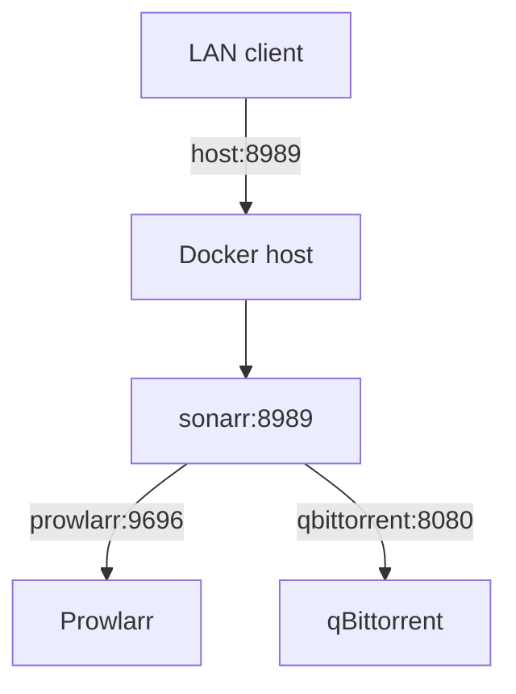

# Reading — Docker networking

**Module:** Module 1 — Infrastructure & Addressing  
**Topic:** 03 — Docker networking  
**Activity type:** Reading / reference (Learn)  
**Bloom focus:** Analyze  
**Links to outcome:** Given two Compose services, the learner can place them on an isolated user-defined network, call one service by DNS name from the other, and explain host-port publish versus container-to-container traffic.

## Why this matters

Wrong networking is the #1 silent failure in ARR and Home Assistant stacks: ‘it works in the browser on the host’ but containers cannot see each other — or everything is published to the LAN by accident.

## Vocabulary

_Add terms as you encounter them in Instruction._

## Core reading

### Originally: Outcomes

You will understand default and user-defined bridges, embedded DNS, port publishing, host networking, `none`, MACVLAN, IPVLAN, overlay networks, and why the ARR stack normally starts with a user-defined bridge.

### Core model

Docker networking has two separate jobs:

1. Let containers communicate with each other.
2. Decide which services are reachable from the host or other networks.

Inside a container, `localhost` means that container. Sonarr calling `localhost:9696` attempts to reach Sonarr, not Prowlarr. On a user-defined bridge, call `http://prowlarr:9696` using the Compose service name.

### Drivers

| Driver/mode | Purpose | Beginner position |
|---|---|---|
| Default bridge | Legacy automatic network | Understand, but do not build the stack around it |
| User-defined bridge | Single-host application networking with DNS | Default for the course |
| Host | Shares host network namespace | Use only with a documented reason |
| None | No external networking | Useful for isolation tests |
| MACVLAN | Gives containers LAN-facing MAC/IP identities | Advanced; switch/AP behavior matters |
| IPVLAN | Alternative L2/L3 attachment model | Advanced routing design |
| Overlay | Multi-host/swarm networking | Not required for one Docker host |

User-defined bridges provide predictable grouping and automatic name resolution. Port publishing is still needed for LAN users to access a service, but container-to-container calls do not need a published host port when both services share the network.

### Exposure and isolation

Do not publish every internal service simply because you can. A database used only by one application can remain reachable only on its Docker network. ARR web interfaces normally remain LAN-only or VPN-protected.

## Worked example (study this)

**I do** — study the reasoning, not just the final answer.

**Bad:** Publish every container port to `0.0.0.0` on the host and point services at `localhost`.

**Better:** Put related services on `media_net` (or similar), use service DNS names for container-to-container calls, and publish host ports only for the UIs you intentionally open.

## Current correction

The lecture's driver survey is valuable, but a single-host ARR stack rarely needs MACVLAN, IPVLAN, or overlay networking. Start with a user-defined bridge and adopt advanced drivers only from an explicit requirement.

## Next

1. Open the **Lesson** for prior-knowledge check, guided practice, and **required Feynman teach-back**.
2. Then complete **Lab**, **Homework**, and **Quiz** for this topic.
