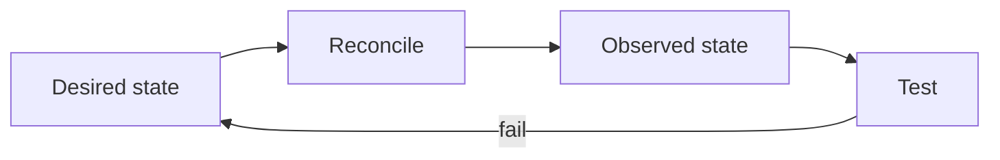

# Reading — Container operations

**Module:** Module 1 — Infrastructure & Addressing  
**Topic:** 04 — Container operations  
**Activity type:** Reading / reference (Learn)  
**Bloom focus:** Apply / Evaluate  
**Links to outcome:** Given a running Compose service, the learner can inspect health and logs, perform a controlled image update, and roll back to a known-good state with evidence.

## Why this matters

The lecture demonstrates Docker's breadth. This class turns that inspiration into engineering discipline: selecting appropriate workloads, understanding state, observing health, updating safely, backing up configuration, and recovering from a failed change.

## Vocabulary

_Add terms as you encounter them in Instruction._

## Core reading

### Workload classification

Before deploying an image, classify it:

| Question | Why it matters |
|---|---|
| Is it stateless or stateful? | Determines backup and persistence needs |
| What data is authoritative? | Tells you what loss is unacceptable |
| What ports are required? | Controls exposure and conflicts |
| What identities access host files? | Controls permissions |
| What devices are required? | GPU, USB, tun, serial, and audio expand risk |
| What are its dependencies? | Defines startup and recovery order |
| How is health measured? | Prevents “container running” from being mistaken for service working |

Containers package processes. They do not remove systems-engineering responsibilities.

### Desired state and observed state

Compose says what should run. Commands and tests show what is actually running.



A container can be “Up” while the application is deadlocked, unable to reach its database, or serving an error page. Use layered signals:

- Docker state and restart count.
- Healthcheck status.
- Application logs.
- Local HTTP/API probe.
- Dependency tests.
- User-level transaction.

### Image trust and versioning

Record image source, tag, digest when appropriate, upstream project, release notes, and last-known-good version. `latest` is a moving pointer, not a release policy. Before updates, capture configuration backup and current version, then change one service or dependency group at a time.

### Logs and resource observation

Useful commands:

```bash
docker compose ps
docker compose logs --since=10m SERVICE
docker inspect CONTAINER
docker stats --no-stream
docker system df
```

Do not treat all warnings as faults. Tie logs to the test time and symptom. Redact tokens, API keys, cookies, internal hostnames, and personal media names before sharing.

### ARR operational contract

For every later service, record the same fields. This turns containers into an operable system.

## Worked example (study this)

**I do** — study the reasoning, not just the final answer.

**Bad ops:** `docker compose pull && up -d` on Friday night with no backup and no pin.

**Better:** Record current image digest/tag → backup config volume → change one variable → observe health/logs → keep a rollback tag ready.

## Current correction

Novel container examples age quickly. Use the lecture to understand deployment possibilities, then verify maintenance status, image provenance, architecture support, licenses, and security guidance before adopting any showcased project.

## Next

1. Open the **Lesson** for prior-knowledge check, guided practice, and **required Feynman teach-back**.
2. Then complete **Lab**, **Homework**, and **Quiz** for this topic.
