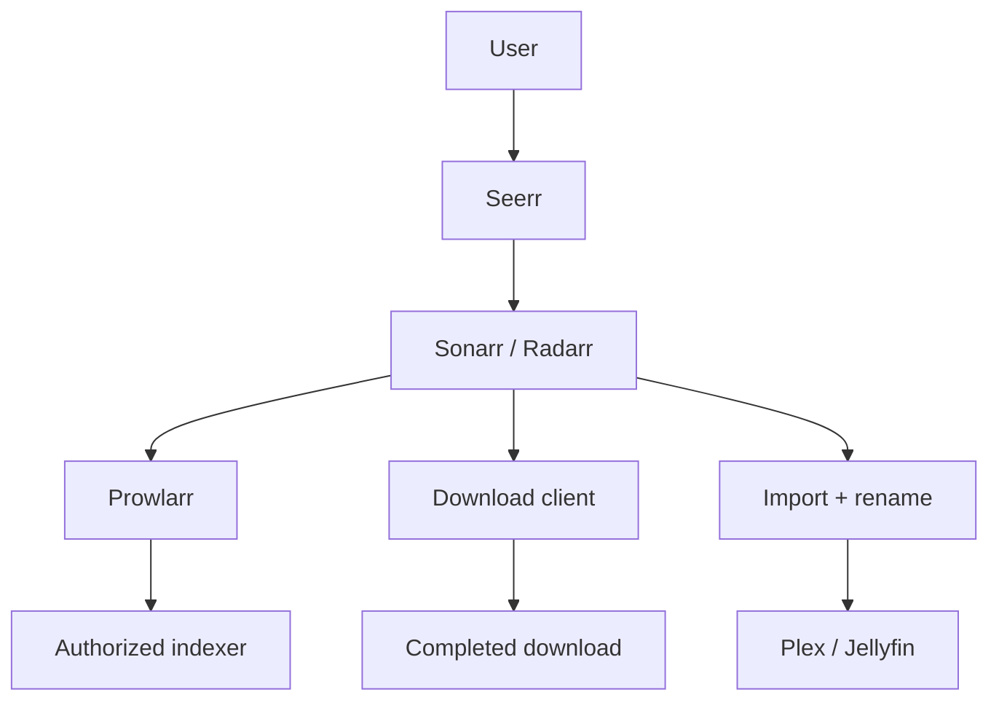

# Reading — Prowlarr & ARR request flow

**Module:** Module 2 — ARR Media Automation  
**Topic:** 01 — Prowlarr & ARR request flow  
**Activity type:** Reading / reference (Learn)  
**Bloom focus:** Apply / Analyze  
**Links to outcome:** Given authorized indexer credentials and Compose networking, the learner can connect Prowlarr to Sonarr/Radarr, prove sync/tests, and trace a request through search → download client → import boundaries.

## Why this matters

Clicking through UIs without service contracts produces mystery failures. Prowlarr is the contract hub: if sync and tests are wrong, every later quality and automation class sits on sand.

## Vocabulary

| Term | Meaning |
|---|---|
| Indexer | Search source for release metadata |
| Application sync | Prowlarr propagating indexer configuration to Sonarr/Radarr |
| Download client | Application that receives a selected job |
| Category | Label used to separate queues and import handling |
| API key | Credential used for application-to-application calls |
| RSS sync | Periodic discovery of newly posted releases; not a full search |
| Interactive search | User-visible candidates for manual selection |
| Automatic search | Application selecting candidates under policy |
| Import | ARR application moving/linking completed content into the library |

## Core reading

### Scope and legal boundary

Prowlarr manages indexer definitions and makes search results available to compatible applications. This course covers architecture, configuration control, and testing. Use only indexers and content sources you are authorized to use.

### End-to-end architecture



Prowlarr does not replace Sonarr or Radarr. Sonarr/Radarr own the monitored title, quality policy, candidate evaluation, download handoff, and completed-download import. Prowlarr centralizes indexer connectivity and synchronization.

### Service contracts before clicking

Record the following for Prowlarr, Sonarr, Radarr, and each download client:

- Docker service name and internal port.
- LAN address only if humans need it.
- Docker network.
- API credential owner and rotation plan.
- Download category.
- Root folder and container path mappings.
- Health/test button expected result.

Within one Compose network, prefer service DNS names such as `http://sonarr:8989`. From Prowlarr's container, `localhost:8989` points back to Prowlarr and is wrong unless both processes genuinely share a network namespace.

### Applications and synchronization

Adding Sonarr/Radarr to Prowlarr creates an application relationship. The exact sync settings can vary, but the intended result is clear: indexers approved for a target application appear there with the proper categories and settings.

Treat the connection test and the synchronization test as different requirements:

1. **Connection:** Can Prowlarr authenticate to the target API?
2. **Synchronization:** Does the desired indexer configuration actually appear and remain consistent?

### Indexer tests

An indexer test can fail at several layers:

```text
DNS -> TCP/TLS -> provider response -> authentication -> rate limit -> categories -> application policy
```

Do not regenerate every API key because DNS failed. Capture the exact test time, response class, and one hypothesis.

### Download handoff and categories

Sonarr/Radarr normally send a selected release to the download client. Categories keep traffic separated, for example `tv` and `movies`. The client must report completed paths that the ARR container can resolve.

The most reliable beginner layout gives download client and importers a consistent `/data` view:

```text
Host: /srv/data                 Containers: /data
  /torrents                       /torrents
  /usenet                         /usenet
  /media/tv                       /media/tv
  /media/movies                   /media/movies
```

This reduces remote-path mappings and enables hardlinks when source and destination are on the same filesystem.

### Hardlinks

A hardlink gives two directory entries to the same underlying file data. It avoids a second full copy while allowing the downloader to seed from one path and the media library to use another.

Conditions include:

- Same filesystem/device.
- Compatible permissions.
- Application configured to use hardlinks where appropriate.
- Paths presented consistently.

On Linux, compare device and inode values with `stat`. Two paths with the same device and inode refer to the same file data.

## Worked example (study this)

**I do** — study the reasoning, not just the final answer.

**Bad:** Point Sonarr at Prowlarr using `localhost` from inside another container; skip indexer tests.

**Better:** Use the Compose DNS name + correct port, complete application sync, run indexer/app tests, and record pass/fail in the workbook before adding download clients.

## Current correction

Application fields and sync behavior evolve. Follow the current Servarr/Prowlarr documentation for exact UI steps. Preserve the architecture and tests even if labels move.

## Next

1. Open the **Lesson** for prior-knowledge check, guided practice, and **required Feynman teach-back**.
2. Then complete **Lab**, **Homework**, and **Quiz** for this topic.
