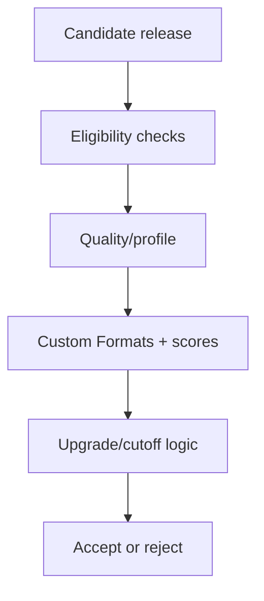

# Reading — TRaSH quality profiles

**Module:** Module 2 — ARR Media Automation  
**Topic:** 02 — TRaSH quality profiles  
**Activity type:** Reading / reference (Learn)  
**Bloom focus:** Evaluate / Create  
**Links to outcome:** Given playback and storage constraints, the learner can write a plain-language quality policy, configure Custom Formats and cutoff/upgrade settings, and prove ranking on five controlled candidates.

## Why this matters

Installing Sonarr or Radarr is easy. Designing what they should prefer, reject, upgrade, and stop upgrading is the difficult part. TRaSH Guides supplies maintained recommendations; your profile still represents a local policy constrained by display, audio system, storage, bandwidth, and tolerance for upgrades.

## Vocabulary

| Term | Meaning |
|---|---|
| Quality | Technical source/encode class recognized by the ARR application |
| Quality definition | Size limits associated with quality classes |
| Quality profile | Allowed qualities, ordering, upgrade, and cutoff policy |
| Custom Format (CF) | Rule that matches release characteristics |
| CF score | Positive or negative preference applied to a match |
| Minimum CF score | Threshold a candidate must meet |
| Upgrade-until score | Score target that can trigger further upgrades |
| Cutoff | Quality condition after which quality upgrades stop |
| REMUX | Near-direct disc media remuxed into a container |
| WEB-DL | File sourced from a streaming distributor download |
| Blu-ray encode | Compressed encode sourced from Blu-ray |
| DV/HDR | Dynamic-range formats with compatibility considerations |

## Core reading

### The decision model

Candidate selection is not one universal score. The application evaluates availability, monitored state, language, quality, Custom Formats, rejection rules, existing-file state, upgrade settings, and other constraints.

The correct question is not “What is the highest number?” It is “Does the selected result match the intended policy, and will future upgrades stop where we expect?”

### Requirements before profiles

Write the policy in plain language:

- Target resolution: 1080p, 2160p, or separate libraries/profiles.
- Maximum practical file size or storage budget.
- Accepted source classes.
- HDR/Dolby Vision compatibility.
- Preferred audio codecs and channel layouts.
- Language requirements.
- Whether release-group preferences matter.
- Whether remux quality is desired or wasteful for the environment.
- When upgrades should stop.

Example requirement:

> Prefer 1080p WEB-DL or strong Blu-ray encodes, reject unwanted low-quality sources, prefer compatible surround audio, avoid DV-only releases on displays lacking DV, and stop upgrading after the target quality and score are reached.

### Quality definitions versus profiles

Quality definitions bound expected sizes. Profiles decide allowed/ordered qualities and cutoff behavior. Custom Formats express characteristics that the built-in quality class does not fully capture.

Changing a size limit can make releases unavailable even if their quality name is allowed. Changing a cutoff can prevent or cause future upgrades. Changing CF scores can reorder candidates and trigger replacement activity. Treat each as a controlled configuration change.

### Custom Formats

A CF might recognize HDR type, audio codec, streaming service, release group, unwanted edition, or another release-name/media characteristic. A score expresses preference, not certainty. Overlapping CFs can stack, so test sample names rather than assuming one rule wins.

Design principles:

- Use negative scores or explicit rejection for truly unwanted traits.
- Use modest positive scores for preferences.
- Reserve very large weights for hard policy distinctions.
- Document why each score exists.
- Avoid importing every available CF “just in case.”

### Upgrade logic

Four questions must have explicit answers:

1. Are upgrades enabled?
2. What quality cutoff applies?
3. What minimum CF score makes a candidate eligible?
4. What upgrade-until CF score ends score-driven replacement?

A profile can accept a current file yet continue searching forever if upgrade targets are unreachable. It can also stop too early if cutoff or score targets are accidentally satisfied.

## Worked example (study this)

**I do** — study the reasoning, not just the final answer.

**Bad requirement:** “The library should look good.”

**Better requirement:** “Prefer 1080p WEB-DL or strong Blu-ray encodes; reject unwanted low-quality sources; prefer compatible surround audio; avoid DV-only releases on displays lacking DV; stop upgrading after target quality and CF score are reached.”

Now scoring can be tested against the sentence.

### Example scoring exercise

Keep the in-class scoring table from the lesson. Practice explaining each total out loud.

## Current correction

TRaSH recommendations and supported sync tooling change. Always use the current guide for profile identifiers and semantics, then verify behavior in the current Sonarr/Radarr release before applying changes broadly.

## Next

1. Open the **Lesson** for prior-knowledge check, guided practice, and **required Feynman teach-back**.
2. Then complete **Lab**, **Homework**, and **Quiz** for this topic.
