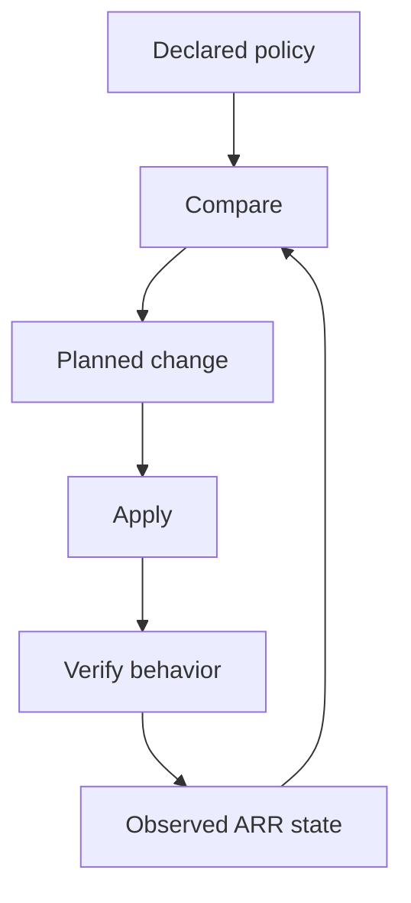

# Reading — Configuration automation

**Module:** Module 2 — ARR Media Automation  
**Topic:** 03 — Configuration automation  
**Activity type:** Reading / reference (Learn)  
**Bloom focus:** Apply / Evaluate  
**Links to outcome:** Given a known-good profile backup, the learner can choose one authoritative sync path, run dry-run/apply/rollback, and produce a drift report that matches the live apps.

## Why this matters

Manual clicking can create a correct profile once. Automation aims to keep declared policy synchronized over time. That introduces new hazards: upstream changes, destructive replacement, token exposure, and configuration drift. This class teaches controlled automation rather than blind synchronization.

## Vocabulary

| Term | Meaning |
|---|---|
| Source of truth | Authoritative declaration of intended configuration |
| Drift | Difference between intended and observed state |
| Idempotent | Repeated application converges without unwanted duplication |
| Dry run | Preview of proposed changes without applying them |
| Sync | Reconciliation of target application with declared policy |
| Rollback | Return to a verified previous state |
| Pinning | Selecting an explicit version/revision instead of a moving target |
| Blast radius | Scope of systems or profiles affected by a failure |

## Core reading

### Control-loop model



The loop is incomplete without behavior verification. A tool reporting “sync successful” proves only that its operation completed; it does not prove the resulting release rankings match household requirements.

### Choose one authoritative path

Current environments may use Recyclarr, Notifiarr-supported synchronization, or another maintained method. Avoid having two tools own the same profiles and CF scores unless their responsibilities are explicitly separated. Competing writers create oscillation and confusing drift.

The authoritative record should include:

- Tool and version.
- Configuration file location.
- Target application and profile.
- Guide/profile identifiers.
- Locally intentional score overrides.
- Secret injection method.
- Last successful sync.
- Last verified behavior test.

### Safe rollout pattern

1. Back up application database/configuration.
2. Export or screenshot the current profile in a secret-safe way.
3. Pin the automation tool version.
4. Validate syntax.
5. Run a dry run/preview where supported.
6. Review creations, updates, deletions, and score changes.
7. Apply to one test profile or one application.
8. Run controlled candidate-scoring tests.
9. Expand only after acceptance criteria pass.

### Secrets

API URLs and API keys are credentials. Keep them outside tracked configuration when the tool supports environment or secret injection. Limit filesystem permissions. Rotate a key if it appears in logs, screenshots, shell history, or a repository.

Example conceptual configuration—not a copy/paste guarantee:

```yaml
radarr:
  movies:
    base_url: !env_var RADARR_URL
    api_key: !env_var RADARR_API_KEY
    quality_definition: movie
    quality_profiles:
      - name: HD Balanced
```

Consult the selected tool's current schema for exact syntax.

### Change classification

Before production syncs, label each change: low (cosmetic rename), medium (score tweak), high (cutoff / deletes / mass CF). High-risk needs backup + dry-run + test profile first.

## Worked example (study this)

**I do** — study the reasoning, not just the final answer.

**Bad:** Edit scores in the UI *and* in a sync tool with no single owner.

**Better:** Pick one authoritative path (for example Recyclarr *or* Notifiarr — not both fighting), backup → dry run → apply → verify → keep rollback.

## Current correction

Do not assume the automation mechanism shown in an older video remains the recommended integration. Select a currently maintained sync path, use its current schema, and preserve the source-of-truth, preview, verification, and rollback controls taught here.

## Next

1. Open the **Lesson** for prior-knowledge check, guided practice, and **required Feynman teach-back**.
2. Then complete **Lab**, **Homework**, and **Quiz** for this topic.
