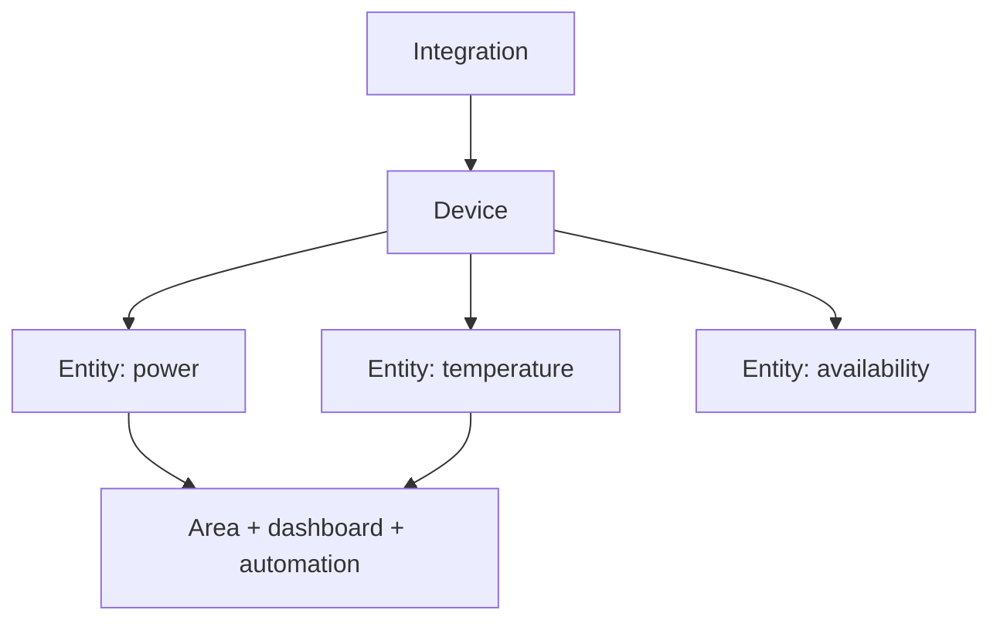

# Reading — Home Assistant foundations

**Module:** Module 3 — Home Assistant & Secure Access  
**Topic:** 01 — Home Assistant foundations  
**Activity type:** Reading / reference (Learn)  
**Bloom focus:** Apply  
**Links to outcome:** Given a Home Assistant install path, the learner can identify device/entity/area/integration, build a minimal dashboard, and prove backup + restore evidence.

## Why this matters

Automations and voice are useless on a unnamed mess of entities. Foundations — objects, areas, backups — decide whether later classes are joyful or cursed.

## Vocabulary

_Add terms as you encounter them in Instruction._

## Core reading

### Originally: Outcomes

You will understand instances, integrations, devices, entities, areas, services/actions, states, dashboards, helpers, add-ons, backups, and the separation between Home Assistant OS and containerized installations.

### Object model



An integration connects Home Assistant to a platform or protocol. A device is a physical or logical product. An entity is one controllable or observable property. Automations usually reason over entity state and invoke actions/services.

### Installation choices

### Home Assistant OS

A complete managed appliance model with Supervisor and add-on support. It fits well in a dedicated VM and is the course's default for the capstone.

### Home Assistant Container

Runs Home Assistant Core in Docker. The operator manages surrounding services and does not receive the same managed add-on environment. This is valid, but instructions written for add-ons cannot be copied directly.

Do not combine installation models mentally. First record which model you operate, then follow matching documentation.

### States, actions, and history

An entity has a current state plus attributes. An action changes or requests something. A state value can be `unknown` or `unavailable`; automations must handle these deliberately.

Example:

```text
entity_id: light.office
state: on
attributes: brightness, color_temp, friendly_name
```

Home Assistant's developer tools let you inspect live state and manually invoke actions. These are diagnostic instruments, not merely advanced features.

### Naming and areas

Assign stable, human-readable names. Avoid encoding temporary room names or manufacturer details into every identity. Areas make dashboards and voice sentences more natural.

Good entity management supports:

- Readable automations.
- Useful voice commands.
- Faster troubleshooting.
- Migration when hardware changes.

### Backups

A backup is valuable only if it can be located, protected, and restored. Record:

- Backup scope.
- Creation time and HA version.
- Storage location outside the instance.
- Encryption/recovery information if applicable.
- Restore test result.

Snapshots, VM backups, and HA backups protect different failure modes. Use layers for important systems.

## Worked example (study this)

**I do** — study the reasoning, not just the final answer.

**Bad:** Default entity ids everywhere (`sensor.temperature_3`) and no backup.

**Better:** Name by area + purpose, attach areas, create one dashboard card you can explain, and complete a backup you have actually restored once.

## Current correction

Home Assistant navigation and terminology change frequently. Use current official documentation for exact menu paths. Preserve the object model and verification steps even when the UI labels differ from the lecture.

## Next

1. Open the **Lesson** for prior-knowledge check, guided practice, and **required Feynman teach-back**.
2. Then complete **Lab**, **Homework**, and **Quiz** for this topic.
