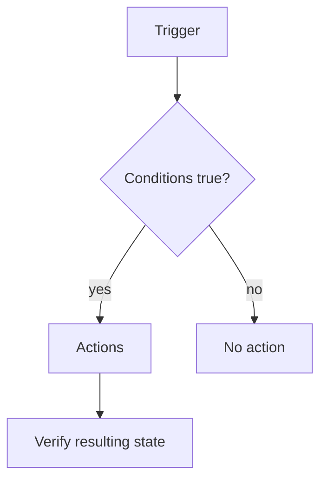

# Reading — Home Assistant automations

**Module:** Module 3 — Home Assistant & Secure Access  
**Topic:** 02 — Home Assistant automations  
**Activity type:** Reading / reference (Learn)  
**Bloom focus:** Analyze / Create  
**Links to outcome:** Given a plain-language automation requirement, the learner can implement trigger → condition → action logic and prove positive, negative, and failure cases with traces.

## Why this matters

An automation that ‘usually works’ is a hazard. Testable logic — including when it must *not* fire — is how you trust the house.

## Vocabulary

_Add terms as you encounter them in Instruction._

## Core reading

### Automation model

An automation has three core parts:

```text
WHEN trigger occurs
IF conditions are true
THEN perform actions
```

Triggers begin evaluation. Conditions guard execution. Actions express intended changes. This separation matters when diagnosing “it did not run.”



### State versus event

A state trigger reacts when an entity changes state. An event trigger reacts to a bus event. Time, sun, template, webhook, zone, device, and other trigger families express different initiation mechanisms. Pick the type that matches the requirement rather than the one easiest to click.

### Modes and concurrency

Automation modes control what happens when a new trigger occurs while a prior run is active:

| Mode | Behavior |
|---|---|
| single | Ignore or warn on overlapping trigger |
| restart | Stop prior run and begin newest |
| queued | Run invocations in order |
| parallel | Run multiple invocations concurrently |

The right mode depends on safety and intent. A door announcement may use queued behavior; a motion-controlled timer may use restart; parallel actions can create races if they modify the same system.

### Traces

Automation traces show which trigger fired, condition result, path taken, variables, and action errors. Use the trace before editing unrelated devices or reinstalling an integration.

### Monitoring the homelab

Optional stretch: notify when a critical binary sensor / container health helper fails—still use a helper first.

## Worked example (study this)

**I do** — study the reasoning, not just the final answer.

**Bad requirement:** “Turn on the light when I’m home.”

**Better:** “When binary_sensor.front_door changes to on after sunset, if nobody is already marked home, turn on light.living_room and notify; do nothing if the light is already on; mode: single.”

### Example requirement

> When the office test switch turns on after sunset, turn on the office test light at 40 percent. Do nothing during daytime. If the light is unavailable, create a persistent notification.

This requirement is measurable. It identifies trigger, condition, nominal action, exception behavior, and expected state.

## Current correction

Current Home Assistant uses action-oriented terminology in places where old material may say “call service.” Follow the current editor/schema while retaining trigger-condition-action logic and trace-based diagnosis.

## Next

1. Open the **Lesson** for prior-knowledge check, guided practice, and **required Feynman teach-back**.
2. Then complete **Lab**, **Homework**, and **Quiz** for this topic.
