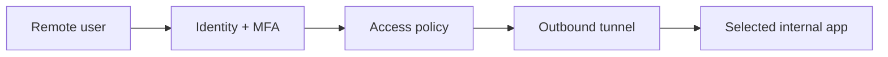

# Reading — Secure remote access

**Module:** Module 3 — Home Assistant & Secure Access  
**Topic:** 03 — Secure remote access  
**Activity type:** Reading / reference (Learn)  
**Bloom focus:** Evaluate / Apply  
**Links to outcome:** Given a threat model for admin UIs, the learner can choose VPN vs tunnel vs dangerous port-forward patterns, implement an authenticated remote path (or document VPN-only), and prove unauthorized denial plus rollback.

## Why this matters

Remote access must not mean publishing every admin interface to the internet. The objective is a narrow, authenticated path with encrypted transport, least privilege, logs, revocation, and a rollback plan.

## Vocabulary

_Add terms as you encounter them in Instruction._

## Core reading

### Threat model

Assets include Home Assistant control, ARR API keys, download clients, media libraries, cameras, door controls, and internal topology. Threats include password reuse, token theft, software vulnerabilities, incorrect access policies, exposed origin ports, and session theft.

### Architecture choices

### VPN/mesh access

The remote device joins a private network and reaches services as if on an authorized internal segment. This is usually the simplest mental model for owner/admin access.

### Outbound tunnel with access policy

A connector initiates an outbound tunnel to a provider. A policy layer authenticates the user before proxying to a selected internal service.

The tunnel encrypts and routes traffic; it does not automatically create a good authorization policy. An accidentally public hostname can still be dangerous.

### Rules for this course

- Never expose qBittorrent, SABnzbd, Sonarr, Radarr, Prowlarr, Proxmox, or Docker APIs directly to the public internet.
- Prefer VPN access for administrative tools.
- If publishing Home Assistant through a supported proxy/tunnel pattern, require strong identity controls and follow HA proxy configuration guidance.
- Do not disable TLS validation as a permanent fix.
- Keep origin services LAN-bound where possible.
- Store tunnel credentials as secrets and rotate after exposure.

### Cloudflare concepts

| Term | Meaning |
|---|---|
| Tunnel connector | Local process creating outbound connectivity |
| Public hostname | External hostname mapped through the tunnel |
| Origin service | Internal destination reached by the connector |
| Access policy | Identity/attribute rules that allow or deny requests |
| Service token | Machine-to-machine credential where supported |
| MFA | Additional authentication factor |

### Reverse proxy awareness

If you terminate TLS on a proxy, record host headers and whether HA `trusted_proxies` (or equivalent) is required—follow current HA docs.

## Worked example (study this)

**I do** — study the reasoning, not just the final answer.

**Bad:** Forward port 8123/8989 to the world because “I’ll use a strong password.”

**Better:** Prefer VPN or an authenticated tunnel pattern approved by the lesson; never expose download clients; prove an unauthorized client is denied; keep a rollback.

## Current correction

Provider dashboards, policy syntax, and product names change. Use current official Cloudflare or selected VPN documentation. The security requirements—narrow exposure, explicit identity, denial testing, revocation, and fail-closed behavior—remain the authority.

## Next

1. Open the **Lesson** for prior-knowledge check, guided practice, and **required Feynman teach-back**.
2. Then complete **Lab**, **Homework**, and **Quiz** for this topic.
