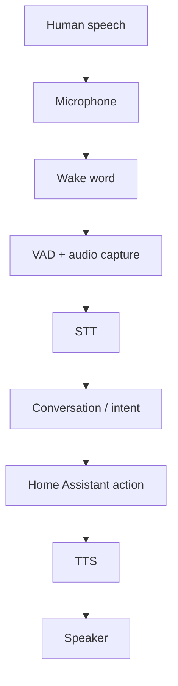

# Lesson 04.01 — Local voice architecture

**Module:** Module 4 — Local Voice Assistant  
**Activity type:** Lesson (Orient → Recall → Learn → Explain → Reflect)  
**Learning objective:** Given a voice request, the learner can draw the local Assist pipeline stages, instrument one test per stage, and isolate faults to mic, wake, STT, intent/action, TTS, or playback.  
**Bloom level:** Analyze  
**Build output:** voice-pipeline test record with one test per stage  
**Mastery unlock for this topic:** reading done + Feynman complete + quiz ≥80% (when scored) + lab gate + homework submitted

## Learning objective

Given a voice request, the learner can draw the local Assist pipeline stages, instrument one test per stage, and isolate faults to mic, wake, STT, intent/action, TTS, or playback.

## Why this matters

Never test the entire voice pipeline first. Each stage transforms an input into an output. Capture the boundary result and prove it before moving forward.

## Prior-knowledge check

Answer briefly before reading Instruction. Wrong answers are useful — they show what to review.

1. What does STT mean? TTS?
2. Why test stages independently before the full pipeline?
3. Which HA entities will voice actions target (from Class 8–9)?

## Learn

Complete the module reading first:

- [Reading — Local voice architecture](./reading.md)

Then review the worked example inside that reading (I do).

## Guided practice (We do)

**We do** — hints allowed. Check your reasoning against Instruction.

Fill the stage table for a sample phrase with assistance.

## Feynman teach-back (required)

Required. Do not skip.

### Explain
Describe **the local voice signal chain and fault isolation** in your own words. No copying the lesson verbatim.

### Simplify
Explain the same idea to a 12-year-old. If you use a technical word, define it.

### Example
Analogy: a relay race — you must know which runner dropped the baton.

### Weak spot
What part was hard to explain? That is where your understanding is thin.

### Retry
Return to that part of **Instruction**, restudy it, then rewrite a clearer explanation below.

> Mastery note: a completed Feynman teach-back is required before the next class unlocks — “I get it” without explanation does not count.

## Reflection

Which stage is hardest to observe, and what log or UI proves it?

Also answer:

1. What did I learn?
2. What did I struggle with?
3. How does this connect to earlier classes?

## Spiral hook

Classes 12–13 implement STT/TTS and the full speaker. Every failure report should cite a Class 11 stage name.

## Topic path (do in order)

| Step | Activity | Purpose |
|---|---|---|
| 1 | [Reading](./reading.md) | Learn |
| 2 | This lesson (Feynman) | Explain / understand |
| 3 | [Lab](./lab.md) | Practice under guidance + break/fix |
| 4 | [Homework](./homework.md) | Independent apply |
| 5 | [Quiz](./quiz.md) | Test / retrieval |
