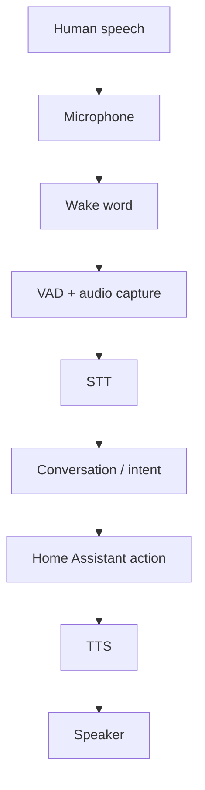

# Reading — Local voice architecture

**Module:** Module 4 — Local Voice Assistant  
**Topic:** 01 — Local voice architecture  
**Activity type:** Reading / reference (Learn)  
**Bloom focus:** Analyze  
**Links to outcome:** Given a voice request, the learner can draw the local Assist pipeline stages, instrument one test per stage, and isolate faults to mic, wake, STT, intent/action, TTS, or playback.

## Why this matters

Never test the entire voice pipeline first. Each stage transforms an input into an output. Capture the boundary result and prove it before moving forward.



## Vocabulary

| Acronym | Meaning | Boundary output |
|---|---|---|
| VAD | Voice Activity Detection | Start/end of utterance |
| STT/ASR | Speech to Text / Automatic Speech Recognition | Transcript |
| NLU | Natural-language understanding | Intent and slots/entities |
| HA | Home Assistant | State/action result |
| TTS | Text to Speech | Audio waveform/stream |
| Wake word | Local keyword detector | Detection event |

## Core reading

### Signal chain

Microphone quality, gain, distance, echo, noise, sample format, and clipping affect everything downstream. An LLM cannot recover words that were never captured. Begin with a recorded audio sample and listen to it.

### Wake word

Wake-word detection should occur before expensive STT in a typical always-listening satellite. Tune for the environment: too sensitive causes false activations; not sensitive enough causes misses. Measure both false rejects and false accepts.

### VAD and endpointing

VAD determines when speech begins and ends. If endpointing cuts early, the transcript may miss the final noun. If it waits too long, latency increases. Diagnose timing from captured audio length and pipeline timestamps.

### STT

STT turns captured audio into text. Its test result is the transcript, not whether a light eventually changes. Use a known sentence and acceptance rule.

### Conversation and intent

The conversation layer interprets text. Deterministic home-control sentences should produce a clear intent and target. Open-ended LLM responses and smart-home commands may use different agents or routing policies.

### Action

Home Assistant must be able to perform the action from text/manual developer tools before voice is involved.

### TTS and playback

TTS produces audio; the output device must play it. Test synthesis and playback separately so a muted speaker is not blamed on Piper.

### Acceptance criteria example

```text
Wake detect ≥ 8/10 at 1m
False wakes ≤ 1/10
STT exact match ≥ 4/5 fixed phrases
Assist maps to correct intent 5/5 when given perfect text
TTS intelligible 5/5
E2E success ≥ 7/10 from seating position
```

### Symptom-to-layer diagnosis

| Symptom | Check layer first |
|---|---|
| Never wakes | Mic / wake model |
| Wakes but silence | VAD / transport |
| Wrong words | STT / noise / model |
| Right words, wrong action | Assist / expose entities |
| Action ok, no voice back | TTS / speaker |

## Worked example (study this)

**I do** — study the reasoning, not just the final answer.

**Bad debug:** “Voice is broken” → reinstall everything.

**Better:** Stage table — mic level OK? wake fired? STT text correct? intent matched? action ran? TTS audio generated? speaker played? Fix the first failing stage only.

## Current correction

Home Assistant voice pipelines and supported hardware continue to evolve. Use current HA voice documentation for UI and integration steps; preserve boundary testing regardless of the selected satellite or agent.

## Next

1. Open the **Lesson** for prior-knowledge check, guided practice, and **required Feynman teach-back**.
2. Then complete **Lab**, **Homework**, and **Quiz** for this topic.
