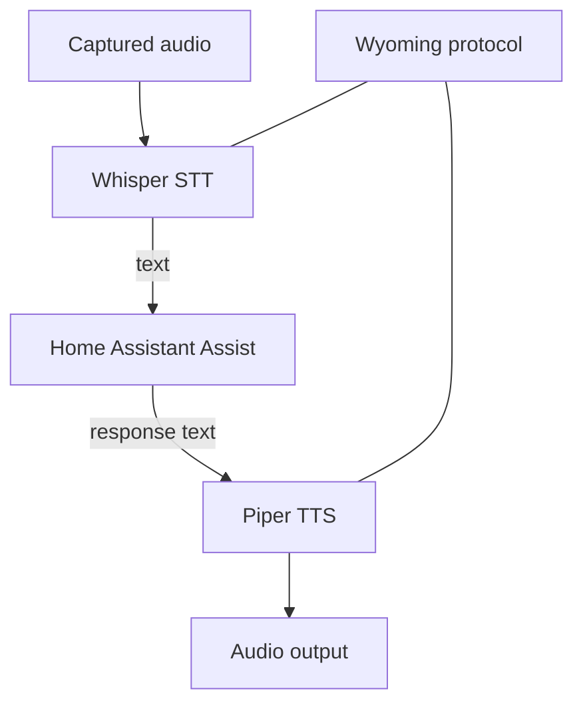

# Reading — Whisper, Piper & Wyoming

**Module:** Module 4 — Local Voice Assistant  
**Topic:** 02 — Whisper, Piper & Wyoming  
**Activity type:** Reading / reference (Learn)  
**Bloom focus:** Apply / Evaluate  
**Links to outcome:** Given CPU/RAM constraints, the learner can deploy local Whisper (STT) and Piper (TTS) via Wyoming, benchmark them separately, and record latency/quality tradeoffs before integration.

## Why this matters

Voice feels ‘AI magic’ until a tiny host thrashes. Separate STT/TTS proof prevents false blame on Home Assistant or the satellite.

## Vocabulary

_Add terms as you encounter them in Instruction._

## Core reading

### Architecture

Whisper provides speech recognition. Piper provides speech synthesis. Wyoming is a protocol used to connect compatible voice services and satellites. Home Assistant orchestrates the Assist pipeline.



These are distinct services. A Wyoming endpoint being reachable does not prove the model is loaded, the language is correct, or the audio is good.

### Compute and model tradeoffs

Larger STT models can improve recognition but cost memory and latency. CPU-only inference may be acceptable for short commands but slow for conversation. GPU acceleration adds drivers, device access, model compatibility, and resource competition. Establish a baseline before optimizing.

Record:

- STT model and language.
- Compute device.
- Cold and warm latency.
- Test phrase accuracy.
- Real-time factor if available.
- Concurrent-request behavior.

Piper voices have language, speaker, sample-rate, and voice-model characteristics. A voice file and matching metadata/config must remain paired. Voice tuning can change speed and variation; test intelligibility before personality.

### Network contract

For every Wyoming service, record host/service name, port, network path, protocol role, health method, model/voice, and logs location. Do not publish voice-service ports to the public internet.

Test layers:

```text
DNS -> TCP port -> Wyoming handshake/discovery -> model load -> inference -> output quality
```

### Resource contention test

1. STT baseline idle  
2. STT while LLM generating (if present)  
3. TTS baseline  
4. TTS during STT  

:::linux
```bash
# Host pressure snapshot while testing:
free -h
uptime
docker stats --no-stream
```
:::

:::windows
```powershell
Get-Process | Sort-Object CPU -Descending | Select-Object -First 10
docker stats --no-stream
```
:::

Record latency, memory, errors, thermal/fan behavior.

## Worked example (study this)

**I do** — study the reasoning, not just the final answer.

**Bad:** Wire wake→STT→HA→TTS→speaker on day one with the biggest model.

**Better:** Prove STT with a known sentence; prove TTS with a known phrase; measure resource contention; only then integrate.

## Current correction

Projects, repositories, add-ons, and model backends change. Use the current Home Assistant integration/add-on guidance and currently maintained Piper/Whisper implementations. Do not follow an old image name or abandoned repository solely because a video shows it.

## Next

1. Open the **Lesson** for prior-knowledge check, guided practice, and **required Feynman teach-back**.
2. Then complete **Lab**, **Homework**, and **Quiz** for this topic.
