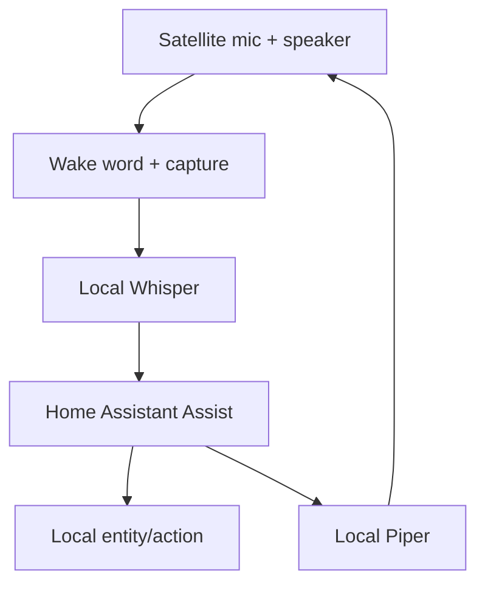

# Reading — Private smart speaker

**Module:** Module 4 — Local Voice Assistant  
**Topic:** 03 — Private smart speaker  
**Activity type:** Reading / reference (Learn)  
**Bloom focus:** Create / Evaluate  
**Links to outcome:** Given working STT/TTS providers, the learner can integrate wake → action → spoken response and prove an internet-disconnected end-to-end pass with staged gates.

## Why this matters

Integrate a voice satellite, wake-word engine, VAD/audio transport, Whisper, Home Assistant Assist, local intent or conversation processing, Piper, and speaker playback. The final privacy requirement is demonstrated behavior under WAN disconnection—not a marketing label.

## Vocabulary

_Add terms as you encounter them in Instruction._

## Core reading

### System boundary

Optional local LLM conversation belongs behind a routing decision. Deterministic home-control commands should not require an open-ended model unless the design explicitly accepts the latency and failure modes.

### Satellite responsibilities

Depending on hardware/software, the satellite may handle microphone capture, wake word, VAD, audio streaming, playback, LED state, and local buttons. Record where each responsibility executes; otherwise failures are impossible to localize.

Example responsibility map:

| Function | Location |
|---|---|
| Microphone capture | Satellite |
| Wake word | Satellite or central service—choose and record |
| STT | Local server |
| Intent/action | Home Assistant |
| LLM, if used | Local compute node |
| TTS | Local server |
| Playback | Satellite |

### Progressive integration gates

Do not skip gates:

### Gate A — audio hardware

Record and play a known sample locally. Validate device selection, gain, clipping, channels, sample rate, echo, and speaker route.

### Gate B — wake word

Run repeated positive and negative trials. Record threshold/model and test distance.

### Gate C — STT

Prove the known sentence transcript. Preserve captured audio for comparison.

### Gate D — HA understanding

Enter transcript as text. Confirm correct intent, area, entity, and action.

### Gate E — action

Confirm entity reaches the requested state and record HA trace/log.

### Gate F — TTS and playback

Synthesize a fixed response and play it through the satellite.

### Gate G — end to end

Speak wake word and command. Capture timestamps at wake, end-of-speech, transcript, intent, state change, synthesis, and playback.

### Gate H — offline privacy

Disconnect WAN access while preserving the LAN. Repeat the full command and a second informational command that is defined as local. Verify DNS or cloud dependencies do not silently block the pipeline.

### Local LLM routing

If you add an LLM, whitelist only low-risk intents. Lights/locks/garage need deterministic intents—not open-ended chat.

### Reliability and recovery

Document restart order: network → HA → Wyoming STT/TTS → satellite. Keep a known-good backup of HA and satellite config.

## Worked example (study this)

**I do** — study the reasoning, not just the final answer.

**Bad acceptance:** “It worked once while Wi-Fi was up.”

**Better:** Progressive gates — wake only → STT → intent/action → TTS → full path — then repeat with internet disconnected and record the pass.

## Current correction

Use the lecture as a system-integration example. Hardware support, satellites, add-ons, repositories, and Home Assistant pipeline screens change. Current official documentation and the staged acceptance tests in this class govern the build.

## Next

1. Open the **Lesson** for prior-knowledge check, guided practice, and **required Feynman teach-back**.
2. Then complete **Lab**, **Homework**, and **Quiz** for this topic.
